# Python & Git 기초 — 나만의 프롬프트 관리 프로그램

## 1. 프로젝트 소개

이 프로젝트는 Python 기초 문법과 Git/GitHub 사용법을 익히기 위해 제작한 콘솔 기반 프롬프트 관리 프로그램입니다.

이전 AI 미션에서 작성한 프롬프트를 한곳에 모아 관리하고, 새로운 프롬프트를 추가하거나 카테고리별로 조회하고, 키워드 검색·상세 보기·즐겨찾기 등의 기능을 사용할 수 있도록 구현합니다.

또한 프로그램을 기능 단위로 개발하면서 Git으로 변경 이력을 기록하고, 별도의 Branch에서 기능을 개발한 뒤 `main` Branch에 병합하는 과정을 실습합니다.

과제에서는 프롬프트를 카테고리별로 분류하고 검색·즐겨찾기하면서 데이터 처리 논리를 익히고, 동시에 Git으로 코드의 변경 이력을 관리하는 것을 주요 학습 목표로 합니다.

---

## 2. 프로그래밍 언어에 친숙하지 않은 사람을 위한 핵심 용어 설명

이번 보고서는 Python이나 Git을 처음 접하는 사람도 이해할 수 있도록 주요 용어를 먼저 설명합니다.

| 용어 | 쉬운 설명 | 이번 과제에서의 역할 |
|---|---|---|
| **Python** | 사람이 작성한 명령을 컴퓨터가 실행할 수 있도록 프로그램을 만드는 프로그래밍 언어 | 프롬프트 관리 프로그램 제작 |
| **VS Code** | 프로그램 코드를 작성하고 수정·실행할 수 있는 코드 편집 프로그램 | Python 코드 작성 및 실행 |
| **콘솔(Console)** | 버튼 대신 글자나 번호를 입력하여 프로그램을 사용하는 방식 | 메뉴 번호를 입력하여 기능 선택 |
| **터미널(Terminal)** | 명령어를 글자로 입력하여 컴퓨터에 작업을 지시하는 창 | Python 실행 및 Git 명령어 입력 |
| **Git** | 코드가 언제 어떻게 변경되었는지 기록하는 버전 관리 도구 | 기능별 개발 과정 기록 |
| **GitHub** | Git으로 관리한 프로젝트를 온라인에 저장·공유할 수 있는 서비스 | 과제 코드 업로드 및 제출 |
| **Repository** | Git이 프로젝트 파일과 변경 기록을 관리하는 저장소 | 프로젝트 관리 |
| **Commit** | 특정 시점의 변경사항을 하나의 기록으로 저장하는 것 | 기능별 작업 기록 |
| **Branch** | 기존 코드를 유지하면서 별도의 작업 공간에서 기능을 개발하는 방법 | 프롬프트 목록 기능 별도 개발 |
| **Merge** | 다른 Branch에서 작업한 내용을 현재 Branch에 합치는 것 | 목록 기능을 `main`에 병합 |

과제에서는 Git이 무엇이고 왜 필요한지 설명할 수 있어야 하며, `init`, `add`, `commit`, `push`, `pull`, `checkout`, `clone`, `merge`가 각각 어떤 역할을 하는지도 설명할 수 있어야 합니다.

---

## 3. 개발 환경

| 항목 | 사용 환경 |
|---|---|
| OS | Windows 10 |
| Python | Python 3.14.7 |
| Editor | Visual Studio Code |
| VS Code Python Extension | 설치 |
| Korean Language Pack | 설치 |
| Git | Git 2.55.0.windows.4 |
| GitHub | GitHub CLI 인증 및 원격 Repository 연동 완료 |
| 기본 Branch | `main` |

### 3.1 개발 도구 설치

프롬프트 관리 프로그램을 개발하기 위해 Python, Visual Studio Code, Git을 설치했습니다.

Python은 프로그램을 작성하고 실행하기 위한 프로그래밍 언어이며, Visual Studio Code는 Python 코드를 작성·수정·실행하기 위한 코드 편집 프로그램입니다. Git은 프로그램을 개발하면서 변경 이력을 기록하고 Branch와 Merge 등의 버전 관리 기능을 사용하기 위해 설치했습니다.

#### 📷 Python 설치 증빙

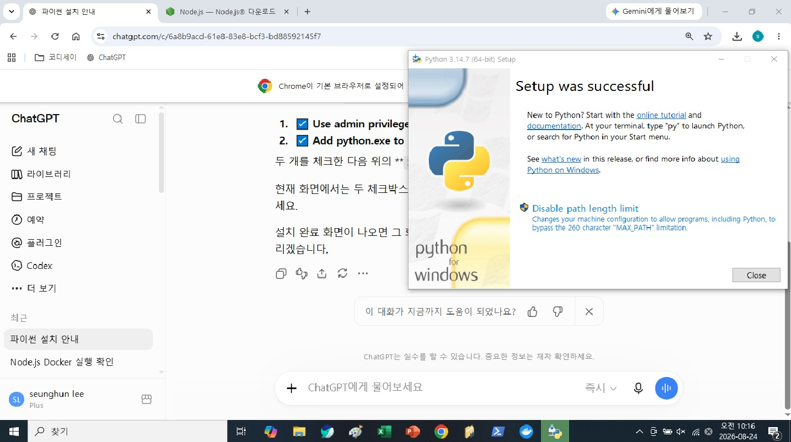

**그림 1. Python 3.14.7 설치 완료**

Python 3.14.7 설치가 정상적으로 완료된 화면입니다. 설치 후 터미널에서 `python --version` 명령어를 실행하여 실제 설치된 버전도 다시 확인했습니다.

#### 📷 Visual Studio Code 설치 증빙

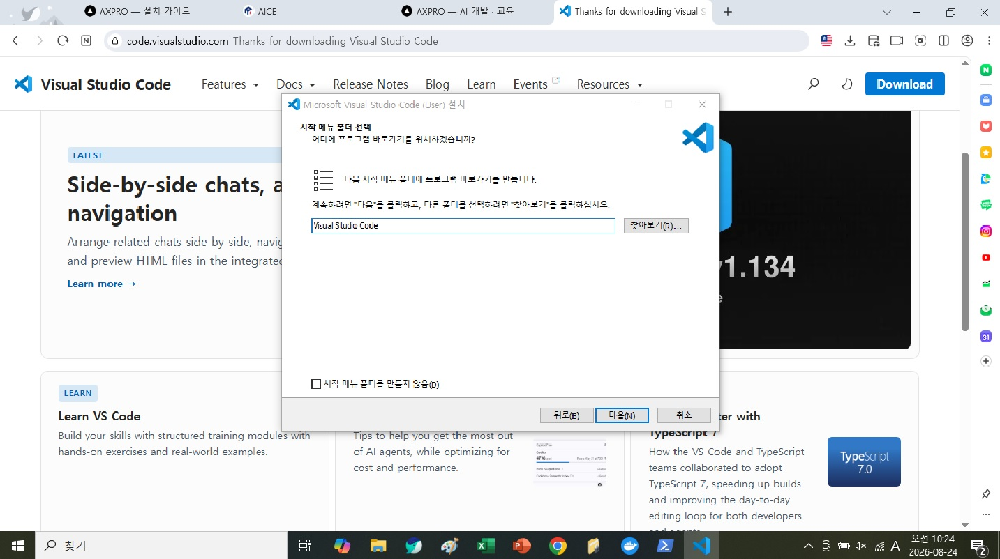

**그림 2. Visual Studio Code 설치**

Python 코드를 작성하고 실행하기 위해 Visual Studio Code를 설치하는 과정입니다. 이후 VS Code에서 프로젝트 폴더를 열고 Python 파일 작성과 터미널 명령 실행에 사용했습니다.

#### 📷 Git 설치 증빙

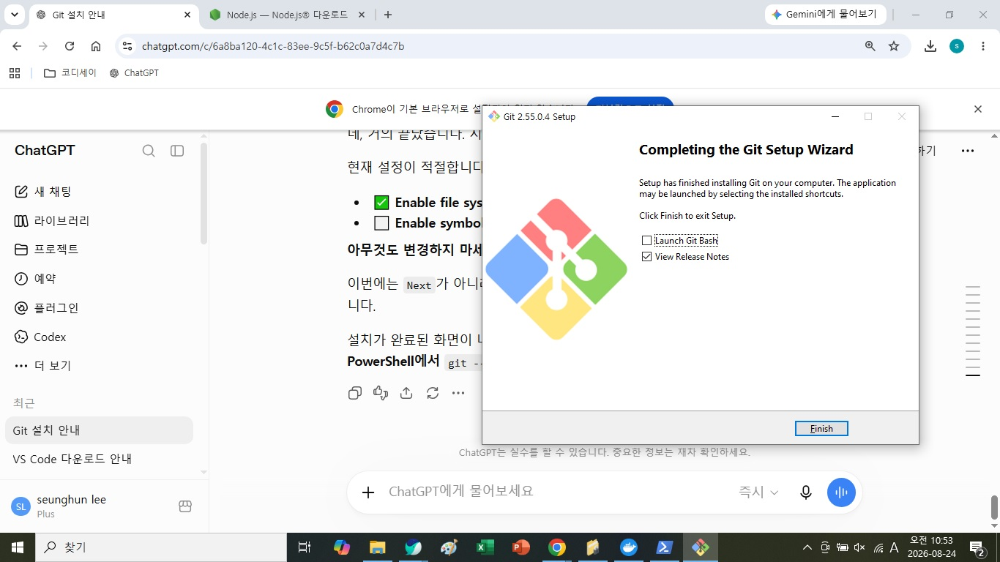

**그림 3. Git 2.55.0 설치 완료**

Git 설치가 정상적으로 완료된 화면입니다. 설치 후 `git --version` 명령어를 실행하여 Git이 정상적으로 사용할 수 있는 상태인지 다시 확인했습니다.

---

### 3.2 개발 환경 설정 및 Python 실행 확인


개발 도구를 설치한 뒤 Git을 사용하기 위한 사용자 정보와 기본 Branch를 설정했습니다.

Git에서 Commit 작성자를 구분할 수 있도록 사용자 이름과 이메일을 먼저 설정했습니다.

```bash

git config --global user.name "사용자 이름"

git config --global user.email "사용자 이메일"

```

새로운 Git 저장소를 만들었을 때 기본 Branch가 `main`이 되도록 설정했습니다.

```bash

git config --global init.defaultBranch main

```

설정 후 다음 명령어를 사용하여 Python과 Git의 설치 상태 및 Git 설정값을 확인했습니다.

```bash

python --version

git --version

git config --global user.name

git config --global user.email

git config --global init.defaultBranch

```

그 다음 현재 `python-git-prompt-manager` 프로젝트 폴더를 Git으로 관리하기 위해 Git 저장소를 초기화했습니다.

```bash

git init

```

Git 저장소를 초기화한 뒤 현재 Branch를 확인했습니다.

```bash

git branch --show-current

```

확인 결과 현재 Branch가 다음과 같이 `main`으로 설정되어 있었습니다.

```text

main

```

마지막으로 Python이 정상적으로 프로그램을 실행할 수 있는지 확인하기 위해 `hello.py` 파일을 작성했습니다.

```python

print("Hello")

```

터미널에서 다음 명령어로 실행했습니다.

```bash

python .\hello.py

```

실행 결과:

```text

Hello

```

#### 📷 개발 환경 설정 및 Python 실행 증빙

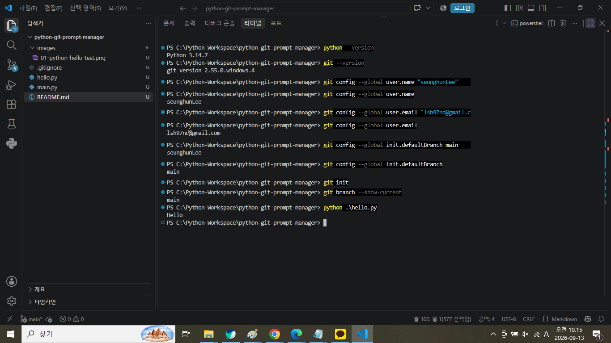

**그림 4. 개발 환경 설정 및 Python 실행 확인**

위 화면에서는 다음 내용을 한 번에 확인할 수 있습니다.

- Python 3.14.7 버전 확인

- Git 2.55.0.windows.4 버전 확인

- Git 사용자 이름 설정 및 확인

- Git 사용자 이메일 설정 및 확인

- 기본 Branch를 `main`으로 설정 및 확인

- `git init`을 통한 프로젝트 Git 저장소 초기화

- 현재 Branch가 `main`인지 확인

- `hello.py` 실행 후 `Hello`가 정상적으로 출력되는지 확인

Git을 처음 사용하는 경우 단순히 확인 명령어부터 실행하기보다 **사용자 이름·이메일 및 기본 Branch 설정 → 설정값 확인 → `git init` → 현재 Branch 확인** 순서로 진행하는 것이 좋습니다. 특히 Git 저장소가 아닌 폴더에서 Branch 관련 명령어를 먼저 실행하면 오류가 발생할 수 있으므로, 프로젝트 폴더를 Git 저장소로 초기화한 뒤 확인했습니다.


---

### 3.3 Git 추적 대상 등록 및 `.gitignore` 확인

프로젝트의 초기 파일을 작성한 뒤 Git으로 변경 이력을 관리하기 위해 다음 명령어를 실행했습니다.

```bash

git add .

git status

```

`git add .`는 현재 프로젝트의 변경사항을 다음 Commit에 포함할 대상으로 등록하는 명령어입니다.

`git status`는 어떤 파일이 Git의 추적 대상이 되었는지와 어떤 변경사항이 Commit을 위해 준비되어 있는지 확인하는 명령어입니다.

#### 📷 Git Commit 대상 파일 확인

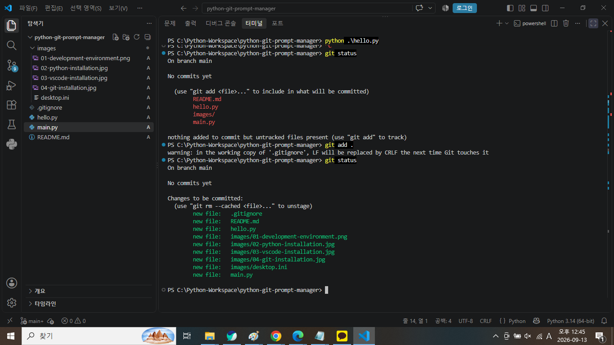

**그림 5. `git add .` 및 `git status` 실행 결과**

`git add .` 실행 후 `git status`를 사용하여 `.gitignore`, `README.md`, `hello.py`, `main.py`, `images/` 폴더의 증빙 자료가 Commit 대상으로 등록된 것을 확인했습니다.

이 과정에서 Windows가 자동으로 생성한 `images/desktop.ini` 파일도 Commit 대상에 포함된 것을 발견했습니다.

---

#### 📷 불필요한 시스템 파일 제외 설정

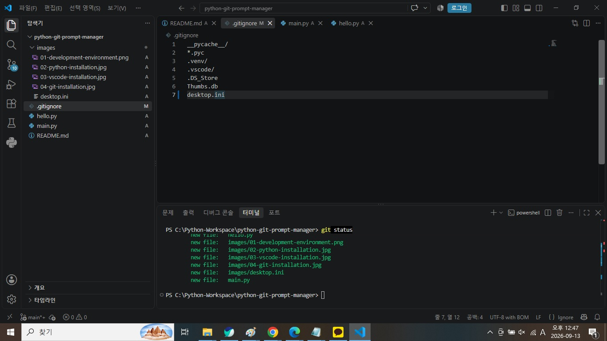

**그림 6. `.gitignore`에 `desktop.ini` 제외 규칙 추가**

`desktop.ini`는 Windows가 폴더 설정 정보를 저장하기 위해 자동으로 생성하는 시스템 파일로, 이번 Python 프로그램의 실행에 필요한 파일이 아닙니다.

불필요한 시스템 파일이 GitHub Repository에 포함되지 않도록 `.gitignore`에 다음 항목을 추가했습니다.

```gitignore

desktop.ini

```

`.gitignore`는 Git으로 관리할 필요가 없는 파일이나 폴더를 추적 대상에서 제외하기 위한 설정 파일입니다.

여기서 **제외한다는 것은 컴퓨터에서 해당 파일을 삭제한다는 뜻이 아닙니다.**

`.gitignore`의 목적은 파일을 컴퓨터에서 없애는 것이 아니라 **Git이 해당 파일을 추적하거나 Commit 대상으로 등록하지 않도록 하는 것**입니다.

따라서 `desktop.ini` 파일은 실제 `images/` 폴더에 남아 있어도 문제가 없습니다.

`git status`에서 `desktop.ini`가 나타나지 않는다면 `.gitignore`가 정상적으로 적용된 것입니다.

---

#### 📷 `.gitignore` 적용 결과 확인

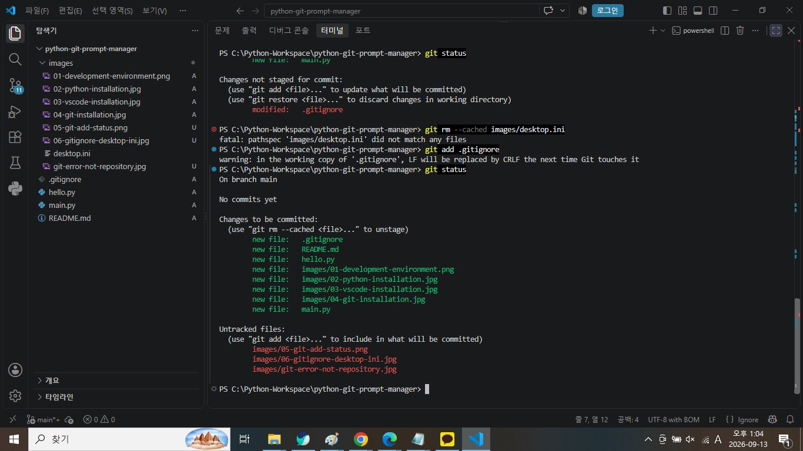

**그림 7. `desktop.ini` 제외 후 Git 상태 확인**

`.gitignore`를 수정한 뒤 다시 `git status`를 실행했습니다.

확인 결과 이전에는 Commit 대상에 표시되었던 `images/desktop.ini`가 더 이상 표시되지 않았으며, 실제 프로젝트에 필요한 파일만 Commit 대상으로 남은 것을 확인했습니다.

이 과정을 통해 단순히 `.gitignore` 파일을 작성하는 것에서 끝내지 않고,

**불필요한 파일 발견 → `.gitignore` 수정 → `git status`를 통한 적용 결과 확인**

순서로 설정이 실제로 적용되었는지 검증했습니다.

---

#### 📷 첫 Commit 전 최종 Staging 상태 확인

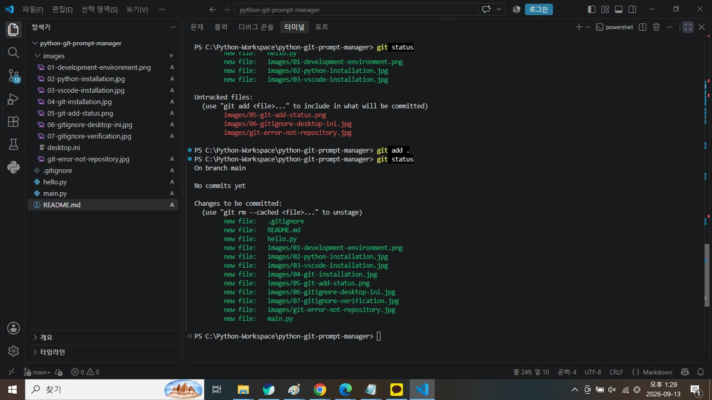

**그림 8. 첫 Commit 전 Git Staging 상태 최종 확인**

`.gitignore` 설정을 적용한 뒤 다시 `git add .`와 `git status`를 실행하여 첫 Commit에 포함될 파일을 확인했습니다.

확인 결과 `.gitignore`, `README.md`, `hello.py`, `main.py`와 `images/` 폴더의 증빙 자료가 Commit 대상으로 등록되었으며, Windows가 자동으로 생성한 `desktop.ini`는 Commit 대상에서 제외된 것을 확인했습니다.

또한 실제 작업 중 발생한 `not a git repository` 오류 화면은 이후 문제 해결 및 시행착오 과정을 설명하기 위한 증빙 자료로 보관했습니다.

---

#### 📷 첫 Commit 전 Staging 완료 확인

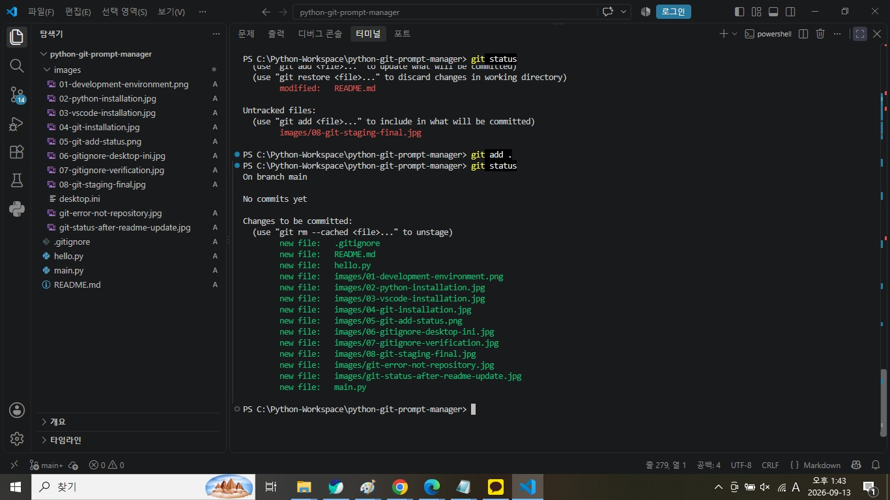

**그림 9. 첫 Commit 전 Git Staging 완료 확인**

README와 새로운 증빙 자료를 추가한 뒤 `git add .`을 다시 실행하고 `git status`로 최종 상태를 확인했습니다.

확인 결과 프로젝트의 초기 파일과 증빙 자료가 모두 `Changes to be committed`에 표시되었습니다.

이는 해당 파일들이 다음 Commit에 포함될 수 있도록 **Staging Area(스테이징 영역)**에 등록되었다는 의미입니다.

여기서 **Staging**은 변경된 파일 중 다음 Commit에 포함할 파일을 미리 선택하여 준비하는 과정입니다.

`git add .`은 현재 프로젝트의 변경사항을 Staging Area에 등록하고, `git status`는 등록 상태를 확인하는 데 사용합니다.

또한 `desktop.ini`는 실제 `images/` 폴더에는 남아 있지만 `.gitignore` 설정에 따라 Git의 추적 대상에서는 제외되어 `git status`에 나타나지 않는 것을 다시 확인했습니다.

따라서 불필요한 Windows 시스템 파일은 제외하면서 과제 수행에 필요한 파일과 증빙 자료만 첫 Commit에 포함할 준비가 완료되었습니다.


### 3.4 첫 Commit 및 Git 기록 확인

프로젝트 초기 파일과 증빙 자료가 Staging Area에 정상적으로 등록된 것을 확인한 뒤 첫 Commit을 생성했습니다.

첫 Commit에는 프로젝트 기본 구조, `README.md`, `.gitignore`, Python 실행 확인 파일과 현재까지 작성한 증빙 자료를 기록했습니다.

다음 명령어를 실행했습니다.

```bash

git commit -m "chore: initialize Python project"

```

`git commit`은 Staging Area에 준비된 변경사항을 하나의 기록으로 저장하는 명령어입니다.

이번 Commit 메시지는 다음과 같이 작성했습니다.

```text

chore: initialize Python project

```

여기서 `chore`는 새로운 프로그램 기능을 추가한 작업이라기보다 프로젝트 설정이나 초기 구조를 구성하는 작업에 사용하는 표현입니다.

`initialize Python project`는 이번 Commit이 Python 프로젝트의 초기 구조를 구성한 작업이라는 의미입니다.

첫 Commit을 생성한 뒤 실제로 Git 기록에 저장되었는지 확인하기 위해 다음 명령어를 실행했습니다.

```bash

git log --oneline

```

`git log`는 지금까지 생성된 Commit 기록을 확인하는 명령어입니다.

여기에 `--oneline` 옵션을 사용하면 각 Commit을 한 줄로 간단하게 표시하여 **Commit 식별값과 Commit 메시지**를 빠르게 확인할 수 있습니다.

#### 📷 첫 Commit 및 Git Log 확인

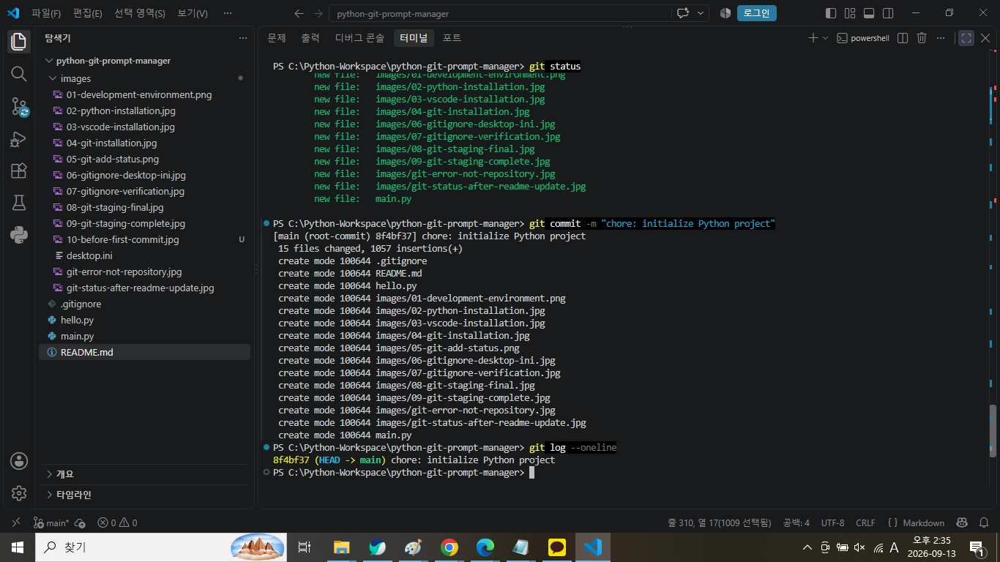

**그림 10. 첫 Commit 생성 및 Git 기록 확인**

`git commit -m "chore: initialize Python project"`를 실행한 결과 첫 Commit이 정상적으로 생성된 것을 확인했습니다.

Commit 결과에 `root-commit`이 표시되었는데, 이는 현재 Repository에서 생성된 **첫 번째 Commit**이라는 의미입니다.

이어서 `git log --oneline`을 실행하여 방금 생성한 `chore: initialize Python project` Commit이 Git 변경 이력에 정상적으로 저장되어 있는지 확인했습니다.

이를 통해 단순히 Commit 명령을 실행하는 것에서 끝내지 않고,

**Staging 완료 → 첫 Commit 생성 → Git Log를 통한 기록 확인**

순서로 첫 번째 변경 이력이 정상적으로 저장되었는지 검증했습니다.


### 3.5 GitHub CLI 설치 및 로그인

GitHub Repository 생성과 원격 저장소 작업을 VS Code Terminal에서도 수행해보기 위해 GitHub CLI를 사용했습니다.

GitHub CLI는 GitHub 웹사이트에서 수행하는 일부 작업을 터미널 명령어로 실행할 수 있도록 해주는 도구입니다.

예를 들어 Repository 생성, GitHub 로그인 상태 확인, Pull Request 확인 등의 작업을 터미널에서 수행할 수 있습니다.

처음 다음 명령어를 실행했습니다.

```bash

gh --version

```

하지만 GitHub CLI가 설치되어 있지 않아 `gh` 명령어를 인식하지 못하는 오류가 발생했습니다.

이후 Windows의 `winget`을 사용하여 GitHub CLI를 설치했습니다.

```powershell

winget install --id GitHub.cli

```

설치가 완료된 뒤 새 터미널에서 다시 다음 명령어를 실행했습니다.

```bash

gh --version

```

확인 결과 다음과 같이 GitHub CLI 버전이 정상적으로 표시되었습니다.

```text

gh version 2.100.0

```

#### 📷 GitHub CLI 설치 및 정상 동작 확인

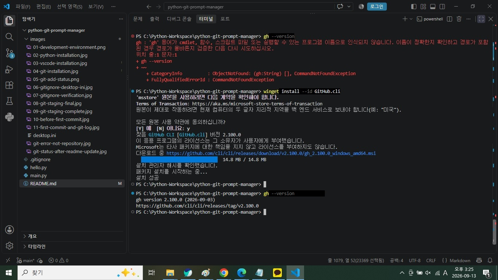

**그림 11. GitHub CLI 설치 및 정상 동작 확인**

처음 `gh --version`을 실행했을 때 GitHub CLI가 설치되어 있지 않아 명령어를 인식하지 못하는 오류가 발생했습니다.

이후 `winget install --id GitHub.cli` 명령어를 사용하여 GitHub CLI를 설치했고, 새 터미널에서 다시 `gh --version`을 실행했습니다.

확인 결과 `gh version 2.100.0`이 정상적으로 출력되어 GitHub CLI가 설치되고 터미널에서 사용할 수 있는 상태임을 확인했습니다.

이 과정을 통해 Git과 GitHub CLI가 서로 다른 도구이며, GitHub CLI를 사용하려면 별도 설치가 필요하다는 점도 확인했습니다.

설치 후 GitHub 로그인 상태를 확인하기 위해 다음 명령어를 실행했습니다.

```bash

gh auth status

```

처음에는 GitHub 계정에 로그인되지 않은 상태였기 때문에 다음 명령어로 인증을 진행했습니다.

```bash

gh auth login

```

인증 과정에서는 GitHub.com, HTTPS, 브라우저 로그인 방식을 선택했고, 브라우저에서 Device Activation과 권한 승인 절차를 진행했습니다.

#### 📷 GitHub CLI 로그인 및 인증 완료

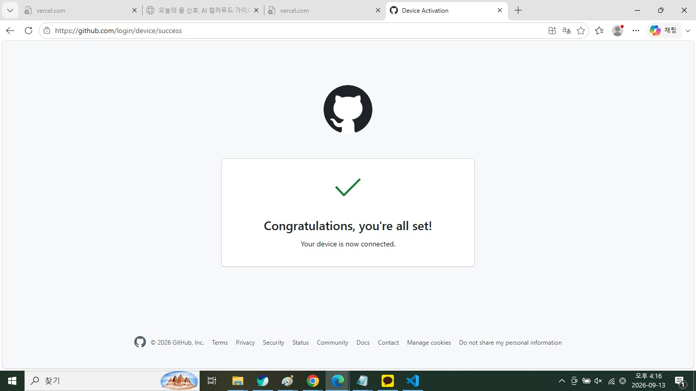

**그림 12. GitHub CLI 로그인 및 인증 완료**

브라우저에서 GitHub Device Activation과 권한 승인 절차를 완료한 뒤 VS Code Terminal로 돌아왔습니다.

터미널에서 `Authentication complete.` 메시지가 표시되었고, Git 작업에 사용할 프로토콜이 HTTPS로 설정된 것도 확인했습니다.

또한 `Logged in as ...`가 표시되어 GitHub CLI가 실제 GitHub 계정에 정상적으로 로그인된 것을 확인했습니다.

이 과정을 통해 다음 순서로 GitHub CLI 인증을 완료했습니다.

**GitHub.com 선택 → HTTPS 선택 → 브라우저 인증 → 권한 승인 → 추가 본인 확인 → 인증 완료**

중간 과정에서 사용한 `13-github-device-activation.jpg`, `14-github-cli-authorization.jpg`, `15-github-cli-confirm-access.jpg`는 GitHub CLI 로그인 절차를 단계별로 확인할 수 있는 참고 자료로 보관했습니다.

#### 📷 GitHub CLI 로그인 상태 확인

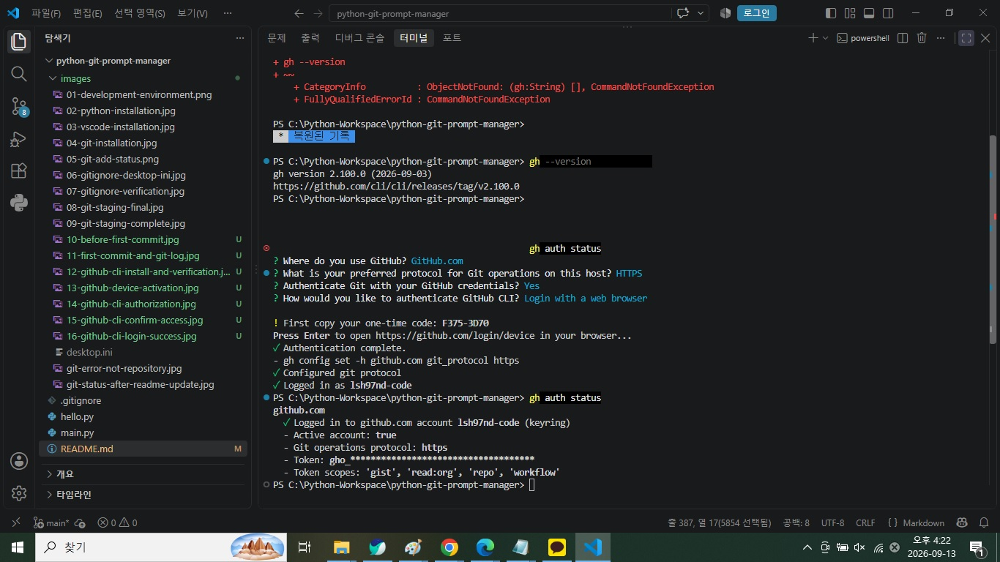

**그림 13. `gh auth status`를 통한 로그인 상태 확인**

GitHub CLI 인증을 완료한 뒤 다음 명령어를 다시 실행했습니다.

```bash

gh auth status

```

확인 결과 GitHub.com 계정이 활성 상태로 로그인되어 있었고, Git 작업에 사용할 프로토콜도 `https`로 설정되어 있음을 확인했습니다.

또한 인증에 필요한 토큰과 Repository 작업에 필요한 권한 범위가 정상적으로 설정된 것을 확인했습니다.

이를 통해 브라우저 인증이 완료되었다는 메시지만 확인하는 데서 끝내지 않고, `gh auth status`를 사용해 실제 GitHub CLI 로그인 상태를 다시 검증했습니다.

#### 터미널에서 GitHub 작업을 진행한 이유

이번 과제의 필수 요구사항만 수행한다면 GitHub 웹사이트에서 Repository를 생성해도 충분합니다.

하지만 Git과 GitHub를 처음 사용하는 입장에서 웹 화면뿐 아니라 VS Code Terminal에서도 GitHub 작업을 직접 수행해보면, 로컬 Git과 원격 GitHub가 어떻게 연결되는지 더 구체적으로 이해할 수 있다고 판단했습니다.

특히 GitHub CLI를 사용하면 Repository 생성, 로그인 상태 확인, 원격 저장소 작업 등을 명령어로 수행할 수 있으므로, 이후 반복적인 GitHub 작업을 더 빠르고 일관된 방식으로 처리하는 연습이 됩니다.

장점은 다음과 같습니다.

- Git과 GitHub CLI의 역할 차이를 실제 작업을 통해 이해할 수 있습니다.

- Repository 생성과 원격 연결 과정을 명령어 단위로 확인할 수 있습니다.

- 반복 작업을 웹 화면보다 빠르게 수행할 수 있습니다.

- 사용한 명령어가 터미널 기록에 남아 작업 과정을 다시 확인하기 쉽습니다.

- 다른 사람이 같은 명령어를 따라 하며 실습하기 좋습니다.

다만 단점도 있습니다.

- GitHub CLI를 별도로 설치하고 로그인해야 합니다.

- 처음에는 명령어와 옵션을 익혀야 하므로 웹 화면보다 어렵게 느껴질 수 있습니다.

- 명령어를 잘못 입력하면 원하지 않는 Repository나 원격 설정을 만들 수 있으므로 실행 전 확인이 필요합니다.

- GitHub CLI 인증 과정에서 계정과 권한 범위를 확인해야 하므로 보안에 대한 주의가 필요합니다.

따라서 이번 과제에서는 **과제 필수 기능을 충족하는 것뿐 아니라 Git/GitHub 작업 흐름을 이해하기 위한 추가 학습 목적으로 GitHub CLI를 사용했습니다.**

### 3.6 GitHub Repository 생성 및 원격 저장소 연결

GitHub CLI 로그인 상태를 확인한 뒤 VS Code Terminal에서 새로운 GitHub Repository를 생성했습니다.

이번에는 GitHub 웹사이트에서 직접 Repository를 만드는 대신, 앞에서 설치한 GitHub CLI를 활용하여 터미널에서 Repository 생성과 원격 저장소 연결 과정을 직접 수행했습니다.

다음 명령어를 실행했습니다.

```bash

gh repo create python-git-prompt-manager --public --source=. --remote=origin

```

각 항목의 의미는 다음과 같습니다.

| 명령 및 옵션 | 의미 |
|---|---|
| `gh repo create` | GitHub에 새로운 Repository를 생성 |
| `python-git-prompt-manager` | 생성할 Repository 이름 |
| `--public` | Repository를 공개(Public) 상태로 생성 |
| `--source=.` | 현재 프로젝트 폴더를 Repository의 기준으로 사용 |
| `--remote=origin` | 생성된 GitHub Repository를 `origin`이라는 이름의 원격 저장소로 연결 |

여기서 **Remote(원격 저장소)** 는 현재 컴퓨터에 있는 로컬 Git Repository와 연결되는 GitHub의 온라인 Repository를 의미합니다.

`origin`은 원격 저장소에 일반적으로 사용하는 기본 이름입니다. 즉, 이후 `git push`나 `git pull`을 사용할 때 `origin`을 통해 현재 로컬 프로젝트와 GitHub Repository 사이에 데이터를 주고받을 수 있습니다.

Repository를 생성한 뒤 원격 저장소가 실제로 연결되었는지 확인하기 위해 다음 명령어를 실행했습니다.

```bash

git remote -v

```

`git remote -v`는 현재 로컬 Repository에 연결된 원격 저장소의 이름과 주소를 확인하는 명령어입니다.

#### 📷 GitHub Repository 생성 및 Remote 연결 확인

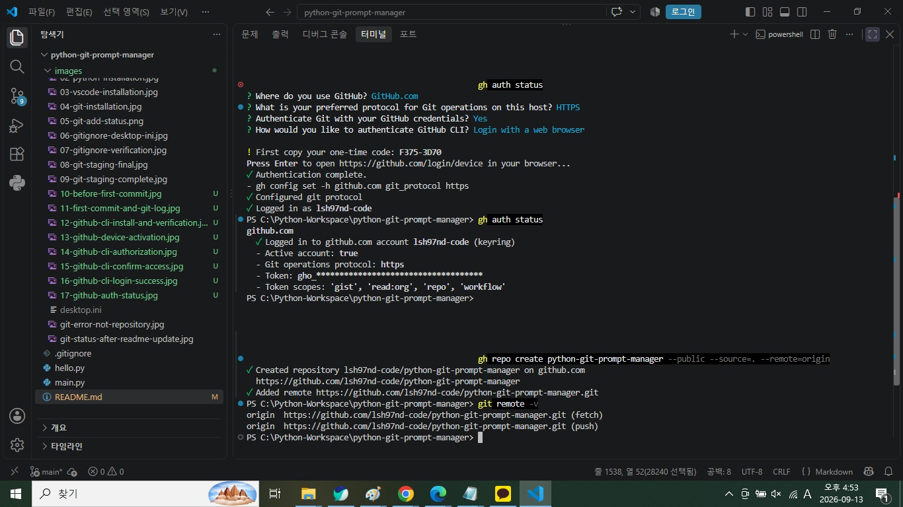

**그림 14. GitHub Repository 생성 및 원격 저장소 연결 확인**

`gh repo create` 명령을 실행한 결과 GitHub에 `python-git-prompt-manager` Repository가 정상적으로 생성되었습니다.

또한 생성된 Repository가 현재 로컬 프로젝트에 `origin`이라는 이름으로 자동 연결된 것을 확인했습니다.

이후 `git remote -v`를 실행한 결과 `origin`에 대해 `fetch`와 `push` 주소가 모두 표시되었습니다.

여기서 `fetch`는 GitHub의 변경사항을 가져올 때 사용하는 주소이고, `push`는 로컬의 Commit을 GitHub로 전송할 때 사용하는 주소입니다.

이를 통해

**GitHub Repository 생성 → 원격 저장소 `origin` 연결 → `git remote -v`를 통한 연결 상태 확인**

순서로 GitHub Repository와 로컬 프로젝트가 정상적으로 연결되었는지 검증했습니다.

### 3.7 GitHub 설정 문서화 Commit 및 첫 Push

GitHub Repository 생성과 원격 저장소 연결을 완료한 뒤, 지금까지 작성한 README와 GitHub CLI 관련 증빙 자료를 Git 변경 이력에 추가했습니다.

먼저 다음 명령어를 사용하여 변경된 파일을 Staging Area에 등록하고 상태를 확인했습니다.

```bash

git add .

git status

```

확인 결과 수정된 `README.md`와 GitHub CLI 설치·로그인·Repository 생성 과정의 증빙 이미지가 다음 Commit에 포함될 대상으로 등록되었습니다.

이후 다음 명령어로 두 번째 Commit을 생성했습니다.

```bash

git commit -m "docs: document GitHub setup process"

```

여기서 `docs`는 프로그램 기능 자체를 추가한 것이 아니라 README, 설명 문서, 증빙 자료와 같은 문서 작업을 기록할 때 사용하는 표현입니다.

`document GitHub setup process`는 GitHub CLI 설치, 로그인, Repository 생성 및 원격 저장소 연결 과정을 문서화했다는 의미입니다.

#### 📷 GitHub 설정 문서화 Commit

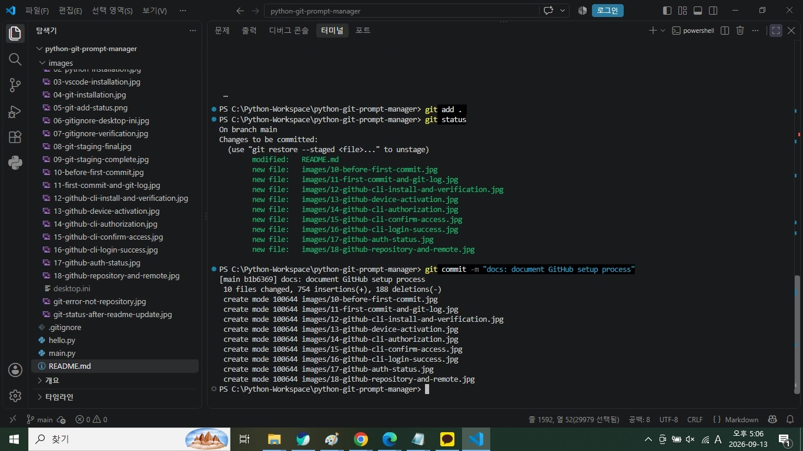

**그림 15. GitHub 설정 과정 문서화 및 두 번째 Commit**

`git add .`과 `git status`를 통해 변경사항을 확인한 뒤 `docs: document GitHub setup process`라는 메시지로 Commit을 생성했습니다.

이를 통해 GitHub 설정 과정을 README와 증빙 이미지에 기록한 작업도 별도의 변경 이력으로 관리했습니다.

---

두 번째 Commit까지 완료한 뒤 로컬 Repository의 Commit을 처음으로 GitHub 원격 Repository에 전송했습니다.

다음 명령어를 실행했습니다.

```bash

git push -u origin main

```

각 명령과 옵션의 의미는 다음과 같습니다.

| 명령 및 옵션 | 의미 |
|---|---|
| `git push` | 로컬 Repository의 Commit을 GitHub 원격 Repository로 전송 |
| `-u` | 현재 `main` Branch와 `origin/main`의 추적 관계를 설정 |
| `origin` | 앞에서 연결한 GitHub 원격 저장소의 이름 |
| `main` | GitHub로 전송할 현재 로컬 Branch |

여기서 `-u` 옵션을 처음 Push할 때 사용하면 로컬 `main` Branch와 GitHub의 `origin/main` Branch 사이에 추적 관계가 설정됩니다.

따라서 이후 같은 Branch에서 작업할 때는 원격 저장소와 Branch를 매번 모두 입력하지 않고 다음과 같이 간단하게 사용할 수 있습니다.

```bash

git push

```

첫 Push를 완료한 뒤 현재 상태를 확인하기 위해 다음 명령어도 실행했습니다.

```bash

git status

```

#### 📷 첫 GitHub Push 및 상태 확인

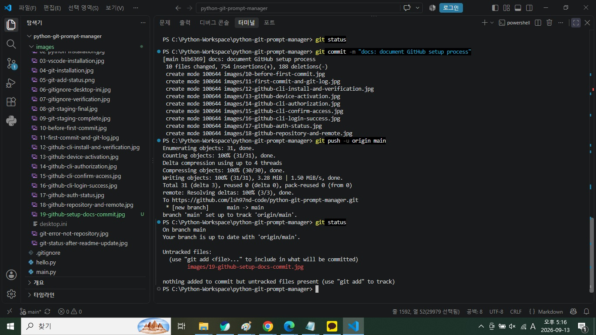

**그림 16. 첫 GitHub Push 성공 및 Push 이후 Git 상태 확인**

`git push -u origin main`을 실행한 결과 다음 메시지가 표시되었습니다.

```text

[new branch] main -> main

branch 'main' set up to track 'origin/main'.

```

이는 로컬 `main` Branch가 GitHub의 `origin/main` Branch로 정상적으로 전송되었으며, 두 Branch 사이의 추적 관계도 설정되었다는 의미입니다.

이후 `git status`를 실행한 결과 다음 메시지가 표시되었습니다.

```text

Your branch is up to date with 'origin/main'.

```

따라서 당시 Commit된 Git 변경 이력은 GitHub와 정상적으로 동기화된 것을 확인했습니다.

다만 첫 Push 직후 새로 만든 증빙 이미지가 `Untracked files`에 표시되었습니다.

여기서 **Untracked file**은 오류가 발생했다는 뜻이 아니라, 파일이 새로 생성되었지만 아직 `git add`와 Commit을 거치지 않았다는 의미입니다.

즉 첫 Push 자체는 정상적으로 성공했지만, 그 과정을 증빙하기 위해 새로 생성한 이미지도 다시 Git으로 관리할 필요가 있음을 확인했습니다.

---

첫 Push 증빙 자료와 README 수정 내용을 다시 Git 변경 이력에 포함하기 위해 다음 명령어를 실행했습니다.

```bash

git add .

git status

git commit -m "docs: add first push evidence"

```

Commit을 완료한 뒤에는 앞에서 `-u` 옵션을 사용하여 추적 관계를 이미 설정했기 때문에 다음과 같이 간단하게 Push할 수 있었습니다.

```bash

git push

```

이처럼 처음에는

```bash

git push -u origin main

```

을 사용하지만, 이후 같은 Branch에서는 추적 관계가 기억되어 있기 때문에 보통 다음 명령어만 사용하면 됩니다.

```bash

git push

```

마지막으로 로컬 Repository와 GitHub가 완전히 같은 상태인지 다시 확인했습니다.

```bash

git status

```

#### 📷 추적 관계 설정 후 Push 및 최종 동기화 확인

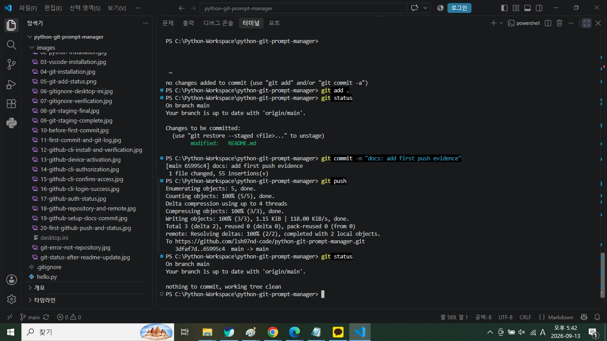

**그림 17. `git push` 실행 및 로컬·GitHub 최종 동기화 확인**

추가 Commit을 생성한 뒤 `git push`를 실행한 결과 새로운 Commit이 GitHub의 `main` Branch로 정상적으로 전송되었습니다.

이후 `git status`를 실행한 결과 다음 메시지가 표시되었습니다.

```text

Your branch is up to date with 'origin/main'.

nothing to commit, working tree clean

```

`Your branch is up to date with 'origin/main'.`은 로컬 `main` Branch와 GitHub의 `origin/main` Branch가 같은 Commit 상태라는 의미입니다.

`nothing to commit, working tree clean`은 현재 수정했지만 Commit하지 않은 파일이나 Git이 추적하지 않는 새 파일이 남아 있지 않다는 의미입니다.

이를 통해 다음 전체 흐름을 실제로 확인했습니다.

**변경사항 Staging → 문서화 Commit → 첫 `git push -u origin main` → 추적 관계 설정 → 새 증빙 파일 발견 → 다시 Commit → 이후 `git push`만으로 전송 → `git status`로 최종 Clean 상태 확인**

특히 첫 Push 직후 증빙 이미지가 새로 생성되면서 다시 `Untracked file`이 발생했지만, 해당 파일을 다시 Staging하고 Commit한 뒤 Push하여 최종적으로 `working tree clean` 상태까지 만들었습니다.

이 과정은 Git에서 **새 파일 생성 → Staging → Commit → Push → 상태 확인**이 반복적으로 이루어진다는 점을 실제 작업을 통해 확인한 사례입니다.

`21-first-push-evidence-commit.jpg`는 첫 Push 증빙 자료를 다시 Commit하는 중간 과정을 확인할 수 있는 참고 자료로 보관했으며, 최종 README에서는 중복을 줄이기 위해 별도의 본문 그림으로 사용하지 않았습니다.

### 3.8 GitHub Repository 및 README 표시 확인

로컬 Repository와 GitHub 원격 Repository의 동기화를 완료한 뒤, 실제 GitHub 웹페이지에서 Repository가 정상적으로 생성되었는지 확인했습니다.

또한 단순히 파일이 Push되었다는 것만 확인하지 않고, `README.md`가 GitHub 웹에서 실제 Markdown 문서로 정상 렌더링되는지와 README에 연결한 이미지가 올바르게 표시되는지도 직접 확인했습니다.

#### 📷 GitHub Repository 및 README 전체 화면 확인

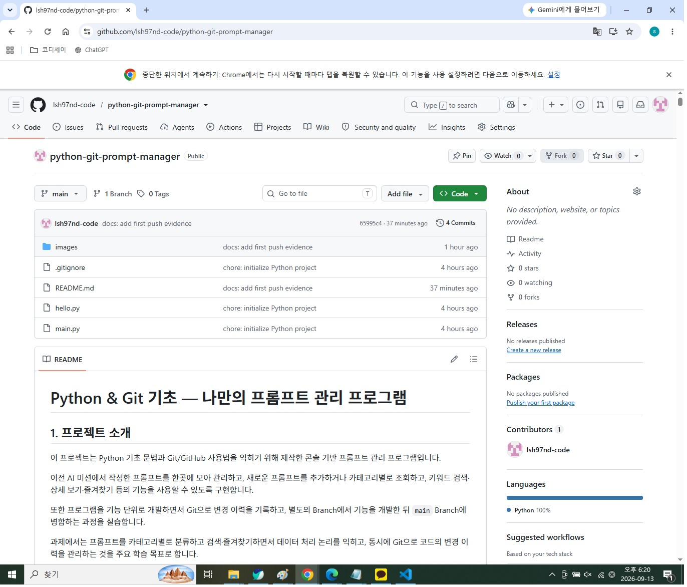

**그림 18. GitHub Repository 생성 결과 및 README 표시 확인**

GitHub 웹페이지에서 `python-git-prompt-manager` Repository가 정상적으로 생성되어 있는지 확인했습니다.

화면에서 다음 항목을 확인할 수 있습니다.

- Repository 이름이 `python-git-prompt-manager`로 표시됨

- Repository가 Public 상태로 생성됨

- `images/` 폴더가 정상적으로 존재함

- `.gitignore`, `README.md`, `hello.py`, `main.py` 파일이 표시됨

- Commit 기록이 GitHub에 반영됨

- Repository 첫 화면 아래에 `README.md` 내용이 실제 문서 형태로 표시됨

이를 통해 VS Code Terminal에서 생성하고 Push한 로컬 프로젝트가 GitHub Repository에 정상적으로 반영되었음을 확인했습니다.

---

#### 📷 README Markdown 및 이미지 렌더링 확인

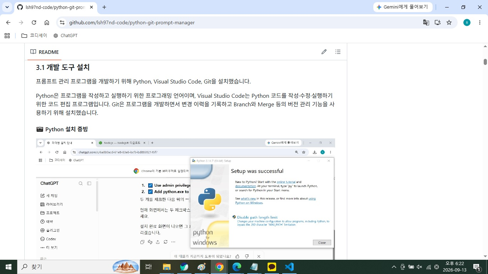

**그림 19. GitHub README Markdown 및 이미지 정상 표시 확인**

GitHub Repository의 README 영역을 아래로 이동하여 Markdown 문법과 이미지가 실제 웹페이지에서 정상적으로 표시되는지 확인했습니다.

확인 결과 `3.1 개발 도구 설치`와 같은 Heading이 문서 제목 형태로 정상 렌더링되었으며, README에 작성한 Python 설치 증빙 이미지도 깨지지 않고 정상적으로 표시되었습니다.

이를 통해 단순히 Markdown 파일이 Repository에 존재하는 것뿐 아니라 다음 사항까지 확인했습니다.

**README 파일 업로드 → Markdown Heading 렌더링 → 이미지 경로 인식 → GitHub 웹에서 실제 이미지 표시**

특히 로컬에서 작성한 이미지 경로가 GitHub에서도 정상적으로 동작한다는 것을 직접 확인함으로써, 제출자가 아닌 다른 사람이 Repository를 열었을 때도 README와 증빙 자료를 확인할 수 있는 상태임을 검증했습니다.

---

## 4. 프로젝트 파일 구조

현재 프로젝트의 핵심 구조는 다음과 같습니다.

```text
python-git-prompt-manager/
│
├── main.py
├── hello.py
├── README.md
├── .gitignore
│
└── images/
    ├── 01-development-environment.png
    ├── 02-python-installation.jpg
    ├── ...
    ├── 69-prompt-list-after-input-validation-and-exit.jpg
    ├── git-error-not-repository.jpg
    └── git-status-after-readme-update.jpg
```

`images/` 폴더에는 개발 환경, Git/GitHub 작업, 프로그램 기능 테스트, 입력 검증, Bonus 기능 검증 과정에서 생성한 증빙 이미지를 순서대로 저장했습니다.

| 파일 및 폴더 | 역할 |
|---|---|
| `main.py` | 프롬프트 관리 프로그램의 필수 기능과 Bonus 기능을 구현한 Python 실행 파일 |
| `hello.py` | `print("Hello")`를 실행하여 Python 환경을 확인하기 위한 파일 |
| `README.md` | 프로젝트 소개, 구현 과정, Git 실습, 테스트 결과와 증빙을 정리한 문서 |
| `.gitignore` | `desktop.ini`, `__pycache__/`, `.venv/` 등 불필요한 파일을 Git 추적 대상에서 제외 |
| `images/` | 설치·Git·기능 테스트·입력 검증·Bonus 결과 등의 증빙 이미지 보관 |

이미지 파일은 가능한 한 `번호-작업내용.jpg/png` 형식으로 이름을 작성하여, 파일명만 보아도 어떤 작업을 증명하는 화면인지 알 수 있도록 정리했습니다.

---

## 5. 프로그램 실행 방법

VS Code에서 프로젝트 폴더를 연 뒤 Terminal에서 다음 명령어를 입력합니다.

```bash
python main.py
```

또는 Windows PowerShell에서는 다음과 같이 실행해도 됩니다.

```powershell
python .\main.py
```

프로그램이 시작되면 숫자 메뉴를 입력하여 원하는 기능을 선택합니다.

각 기능을 수행한 뒤에는 다시 메인 메뉴로 돌아오며, `0`을 선택하면 프로그램을 종료합니다.

---

## 6. 프로그램 주요 기능

현재 프로그램은 필수 기능과 선택한 Bonus 2 기능을 함께 제공합니다.

| 번호 | 기능 | 구분 | 설명 |
|---:|---|---|---|
| 1 | 프롬프트 추가 | 필수 | 제목·내용·카테고리를 입력하여 새 프롬프트 등록 |
| 2 | 프롬프트 목록 | 필수 | 전체 프롬프트의 번호·제목·카테고리·즐겨찾기 표시 |
| 3 | 카테고리별 조회 | 필수 | 선택한 카테고리에 해당하는 프롬프트만 조회 |
| 4 | 프롬프트 검색 | 필수 | 제목 또는 내용에 검색어가 포함된 프롬프트 검색 |
| 5 | 프롬프트 상세 보기 | 필수 + Bonus 연계 | 전체 내용을 확인하고 조회수 증가 |
| 6 | 즐겨찾기 관리 | 필수 | 즐겨찾기 추가·해제 |
| 7 | 즐겨찾기 목록 | 필수 | 즐겨찾기된 프롬프트만 조회 |
| 8 | 프롬프트 수정 | Bonus 2 | 기존 제목·내용·카테고리 수정 |
| 9 | 프롬프트 삭제 | Bonus 2 | 확인 절차 후 프롬프트 삭제 |
| 10 | 많이 본 프롬프트 Top 5 | Bonus 2 | 현재 실행 세션의 조회수를 기준으로 상위 항목 표시 |
| 0 | 종료 | 필수 | 프로그램 종료 |

잘못된 메뉴 번호를 입력하면 프로그램을 종료하지 않고 안내 메시지를 출력한 뒤 다시 입력할 수 있도록 구현했습니다.

---

## 7. 프로그램의 데이터 구조

### 7.1 List와 Dictionary

여러 프롬프트는 하나의 `List`에 저장하고, 프롬프트 하나는 `Dictionary`로 표현합니다.

현재 각 프롬프트는 다음 다섯 가지 정보를 가집니다.

```text
prompts (List)
│
├── 프롬프트 1 (Dictionary)
│   ├── title
│   ├── content
│   ├── category
│   ├── favorite
│   └── view_count
│
├── 프롬프트 2 (Dictionary)
├── 프롬프트 3 (Dictionary)
└── 프롬프트 4 (Dictionary)
```

실제 구조 예시는 다음과 같습니다.

```python
{
    "title": "결과 캐싱 개념 설명",
    "content": "...",
    "category": "텍스트 생성",
    "favorite": False,
    "view_count": 0,
}
```

`favorite`는 즐겨찾기 여부를 `True / False`로 관리하고, `view_count`는 Bonus 기능에서 상세 보기 횟수를 기록합니다.

### 7.2 List + Dictionary를 선택한 이유

여러 프롬프트를 순서대로 관리하기에는 List가 적합하고, 하나의 프롬프트에 제목·내용·카테고리·즐겨찾기·조회수처럼 서로 다른 속성이 있으므로 Dictionary를 사용하면 각 정보의 의미를 명확하게 표현할 수 있습니다.

### 7.3 현재 구조의 한계

현재 데이터는 메모리에만 존재하므로 프로그램을 종료하면 실행 중 변경한 내용이 초기화됩니다.

이번 과제에서는 이 동작이 필수 요구사항과 일치하지만, 실제 장기 사용 프로그램으로 확장하려면 JSON, CSV, SQLite 또는 Database 같은 영구 저장 방식이 필요합니다.

---

## 8. 기본 프롬프트 데이터

프로그램 실행 시 이전 미션과 학습 과정에서 사용한 프롬프트를 기본 데이터로 제공합니다.

과제 요구사항은 최소 3개 이상이며, 현재 프로그램에는 총 4개가 등록되어 있습니다.

| 번호 | 제목 | 카테고리 |
|---:|---|---|
| 1 | 몸 이상 신호 기반 컬러푸드 서비스 기획 | 텍스트 생성 |
| 2 | 주식투자 위험 영상 이미지 수정 | 이미지 생성 |
| 3 | 결과 캐싱 개념 설명 | 텍스트 생성 |
| 4 | 복수 여행지 증빙 확인 | 기타 |

각 기본 프롬프트의 초기값은 다음과 같습니다.

```text
favorite = False
view_count = 0
```

따라서 프로그램을 처음 실행하면 목록에서 즐겨찾기 표시가 `☆`로 보이고, 조회수도 `0`부터 시작합니다.

---

## 9. 메뉴와 프로그램 흐름

전체 흐름은 다음과 같습니다.

```text
프로그램 실행
    ↓
메인 메뉴 출력
    ↓
사용자가 번호 입력
    ↓
선택한 기능 실행
    ↓
결과 출력
    ↓
메인 메뉴로 복귀
    ↓
0. 종료 선택
    ↓
프로그램 종료
```

잘못된 메뉴 번호를 입력하면 다음과 같이 안내합니다.

```text
잘못된 메뉴 번호입니다. 다시 입력해주세요.
```

프로그램은 종료되지 않고 다시 메인 메뉴를 표시합니다.

#### 📷 메인 메뉴 및 잘못된 입력 처리

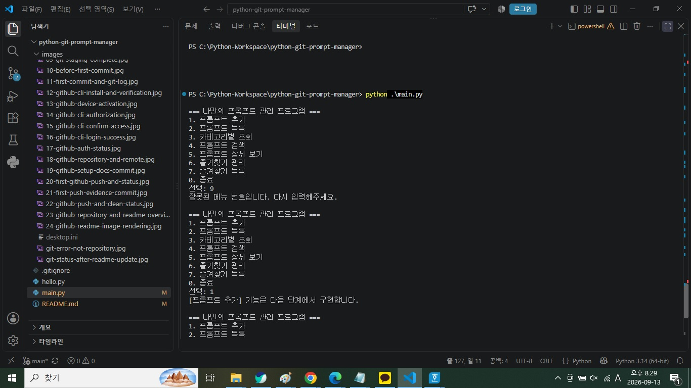

**그림 20-1. 잘못된 메뉴 번호 입력 후 안내하고 다시 메뉴를 표시한 결과**

#### 📷 메뉴 선택 및 정상 종료

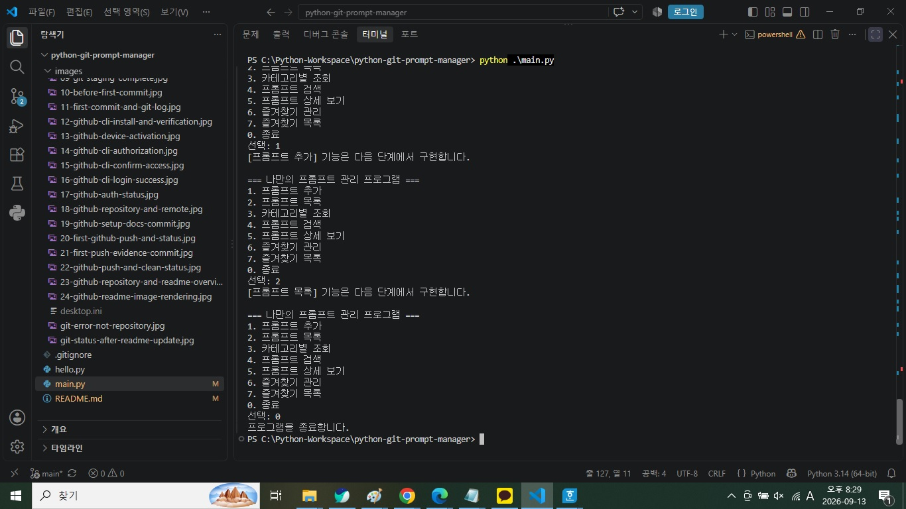

**그림 20-2. 메뉴 기능 실행 후 다시 메인 메뉴로 돌아오고 `0`을 선택하여 정상 종료한 결과**

이후 Chapter 25에서는 `99` 입력을 사용해 잘못된 메뉴 번호 처리도 다시 실제 검증했습니다.

---

## 10. 프롬프트 추가

사용자는 다음 세 가지 정보를 입력하여 새로운 프롬프트를 등록할 수 있습니다.

```text
제목
내용
카테고리
```

카테고리는 미리 정의된 항목에서 선택하거나 `0. 직접 입력`을 선택하여 새 카테고리 이름을 입력할 수 있습니다.

새 프롬프트의 초기 상태는 다음과 같습니다.

```python
"favorite": False
"view_count": 0
```

### 10.1 입력 검증

제목, 내용, 직접 입력 카테고리는 빈 값을 허용하지 않습니다.

빈 값을 입력하면 다음 메시지를 출력하고 같은 항목을 다시 입력받습니다.

```text
빈 값은 입력할 수 없습니다. 다시 입력해주세요.
```

이 처리는 공통 함수 `get_non_empty_input()`을 사용합니다.

### 10.2 프롬프트 추가 실행 결과

#### 📷 빈 입력 검증

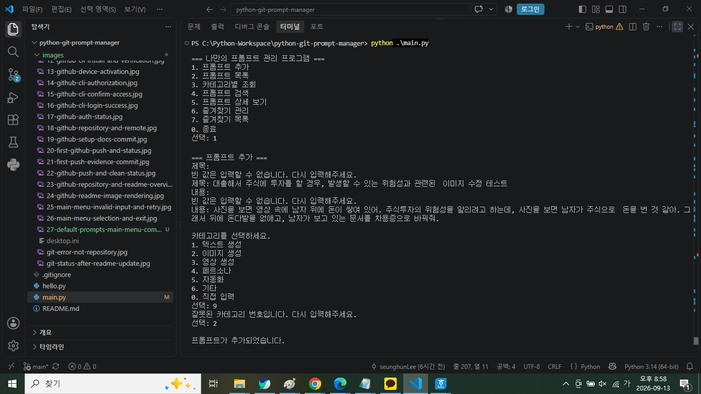

**그림 20-3. 프롬프트 추가 과정에서 빈 입력을 검증하고 정상 값을 다시 입력한 결과**

#### 📷 프롬프트 추가 성공


**그림 20-4. 제목·내용·카테고리를 입력한 뒤 새 프롬프트가 정상 추가된 결과**

추가 기능은 성공 메시지만 확인하지 않고 이후 목록을 다시 열어 새 데이터가 실제 List에 반영되었는지 확인했습니다.

Chapter 25에서는 추가 검증으로 다음 항목도 실제 테스트했습니다.

```text
빈 제목
빈 내용
직접 입력 카테고리 빈 값
잘못된 메뉴 번호
```

관련 증빙은 `66`~`69`번 이미지에 정리했습니다.

---

## 11. 프롬프트 목록 — Branch 활용 ★중요

프롬프트 목록 기능은 과제에서 단순히 기능만 구현하는 것이 아니라, **`main`이 아닌 별도의 Branch에서 개발한 뒤 다시 `main` Branch에 Merge하는 과정까지 수행하도록 요구된 기능**입니다.

따라서 목록 기능을 `main` Branch에서 바로 작성하지 않고, 먼저 전용 Branch를 생성한 뒤 해당 Branch에서 개발을 진행했습니다.

### 11.1 프롬프트 목록 기능 개발용 Branch 생성

Branch를 만들기 전에 프롬프트 추가 기능까지 `main` Branch에서 Commit하고 GitHub에 Push했습니다.

그 다음 프롬프트 목록 기능만 별도의 작업 공간에서 개발하기 위해 다음 명령어를 실행했습니다.

```bash

git checkout -b feature/prompt-list

```

`git checkout -b`는 새로운 Branch를 생성하는 동시에 해당 Branch로 이동하는 명령어입니다.

여기서:

- `feature`는 새로운 기능을 개발하기 위한 Branch라는 의미입니다.

- `prompt-list`는 이번 Branch에서 개발할 기능이 프롬프트 목록 기능이라는 의미입니다.

명령 실행 결과 다음 메시지가 표시되었습니다.

```text

Switched to a new branch 'feature/prompt-list'

```

Branch 생성 후 실제 현재 작업 Branch가 변경되었는지 다시 확인했습니다.

```bash

git branch --show-current

```

확인 결과:

```text

feature/prompt-list

```

가 출력되었습니다.

#### 📷 프롬프트 목록 기능 개발용 Branch 생성 및 확인

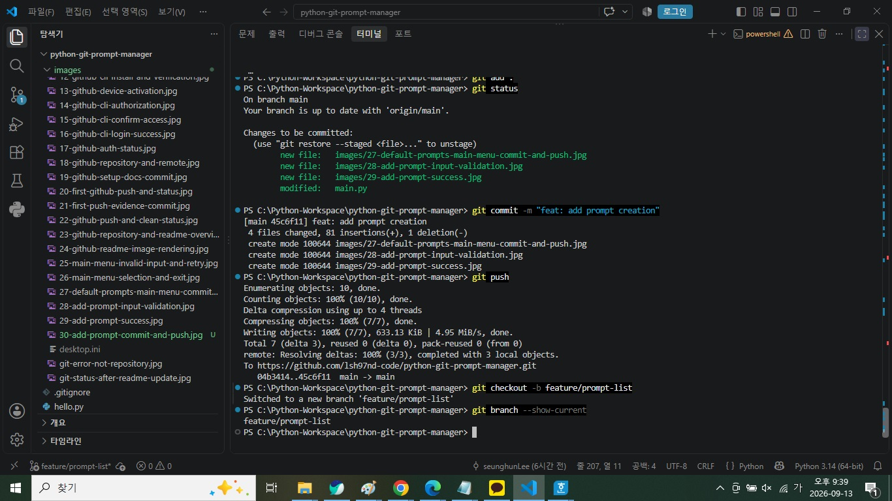

**그림 20. 프롬프트 목록 기능 개발용 `feature/prompt-list` Branch 생성 및 현재 Branch 확인**

`git checkout -b feature/prompt-list`를 실행하여 새로운 Branch를 생성하면서 해당 Branch로 이동했습니다.

이후 `git branch --show-current`를 실행한 결과 현재 Branch가 `feature/prompt-list`로 표시되는 것을 확인했습니다.

VS Code 화면 왼쪽 아래의 Branch 표시 역시 `feature/prompt-list`로 변경되어 있어, 프롬프트 목록 기능을 `main`이 아닌 별도의 Branch에서 개발할 준비가 완료되었음을 확인했습니다.

이를 통해 다음 흐름을 실제로 검증했습니다.

**`main`에서 이전 기능 완료 → `feature/prompt-list` Branch 생성 → 새 Branch로 이동 → 현재 Branch 재확인**

---

### 11.2 프롬프트 목록 기능 구현 및 실행 확인

`feature/prompt-list` Branch에서 프롬프트 목록 기능을 구현했습니다.

목록 기능은 등록된 각 프롬프트의 다음 정보를 한 줄에 표시하도록 구성했습니다.

- 번호

- 제목

- 카테고리

- 즐겨찾기 여부 `★ / ☆`

목록 출력을 위해 `show_prompt_list()` 함수를 작성했습니다.

```python

def show\_prompt\_list():

    """등록된 프롬프트 목록을 번호, 제목, 카테고리, 즐겨찾기와 함께 출력한다."""

    print("\n=== 프롬프트 목록 ===")

    if not prompts:

        print("등록된 프롬프트가 없습니다.")

        return

    for index, prompt in enumerate(prompts, start=1):

        favorite\_mark = "★" if prompt["favorite"] else "☆"

        print(

            f"{index}. "

            f"{favorite\_mark} "

            f"{prompt['title']} "

            f"[{prompt['category']}]"

        )

```

여기서 다음 부분은 프롬프트가 하나도 없을 때를 처리합니다.

```python

if not prompts:

    print("등록된 프롬프트가 없습니다.")

    return

```

이 코드는 **반드시 `show_prompt_list()` 함수 내부에 있어야 합니다.**

현재 실제 `main.py`에서는 이 코드가 함수 내부에 있으며, 프로그램도 정상 실행되었습니다. 만약 이 코드가 파일 맨 아래 함수 밖에 별도로 존재한다면 삭제해야 합니다.

목록 번호는 다음 코드로 `1`부터 표시합니다.

```python

enumerate(prompts, start=1)

```

`enumerate()`는 List의 각 항목을 순서대로 처리하면서 번호도 함께 사용할 수 있도록 해주는 Python 기능입니다.

또한 각 프롬프트의 `favorite` 값에 따라 즐겨찾기를 다음처럼 표시합니다.

```text

True  → ★

False → ☆

```

현재 기본 프롬프트의 `favorite` 값은 모두 `False`이므로 최초 목록에서는 `☆`가 표시됩니다.

기능 구현 후 현재 Branch가 여전히 `feature/prompt-list`인지 확인했습니다.

```bash

git branch --show-current

```

확인 결과:

```text

feature/prompt-list

```

가 출력되었습니다.

그 다음 프로그램을 실행했습니다.

```bash

python .\main.py

```

메인 메뉴에서 `2. 프롬프트 목록`을 선택한 결과 다음과 같이 기본 프롬프트 4개가 정상적으로 출력되었습니다.

```text

\\=== 프롬프트 목록 ===

1\. ☆ 몸 이상 신호 기반 컬러푸드 서비스 기획 [텍스트 생성]

2\. ☆ 주식투자 위험 영상 이미지 수정 [이미지 생성]

3\. ☆ 결과 캐싱 개념 설명 [텍스트 생성]

4\. ☆ 복수 여행지 증빙 확인 [기타]

```

목록 출력이 끝난 뒤 프로그램이 종료되지 않고 다시 메인 메뉴로 돌아오는 것도 확인했습니다.

#### 📷 `feature/prompt-list` Branch에서 프롬프트 목록 실행 확인

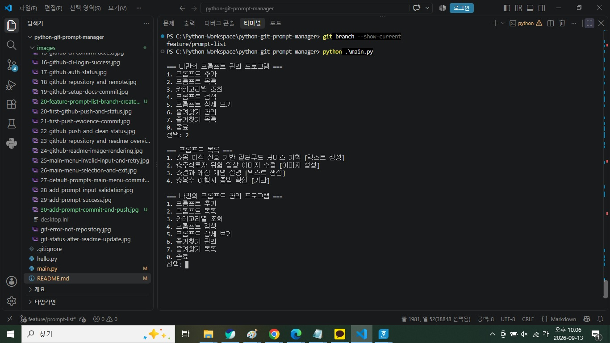

**그림 21. `feature/prompt-list` Branch에서 프롬프트 목록 기능 실행 확인**

화면 상단에서 `git branch --show-current` 명령 결과가 `feature/prompt-list`로 표시되는 것을 확인했습니다.

같은 화면에서 Python 프로그램을 실행한 뒤 `2`번 메뉴를 선택하여 번호, 제목, 카테고리, 즐겨찾기 표시가 포함된 프롬프트 목록이 정상적으로 출력되는 것도 확인했습니다.

또한 목록 출력 후 메인 메뉴가 다시 표시되어, 기능 실행 후 프로그램이 정상적으로 메인 메뉴로 복귀하는 것도 확인했습니다.

이를 통해 단순히 목록 기능이 동작한다는 것뿐 아니라, **해당 기능을 실제로 `feature/prompt-list` Branch에서 개발하고 테스트했다는 사실까지 함께 검증했습니다.**

확인한 흐름은 다음과 같습니다.

**`feature/prompt-list` Branch 확인 → 프로그램 실행 → 2번 목록 선택 → 기본 프롬프트 4개 출력 → 메인 메뉴 복귀**

---

### 11.3 Branch에서 기능 Commit 후 `main`에 Merge

프롬프트 목록 기능 구현과 실행 테스트를 완료한 뒤, 현재 작업 중인 `feature/prompt-list` Branch에서 변경사항을 Commit했습니다.

먼저 변경된 파일을 Staging Area에 등록하고 상태를 확인했습니다.

```bash

git add .

git status

```

`git status`를 통해 현재 Branch가 `feature/prompt-list`인지 확인하고, `main.py`, `README.md`와 이번 작업에서 생성한 증빙 이미지가 Commit 대상으로 등록된 것도 확인했습니다.

이후 다음 명령어로 프롬프트 목록 기능을 Commit했습니다.

```bash

git commit -m "feat: add prompt list"

```

Commit 결과 다음과 같이 `feature/prompt-list` Branch에 새로운 변경 이력이 생성되었습니다.

```text

[feature/prompt-list cb56cde] feat: add prompt list

```

#### 📷 `feature/prompt-list` Branch에서 목록 기능 Commit

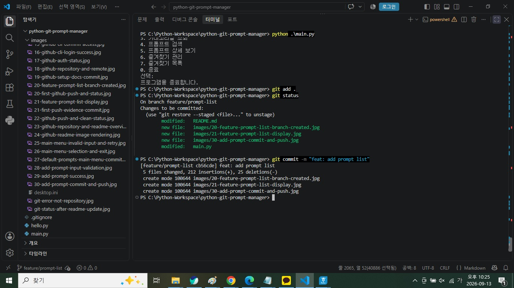

**그림 22. `feature/prompt-list` Branch에서 프롬프트 목록 기능 Commit**

화면에서 현재 Branch가 `feature/prompt-list`인 상태에서 `git add .`, `git status`, `git commit -m "feat: add prompt list"`를 순서대로 실행한 것을 확인할 수 있습니다.

이를 통해 프롬프트 목록 기능이 `main` Branch에서 바로 Commit된 것이 아니라, 과제 요구사항에 따라 별도의 `feature/prompt-list` Branch에서 개발되고 Commit되었다는 변경 이력을 남겼습니다.

---

Branch Commit을 완료한 뒤 작업 폴더에 남아 있는 변경사항이 없는지 확인했습니다.

```bash

git status

```

확인 결과:

```text

On branch feature/prompt-list

nothing to commit, working tree clean

```

이 표시되어 목록 기능 관련 변경사항이 모두 Commit된 상태임을 확인했습니다.

그 다음 `main` Branch로 이동했습니다.

```bash

git checkout main

```

실행 결과:

```text

Switched to branch 'main'

```

이 표시되어 현재 작업 Branch가 `feature/prompt-list`에서 `main`으로 변경되었습니다.

이후 다음 명령어를 사용하여 `feature/prompt-list`에서 개발한 목록 기능을 `main` Branch에 병합했습니다.

```bash

git merge feature/prompt-list

```

Merge 결과 다음과 같이 `Fast-forward`가 표시되었습니다.

```text

Fast-forward

```

`Fast-forward`는 Merge 실패나 오류가 아니라, `main` Branch 이후에 별도의 충돌되는 Commit이 없었기 때문에 `main`이 `feature/prompt-list`의 최신 Commit 위치까지 그대로 이동하여 병합된 것을 의미합니다.

#### 📷 `feature/prompt-list` Branch를 `main`에 Merge

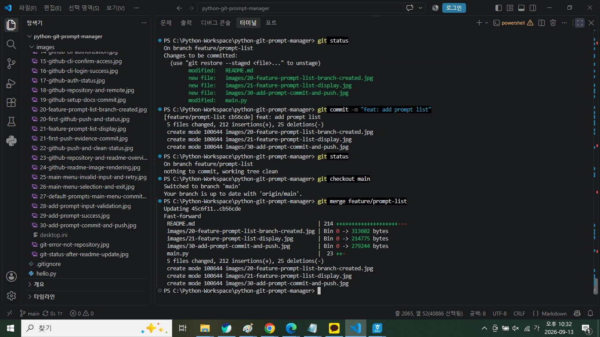

**그림 23. `feature/prompt-list` Branch Commit 후 `main` Checkout 및 Merge**

화면에서 다음 과정을 연속으로 확인할 수 있습니다.

- `feature/prompt-list` Branch의 작업 상태가 Clean인지 확인

- `git checkout main`으로 `main` Branch 이동

- `git merge feature/prompt-list` 실행

- `Fast-forward` 방식으로 Merge 완료

- `main.py`, `README.md` 및 증빙 이미지가 `main`에 반영됨

이를 통해 과제에서 요구한 다음 개발 흐름을 실제로 수행했습니다.

**`feature/prompt-list` 생성 → 목록 기능 개발 및 테스트 → Branch에서 Commit → `main` Checkout → `feature/prompt-list` Merge**

즉, 프롬프트 목록 기능을 `main`에서 직접 개발한 것이 아니라 별도의 Branch에서 독립적으로 개발한 뒤 다시 `main`에 합치는 Git Branch 작업 과정을 완료했습니다.


### 11.4 Git Log를 통한 Branch 및 Merge 기록 확인

`feature/prompt-list` Branch의 프롬프트 목록 기능을 `main` Branch에 Merge한 뒤, Git 변경 이력에서도 정상적으로 반영되었는지 확인했습니다.

다음 명령어를 실행했습니다.

```bash

git log --oneline --graph --all --decorate

```

각 옵션의 의미는 다음과 같습니다.

| 옵션 | 의미 |
|---|---|
| `--oneline` | 각 Commit을 한 줄로 간단하게 표시 |
| `--graph` | Commit과 Branch 관계를 그래프 형태로 표시 |
| `--all` | 현재 Branch뿐 아니라 다른 Branch의 기록도 함께 표시 |
| `--decorate` | `HEAD`, `main`, `feature/prompt-list`, `origin/main`과 같은 Branch 위치를 함께 표시 |

#### 📷 Git Log를 통한 Branch 및 Merge 기록 확인


**그림 24. `git log --oneline --graph --all --decorate`를 통한 Branch 및 Merge 기록 확인**

Git Log의 최신 Commit에서 다음과 같은 내용을 확인했습니다.

```text

cb56cde (HEAD -> main, feature/prompt-list) feat: add prompt list

```

`HEAD -> main`은 현재 작업 위치가 `main` Branch라는 의미입니다.

같은 Commit에 `feature/prompt-list`도 함께 표시되어 있어, 프롬프트 목록 기능을 개발한 Branch와 `main` Branch가 Merge 후 동일한 최신 Commit을 가리키고 있음을 확인했습니다.

또한 당시 `origin/main`은 다음 이전 Commit을 가리키고 있었습니다.

```text

45c6f11 (origin/main) feat: add prompt creation

```

이는 로컬 `main`에는 프롬프트 목록 기능 Merge가 완료되었지만, 아직 해당 최신 Commit을 GitHub 원격 Repository에는 Push하지 않은 상태라는 의미입니다.

이번 Merge는 `Fast-forward` 방식으로 이루어졌기 때문에 Git Graph가 별도의 가지가 갈라졌다 다시 합쳐지는 모양으로 표시되지는 않았습니다.

`Fast-forward` Merge에서는 `main` Branch가 `feature/prompt-list`의 최신 Commit 위치까지 앞으로 이동하므로, Merge 후 두 Branch가 같은 Commit을 가리키는 것이 정상입니다.

이를 통해 다음 과정을 Git 명령 실행 결과뿐 아니라 실제 Commit 기록에서도 다시 검증했습니다.

**Branch 생성 → 목록 기능 개발 → Branch Commit → `main` Checkout → Fast-forward Merge → Git Log를 통한 Branch 위치 및 Commit 기록 확인**

---


### 11.5 Merge 결과 GitHub Push 및 최종 동기화 확인

프롬프트 목록 기능의 Branch 개발, Commit, `main` Merge, Git Log 검증까지 완료한 뒤 관련 README와 증빙 자료를 Git 변경 이력에 추가했습니다.

먼저 변경된 파일을 Staging Area에 등록하고 상태를 확인했습니다.

```bash

git add .

git status

```

이후 다음 Commit을 생성했습니다.

```bash

git commit -m "docs: add prompt list merge evidence"

```

#### 📷 프롬프트 목록 Merge 증빙 문서화 Commit

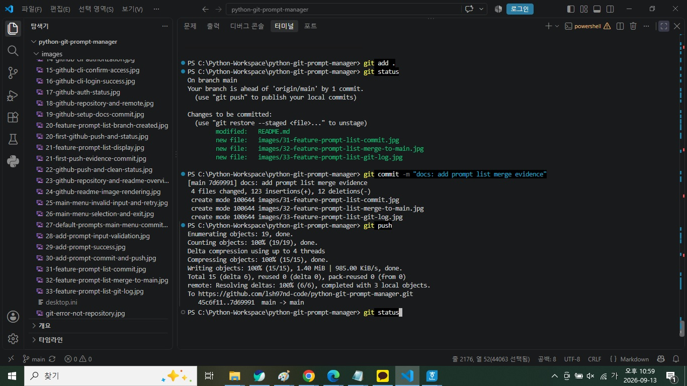

**그림 25. 프롬프트 목록 Branch·Merge 증빙 자료 문서화 Commit**

`README.md`와 `31-feature-prompt-list-commit.jpg`, `32-feature-prompt-list-merge-to-main.jpg`, `33-feature-prompt-list-git-log.jpg`를 Staging한 뒤 `docs: add prompt list merge evidence`라는 메시지로 Commit했습니다.

이를 통해 Branch 생성·기능 개발·Merge·Git Log 확인 과정에서 생성된 증빙 자료도 Git 변경 이력으로 관리했습니다.

Commit 후 다음 명령어를 실행하여 GitHub 원격 Repository에 최신 변경사항을 전송했습니다.

```bash

git push

```

Push가 완료된 뒤 최종 동기화 상태를 확인했습니다.

```bash

git status

```

확인 결과 다음 메시지가 표시되었습니다.

```text

Your branch is up to date with 'origin/main'.

nothing to commit, working tree clean

```

#### 📷 프롬프트 목록 Merge 결과 Push 및 최종 Clean 상태 확인

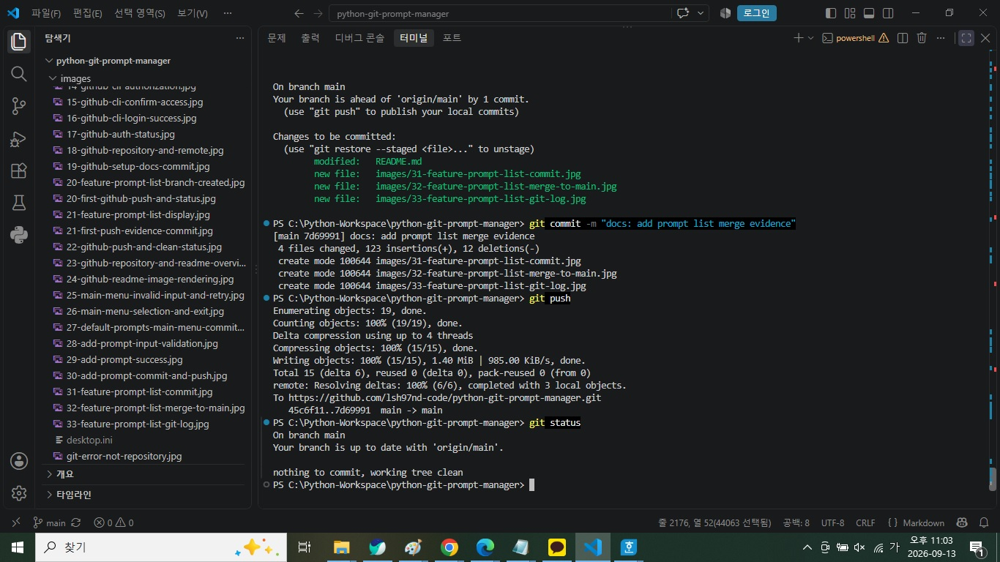

**그림 26. 프롬프트 목록 Branch 작업의 GitHub Push 및 최종 동기화 확인**

`git push` 실행 결과 최신 Commit이 GitHub의 `main` Branch로 정상적으로 전송되었습니다.

이후 `git status`에서 로컬 `main` Branch와 GitHub의 `origin/main` Branch가 같은 상태임을 확인했으며, `nothing to commit, working tree clean` 메시지를 통해 처리되지 않은 변경사항이나 새 파일이 남아 있지 않은 것도 확인했습니다.

이를 통해 프롬프트 목록 기능에 대한 전체 Git 작업 흐름을 완료했습니다.

**Branch 생성 → 기능 개발 → Branch Commit → `main` Merge → Git Log 검증 → 증빙 문서화 Commit → GitHub Push → 최종 Clean 상태 확인**

---

## 12. 카테고리별 조회

프롬프트를 모두 한 번에 확인하는 것뿐 아니라 원하는 카테고리의 프롬프트만 골라 확인할 수 있도록 카테고리별 조회 기능을 구현했습니다.

메인 메뉴의 다음 항목을 선택하면 사용할 수 있습니다.

```text
3. 카테고리별 조회
```

카테고리별 조회 기능은 다음 흐름으로 동작합니다.

**카테고리 목록 표시 → 카테고리 번호 선택 → 해당 카테고리 프롬프트 검색 → 결과 출력 → 메인 메뉴 복귀**

---

### 12.1 카테고리 목록 구성

프롬프트 추가 기능에서는 사용자가 미리 정의된 카테고리를 선택할 수도 있고 `0. 직접 입력`을 이용해 새로운 카테고리를 입력할 수도 있습니다.

따라서 카테고리별 조회에서도 기본 카테고리만 보여주는 것이 아니라, 실제 프롬프트에 사용된 사용자 정의 카테고리까지 조회할 수 있도록 구성했습니다.

이를 위해 다음 함수를 작성했습니다.

```python
def get_available_categories():
    """기본 카테고리와 사용자가 직접 추가한 카테고리를 함께 반환한다."""
    categories = CATEGORIES.copy()

    for prompt in prompts:
        category = prompt["category"]

        if category not in categories:
            categories.append(category)

    return categories
```

먼저 `CATEGORIES.copy()`를 사용해 기본 카테고리 목록을 복사합니다.

그 다음 등록된 프롬프트의 `category` 값을 확인하여 기존 목록에 없는 카테고리가 있으면 추가합니다.

이 방식을 사용하면 프롬프트 추가 과정에서 사용자가 직접 만든 카테고리도 이후 카테고리별 조회 기능에서 다시 선택할 수 있습니다.

또한 `CATEGORIES` 자체를 직접 수정하지 않고 복사본을 사용하므로 프로그램의 기본 카테고리 목록은 그대로 유지됩니다.

---

### 12.2 조회할 카테고리 선택

조회할 카테고리를 번호로 선택할 수 있도록 다음 함수를 작성했습니다.

```python
def select_category_for_filter():
    """카테고리별 조회에 사용할 카테고리를 선택한다."""
    categories = get_available_categories()

    print("\n조회할 카테고리를 선택하세요.")

    for index, category in enumerate(categories, start=1):
        print(f"{index}. {category}")

    while True:
        try:
            choice = input("선택: ").strip()
        except (EOFError, KeyboardInterrupt):
            return None

        if choice.isdigit():
            number = int(choice)

            if 1 <= number <= len(categories):
                return categories[number - 1]

        print("잘못된 카테고리 번호입니다. 다시 입력해주세요.")
```

`enumerate(categories, start=1)`을 사용하여 각 카테고리에 `1`부터 번호를 부여했습니다.

사용자가 숫자가 아닌 값을 입력하거나 실제 카테고리 목록의 범위를 벗어난 번호를 입력하면 다음 메시지를 출력합니다.

```text
잘못된 카테고리 번호입니다. 다시 입력해주세요.
```

잘못된 입력이 들어와도 프로그램을 종료하지 않고 `while` 반복문을 통해 다시 번호를 입력할 수 있도록 했습니다.

실제 테스트에서는 존재하지 않는 번호인 `9`를 입력했고, 안내 메시지가 표시된 뒤 정상 카테고리 번호를 다시 입력할 수 있음을 확인했습니다.

---

### 12.3 선택한 카테고리의 프롬프트 필터링

선택한 카테고리의 프롬프트만 골라내는 작업은 `show_prompts_by_category()` 함수에서 수행합니다.

```python
def show_prompts_by_category():
    """선택한 카테고리에 해당하는 프롬프트만 출력한다."""
    category = select_category_for_filter()

    if category is None:
        print("\n카테고리별 조회를 취소합니다.")
        return

    filtered_prompts = [
        prompt
        for prompt in prompts
        if prompt["category"] == category
    ]

    print(f"\n=== {category} 카테고리 ===")

    if not filtered_prompts:
        print("해당 카테고리에 등록된 프롬프트가 없습니다.")
        return

    for index, prompt in enumerate(filtered_prompts, start=1):
        favorite_mark = "★" if prompt["favorite"] else "☆"

        print(
            f"{index}. "
            f"{favorite_mark} "
            f"{prompt['title']}"
        )
```

다음 부분에서 전체 `prompts` List를 확인하고, 선택한 카테고리와 같은 프롬프트만 새로운 List에 저장합니다.

```python
filtered_prompts = [
    prompt
    for prompt in prompts
    if prompt["category"] == category
]
```

예를 들어 `텍스트 생성`을 선택하면 전체 프롬프트 가운데 다음 조건을 만족하는 항목만 남습니다.

```python
prompt["category"] == "텍스트 생성"
```

이처럼 여러 데이터 가운데 조건에 맞는 데이터만 골라내는 작업을 **필터링(Filter)**이라고 합니다.

---

### 12.4 출력 중복을 줄인 이유

전체 프롬프트 목록에서는 서로 다른 카테고리의 프롬프트가 함께 표시되기 때문에 각 항목에 카테고리를 같이 표시합니다.

예:

```text
1. ☆ 몸 이상 신호 기반 컬러푸드 서비스 기획 [텍스트 생성]
2. ☆ 주식투자 위험 영상 이미지 수정 [이미지 생성]
```

반면 카테고리별 조회에서는 화면의 제목에서 이미 선택한 카테고리를 확인할 수 있습니다.

예:

```text
=== 텍스트 생성 카테고리 ===
```

따라서 각 프롬프트 뒤에 `[텍스트 생성]`을 다시 반복해서 표시하지 않고 다음처럼 간결하게 출력했습니다.

```text
1. ☆ 몸 이상 신호 기반 컬러푸드 서비스 기획
2. ☆ 결과 캐싱 개념 설명
```

전체 목록에서는 카테고리 구분이 필요하지만, 카테고리별 조회에서는 이미 같은 종류의 프롬프트만 출력되므로 중복 정보를 줄이는 편이 더 읽기 쉽다고 판단했습니다.

---

### 12.5 조회 결과가 없는 경우 처리

선택한 카테고리에 등록된 프롬프트가 하나도 없을 수도 있습니다.

이 경우 빈 화면만 보여주는 대신 다음 조건으로 안내 메시지를 출력하도록 구현했습니다.

```python
if not filtered_prompts:
    print("해당 카테고리에 등록된 프롬프트가 없습니다.")
    return
```

조회 결과가 없으면 다음과 같이 표시됩니다.

```text
해당 카테고리에 등록된 프롬프트가 없습니다.
```

현재 기본 프롬프트에는 `페르소나` 카테고리의 데이터가 없으므로 실제 실행 테스트에서 `페르소나`를 선택하여 빈 결과 처리 기능을 검증했습니다.

빈 결과가 발생해도 오류로 종료되지 않고 안내 메시지를 출력한 뒤 다시 메인 메뉴로 돌아가도록 구성했습니다.

---

### 12.6 메인 메뉴 연결

메인 메뉴에서 `3`번을 선택하면 카테고리별 조회 기능이 실행되도록 연결했습니다.

```python
elif choice == "3":
    show_prompts_by_category()
```

카테고리별 조회 함수의 실행이 끝나면 `main()` 함수의 `while` 반복문이 계속 실행되므로 프로그램이 종료되지 않고 다시 메인 메뉴가 표시됩니다.

따라서 별도의 “메뉴로 돌아가기” 코드를 반복해서 작성하지 않아도 각 기능 수행 후 메인 메뉴로 자연스럽게 복귀합니다.

---

### 12.7 실제 실행 테스트

구현한 카테고리별 조회 기능을 다음 명령어로 실행하여 테스트했습니다.

```bash
python .\main.py
```

이번 테스트에서는 정상적인 결과만 확인하지 않고 다음 두 상황을 함께 검증했습니다.

1. 잘못된 카테고리 번호를 입력했을 때 다시 입력할 수 있는지
2. 선택한 카테고리에 프롬프트가 없을 때 안내 메시지가 정상적으로 표시되는지

---

#### 테스트 1 — 잘못된 번호 처리 후 정상 카테고리 조회

먼저 메인 메뉴에서 `3. 카테고리별 조회`를 선택했습니다.

카테고리 선택 화면에서 실제 선택 범위를 벗어난 번호인 `9`를 입력했습니다.

```text
선택: 9
```

그 결과 다음 안내 메시지가 표시되었습니다.

```text
잘못된 카테고리 번호입니다. 다시 입력해주세요.
```

프로그램은 종료되지 않았으며 다시 카테고리 번호 입력을 기다렸습니다.

이어서 `1. 텍스트 생성`을 선택했습니다.

```text
선택: 1
```

실제 실행 결과 다음 두 개의 프롬프트만 출력되었습니다.

```text
=== 텍스트 생성 카테고리 ===
1. ☆ 몸 이상 신호 기반 컬러푸드 서비스 기획
2. ☆ 결과 캐싱 개념 설명
```

기본 프롬프트 4개 가운데 `텍스트 생성` 카테고리에 해당하는 2개만 정확하게 필터링된 것을 확인했습니다.

또한 출력이 끝난 뒤 프로그램이 종료되지 않고 메인 메뉴가 다시 표시되는 것도 확인했습니다.

#### 📷 잘못된 카테고리 번호 처리 및 정상 조회 결과


**그림 27. 잘못된 카테고리 번호 재입력 및 텍스트 생성 카테고리 조회 결과**

위 화면에서는 다음 과정을 한 번에 확인할 수 있습니다.

- 메인 메뉴에서 `3. 카테고리별 조회` 선택
- 존재하지 않는 카테고리 번호 `9` 입력
- `잘못된 카테고리 번호입니다. 다시 입력해주세요.` 안내 출력
- 정상 번호 `1` 재입력
- `텍스트 생성` 카테고리에 해당하는 프롬프트 2개만 출력
- 기능 수행 후 메인 메뉴로 복귀

이를 통해 **잘못된 입력 검증과 정상적인 카테고리 필터링이 모두 작동하는 것**을 확인했습니다.

---

#### 테스트 2 — 조회 결과가 없는 카테고리 처리

첫 번째 조회가 끝나고 메인 메뉴가 다시 표시된 뒤 다시 `3. 카테고리별 조회`를 선택했습니다.

이번에는 기본 프롬프트가 등록되어 있지 않은 `4. 페르소나`를 선택했습니다.

실제 실행 결과 다음과 같이 표시되었습니다.

```text
=== 페르소나 카테고리 ===
해당 카테고리에 등록된 프롬프트가 없습니다.
```

이후 프로그램이 종료되거나 오류가 발생하지 않고 다시 메인 메뉴가 표시되었습니다.

빈 결과 처리 과정은 한 장의 화면에 전체 흐름이 모두 들어가지 않아 두 장의 연속된 증빙 화면으로 확인했습니다.

#### 📷 조회 결과가 없는 카테고리 처리

.jpg>)

.jpg>)

**그림 28. 페르소나 카테고리의 빈 조회 결과 처리 및 메인 메뉴 복귀**

그림 28의 두 화면은 하나의 연속된 실행 과정을 나누어 보여줍니다.

`37-category-filter-empty-result (01).jpg`에서는 메인 메뉴에서 카테고리별 조회를 다시 선택하고 `4. 페르소나`를 선택하는 과정까지 확인할 수 있습니다.

`38-category-filter-empty-result (02).jpg`에서는 선택한 `페르소나` 카테고리에 등록된 프롬프트가 없어 다음 메시지가 표시되는 것을 확인할 수 있습니다.

```text
해당 카테고리에 등록된 프롬프트가 없습니다.
```

또한 안내 메시지를 출력한 뒤 다시 메인 메뉴가 표시되어 빈 조회 결과에서도 프로그램이 정상적으로 계속 실행되는 것을 확인했습니다.

이를 통해 **카테고리 선택 → 데이터 검색 → 빈 결과 판단 → 사용자 안내 → 메인 메뉴 복귀** 흐름이 정상적으로 동작하는 것을 검증했습니다.

---

### 12.8 구현 결과 정리

이번 카테고리별 조회 기능에서는 다음 항목을 실제 실행으로 확인했습니다.

| 확인 항목 | 결과 |
|---|---|
| 기본 카테고리 목록 표시 | ✅ 정상 |
| 카테고리 번호 선택 | ✅ 정상 |
| 잘못된 번호 재입력 | ✅ 정상 |
| 선택한 카테고리만 필터링 | ✅ 정상 |
| 즐겨찾기 `★ / ☆` 표시 | ✅ 정상 |
| 사용자 정의 카테고리도 조회 목록에 포함 가능한 구조 | ✅ 구현 |
| 조회 결과 없음 안내 | ✅ 정상 |
| 기능 실행 후 메인 메뉴 복귀 | ✅ 정상 |

특히 정상적인 조회 결과만 확인하는 데서 끝내지 않고 **잘못된 입력과 빈 조회 결과까지 함께 테스트**하여 예외 상황에서도 프로그램이 중단되지 않는 것을 확인했습니다.

카테고리별 조회 기능은 별도의 외부 Library 없이 Python의 List, 반복문, 조건문, List Comprehension을 이용하여 구현했습니다.

이를 통해 다음 전체 흐름을 실제로 확인했습니다.

**메인 메뉴 → 카테고리 목록 → 잘못된 입력 처리 → 정상 카테고리 선택 → 조건에 맞는 프롬프트 필터링 → 빈 결과 처리 → 메인 메뉴 복귀**

---

## 13. 프롬프트 검색

등록된 프롬프트가 많아지면 전체 목록을 직접 확인하는 것보다 필요한 단어를 이용하여 원하는 프롬프트를 찾는 기능이 필요합니다.

이번 단계에서는 사용자가 입력한 검색어가 프롬프트의 **제목 또는 내용**에 포함되어 있는지 확인하고, 조건에 맞는 프롬프트만 출력하는 검색 기능을 구현했습니다.

메인 메뉴에서는 다음 항목을 선택하여 사용할 수 있습니다.

```text
4. 프롬프트 검색
```

검색 기능은 다음 흐름으로 동작합니다.

**검색어 입력 → 빈 입력 검증 → 제목·내용 검색 → 결과 존재 여부 확인 → 검색 결과 출력 → 메인 메뉴 복귀**

---

### 13.1 검색어 입력 및 빈 값 검증

검색어를 입력받을 때 기존에 구현한 `get_non_empty_input()` 함수를 재사용했습니다.

```python
keyword = get_non_empty_input("검색어: ")
```

`get_non_empty_input()`은 사용자가 아무 내용도 입력하지 않고 Enter를 누르면 다음 메시지를 출력합니다.

```text
빈 값은 입력할 수 없습니다. 다시 입력해주세요.
```

따라서 빈 검색어로 검색을 실행하는 것을 방지할 수 있습니다.

입력 도중 `Ctrl+C` 또는 EOF와 같은 입력 중단이 발생하면 `None`을 반환하고 검색 기능을 취소하도록 구성했습니다.

```python
if keyword is None:
    print("\n프롬프트 검색을 취소합니다.")
    return
```

기존 프롬프트 추가 기능에서 사용했던 입력 검증 함수를 다시 활용했기 때문에 같은 기능을 중복해서 작성하지 않았습니다.

---

### 13.2 제목과 내용 모두 검색

과제 요구사항에 따라 검색어는 프롬프트의 제목뿐 아니라 내용에서도 찾도록 구현했습니다.

핵심 코드는 다음과 같습니다.

```python
search_results = [
    prompt
    for prompt in prompts
    if normalized_keyword in prompt["title"].casefold()
    or normalized_keyword in prompt["content"].casefold()
]
```

조건에서 `or`를 사용했기 때문에 다음 두 조건 가운데 하나만 만족해도 검색 결과에 포함됩니다.

```text
검색어가 제목에 포함됨
또는
검색어가 내용에 포함됨
```

예를 들어 제목에는 검색어가 없더라도 프롬프트 내용에 해당 단어가 있으면 검색 결과에 나타납니다.

이를 통해 제목을 정확하게 기억하지 못하더라도 프롬프트 내용에 포함된 주요 단어를 이용해 원하는 데이터를 찾을 수 있습니다.

---

### 13.3 부분 검색

검색은 제목이나 내용 전체가 검색어와 완전히 같아야 하는 방식이 아니라, 검색어가 문자열의 일부에 포함되어 있는지 확인하는 **부분 검색** 방식으로 구현했습니다.

예를 들어 다음 검색어를 입력할 수 있습니다.

```text
주식
```

이 경우 제목이나 내용 어디든 `주식`이라는 문자열이 포함되어 있으면 검색 결과가 됩니다.

따라서 다음처럼 긴 제목을 모두 입력할 필요가 없습니다.

```text
주식투자 위험 영상 이미지 수정
```

일부분만 기억하고 있어도 검색할 수 있어 사용하기 더 편리합니다.

---

### 13.4 영문 대소문자 구분 완화

영문 검색에서는 사용자가 대문자와 소문자를 다르게 입력할 수 있습니다.

예를 들어 다음 두 문자열은 사람이 보기에는 같은 단어입니다.

```text
Python
python
```

일반 문자열 비교에서는 대소문자가 다르면 다른 값으로 판단될 수 있으므로 검색 비교 전에 `casefold()`를 사용했습니다.

```python
normalized_keyword = keyword.casefold()
```

프롬프트의 제목과 내용도 검색할 때만 다음처럼 변환합니다.

```python
prompt["title"].casefold()
prompt["content"].casefold()
```

따라서 영문 검색 시 대문자와 소문자의 차이 때문에 검색 결과를 놓칠 가능성을 줄였습니다.

`casefold()`는 저장된 원본 프롬프트 내용을 수정하는 기능이 아니라 **검색 비교를 위한 임시 변환**입니다.

---

### 13.5 검색 결과 출력

검색 결과가 존재하면 다음과 같은 정보를 출력합니다.

- 번호
- 즐겨찾기 여부 `★ / ☆`
- 제목
- 카테고리

출력 코드는 다음과 같습니다.

```python
for index, prompt in enumerate(search_results, start=1):
    favorite_mark = "★" if prompt["favorite"] else "☆"

    print(
        f"{index}. "
        f"{favorite_mark} "
        f"{prompt['title']} "
        f"[{prompt['category']}]"
    )
```

검색 결과에는 서로 다른 카테고리의 프롬프트가 함께 나올 수 있으므로 카테고리별 조회와 달리 각 결과 뒤에 `[카테고리]`를 표시했습니다.

예:

```text
1. ☆ 주식투자 위험 영상 이미지 수정 [이미지 생성]
```

---

### 13.6 검색 결과가 없는 경우 처리

사용자가 입력한 검색어와 일치하는 제목이나 내용이 없을 수도 있습니다.

이 경우 빈 화면을 출력하는 대신 다음 조건을 사용해 검색 결과가 없다는 사실을 알려줍니다.

```python
if not search_results:
    print(f"\n'{keyword}'에 대한 검색 결과가 없습니다.")
    return
```

예를 들어 다음 검색어가 등록된 프롬프트 어디에도 존재하지 않는다고 가정합니다.

```text
우주비행사
```

실행 결과는 다음과 같이 표시됩니다.

```text
'우주비행사'에 대한 검색 결과가 없습니다.
```

따라서 사용자는 프로그램이 멈춘 것인지, 실제 검색 결과가 없는 것인지 구분할 수 있습니다.

---

### 13.7 메인 메뉴 연결

메인 메뉴의 `4. 프롬프트 검색`을 선택하면 실제 검색 함수가 실행되도록 연결했습니다.

```python
elif choice == "4":
    search_prompts()
```

검색이 끝나면 `main()` 함수의 `while` 반복문이 계속되므로 다시 메인 메뉴가 표시됩니다.

따라서 검색 결과가 있거나 없더라도 프로그램을 다시 실행할 필요 없이 다른 메뉴를 계속 사용할 수 있습니다.

---

### 13.8 구현한 검색 함수 전체

이번 단계에서 추가한 `search_prompts()` 함수는 다음과 같습니다.

```python
def search_prompts():
    """제목 또는 내용에 검색어가 포함된 프롬프트를 찾는다."""
    print("\n=== 프롬프트 검색 ===")

    keyword = get_non_empty_input("검색어: ")

    if keyword is None:
        print("\n프롬프트 검색을 취소합니다.")
        return

    normalized_keyword = keyword.casefold()

    search_results = [
        prompt
        for prompt in prompts
        if normalized_keyword in prompt["title"].casefold()
        or normalized_keyword in prompt["content"].casefold()
    ]

    if not search_results:
        print(f"\n'{keyword}'에 대한 검색 결과가 없습니다.")
        return

    print(f"\n=== '{keyword}' 검색 결과 ===")

    for index, prompt in enumerate(search_results, start=1):
        favorite_mark = "★" if prompt["favorite"] else "☆"

        print(
            f"{index}. "
            f"{favorite_mark} "
            f"{prompt['title']} "
            f"[{prompt['category']}]"
        )
```

---

### 13.9 실제 실행 테스트

구현한 프롬프트 검색 기능을 다음 명령어로 실행하여 테스트했습니다.

```bash
python .\main.py
```

이번 테스트에서는 정상 검색만 확인하지 않고 다음 세 가지 상황을 함께 검증했습니다.

1. 빈 검색어를 입력했을 때 다시 입력하도록 안내하는지
2. 제목 또는 내용에 검색어가 포함된 경우 정상적으로 결과가 출력되는지
3. 검색 결과가 없는 경우 안내 메시지를 출력하고 메인 메뉴로 돌아오는지

---

#### 테스트 1 — 빈 검색어 입력 후 정상 검색

메인 메뉴에서 다음 번호를 선택했습니다.

```text
4
```

`검색어:`가 표시된 상태에서 아무 내용도 입력하지 않고 Enter를 눌렀습니다.

실제 실행 결과 다음 메시지가 표시되었습니다.

```text
빈 값은 입력할 수 없습니다. 다시 입력해주세요.
```

프로그램은 검색 기능을 종료하지 않고 다시 검색어 입력을 기다렸습니다.

이어서 실제 기본 프롬프트에 포함된 다음 검색어를 입력했습니다.

```text
주식
```

실제 실행 결과는 다음과 같았습니다.

```text
=== '주식' 검색 결과 ===
1. ☆ 주식투자 위험 영상 이미지 수정 [이미지 생성]
```

이를 통해 빈 검색어 입력을 차단한 뒤 정상적인 검색어를 다시 입력할 수 있으며, 검색어가 제목 또는 내용에 포함된 프롬프트가 정상적으로 검색되는 것을 확인했습니다.

#### 📷 빈 검색어 검증 및 정상 검색 결과


**그림 29. 빈 검색어 재입력 처리 및 `주식` 검색 결과 확인**

위 화면에서는 다음 흐름을 한 번에 확인할 수 있습니다.

- 메인 메뉴에서 `4. 프롬프트 검색` 선택
- 검색어를 입력하지 않고 Enter
- `빈 값은 입력할 수 없습니다. 다시 입력해주세요.` 안내 출력
- 검색어 `주식` 재입력
- `주식투자 위험 영상 이미지 수정` 프롬프트 검색
- 검색 결과에 즐겨찾기 상태 `☆`, 제목, 카테고리 `[이미지 생성]` 표시
- 검색 완료 후 메인 메뉴 복귀

이를 통해 **빈 입력 검증 → 정상 검색어 재입력 → 검색 결과 출력 → 메인 메뉴 복귀** 흐름이 정상적으로 동작하는 것을 확인했습니다.

---

#### 테스트 2 — 검색 결과가 없는 경우

첫 번째 검색을 완료한 뒤 다시 메인 메뉴에서 `4. 프롬프트 검색`을 선택했습니다.

이번에는 등록된 기본 프롬프트의 제목과 내용에 존재하지 않는 다음 검색어를 입력했습니다.

```text
우주비행사
```

실제 실행 결과 다음 메시지가 표시되었습니다.

```text
'우주비행사'에 대한 검색 결과가 없습니다.
```

검색 결과가 없더라도 오류가 발생하거나 프로그램이 종료되지 않았으며, 안내 메시지를 출력한 뒤 다시 메인 메뉴가 표시되었습니다.

#### 📷 검색 결과 없음 및 메인 메뉴 복귀

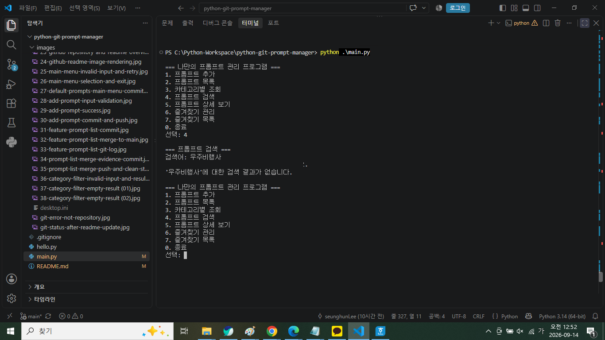

**그림 30. 검색 결과가 없는 경우의 안내 메시지 및 메인 메뉴 복귀 확인**

위 화면에서는 다음 과정을 확인할 수 있습니다.

- 메인 메뉴에서 `4. 프롬프트 검색` 선택
- 검색어 `우주비행사` 입력
- `'우주비행사'에 대한 검색 결과가 없습니다.` 안내 출력
- 오류 없이 메인 메뉴로 복귀

이를 통해 **검색어 입력 → 제목·내용 검색 → 검색 결과 없음 판단 → 사용자 안내 → 메인 메뉴 복귀** 흐름이 정상적으로 동작하는 것을 확인했습니다.

---

이번 실행 테스트를 통해 프롬프트 검색 기능에서 다음 사항을 실제로 검증했습니다.

| 확인 항목 | 결과 |
|---|---|
| 검색 메뉴 실행 | ✅ 정상 |
| 빈 검색어 입력 방지 | ✅ 정상 |
| 검색어 재입력 | ✅ 정상 |
| 제목 또는 내용 검색 | ✅ 정상 |
| 부분 문자열 검색 | ✅ 정상 |
| 검색 결과 제목 표시 | ✅ 정상 |
| 검색 결과 카테고리 표시 | ✅ 정상 |
| 즐겨찾기 `★ / ☆` 표시 | ✅ 정상 |
| 검색 결과 없음 안내 | ✅ 정상 |
| 검색 후 메인 메뉴 복귀 | ✅ 정상 |

따라서 이번 검색 기능은 과제에서 요구하는 **제목 또는 내용에 검색어가 포함된 프롬프트 검색과 검색 결과 없음 처리**를 모두 충족하는 것을 실제 실행 화면으로 확인했습니다.

---

### 13.10 현재 검색 기능의 범위와 한계

이번 검색 기능은 과제에서 요구하는 **제목 또는 내용 검색**을 중심으로 구현했습니다.

현재 지원하는 기능은 다음과 같습니다.

| 검색 기능 | 지원 여부 |
|---|---|
| 제목 검색 | ✅ |
| 내용 검색 | ✅ |
| 부분 문자열 검색 | ✅ |
| 영문 대소문자 차이 완화 | ✅ |
| 빈 검색어 검증 | ✅ |
| 검색 결과 없음 안내 | ✅ |
| 오타 자동 교정 | ❌ |
| 띄어쓰기 자동 보정 | ❌ |
| 유사어 검색 | ❌ |
| 정규식 검색 | ❌ |

과제의 필수 기능을 단순하고 이해하기 쉬운 방식으로 구현하는 것이 우선이므로 오타 교정이나 유사어 검색과 같은 복잡한 기능은 추가하지 않았습니다.

필요하다면 이후 기능 확장 단계에서 검색 정확도를 높이는 기능으로 발전시킬 수 있습니다.

---

## 14. 프롬프트 상세 보기

프롬프트 목록에서 번호를 선택하여 해당 프롬프트의 전체 정보를 확인할 수 있도록 상세 보기 기능을 구현했습니다.

메인 메뉴의 다음 항목을 선택하면 사용할 수 있습니다.

```text

5. 프롬프트 상세 보기

```

상세 보기 기능은 다음 흐름으로 동작합니다.

**프롬프트 목록 표시 → 번호 입력 → 번호 유효성 검사 → 선택한 프롬프트 상세 정보 출력 → 메인 메뉴 복귀**

---

### 14.1 프롬프트 목록 재사용**

상세 보기 기능에서는 사용자가 어떤 번호를 선택해야 하는지 먼저 확인할 수 있도록 기존의 `show_prompt_list()` 함수를 재사용했습니다.

```python

show_prompt_list()

```

따라서 상세 보기 기능에 별도의 목록 출력 코드를 다시 작성하지 않고 기존 목록 기능을 그대로 활용할 수 있습니다.

실행 시 다음과 같이 프롬프트 번호, 즐겨찾기 상태, 제목, 카테고리가 표시됩니다.

```text

=== 프롬프트 목록 ===
1. ☆ 몸 이상 신호 기반 컬러푸드 서비스 기획 [텍스트 생성]
2. ☆ 주식투자 위험 영상 이미지 수정 [이미지 생성]
3. ☆ 결과 캐싱 개념 설명 [텍스트 생성]
4. ☆ 복수 여행지 증빙 확인 [기타]

```

기존 함수를 재사용하면 같은 기능을 여러 위치에 중복해서 작성할 필요가 없기 때문에 코드 관리가 더 쉬워집니다.

---

### 14.2 프롬프트 번호 입력**

목록을 확인한 뒤 상세 정보를 보고 싶은 프롬프트 번호를 입력하도록 구현했습니다.

```python

choice = input("\n상세 보기할 프롬프트 번호: ").strip()

```

사용자가 입력한 값은 문자열이므로 먼저 숫자인지 확인합니다.

```python

if choice.isdigit():

```

숫자인 경우 정수로 변환합니다.

```python

number = int(choice)

```

그 다음 실제 프롬프트 개수 범위 안에 있는 번호인지 확인합니다.

```python

if 1 <= number <= len(prompts):

```

이 조건을 통과한 경우에만 해당 프롬프트를 선택합니다.

```python

prompt = prompts[number - 1]

```

Python의 List는 첫 번째 위치가 `0`부터 시작하므로 사용자가 입력한 번호에서 `1`을 빼서 실제 List 위치를 찾습니다.

예를 들어 사용자가 `2`를 입력하면 다음 데이터를 선택합니다.

```python

prompts[1]

```

즉 화면에서는 사람이 이해하기 쉽게 `1, 2, 3, 4`로 번호를 표시하고, 내부에서는 Python List의 `0, 1, 2, 3` 위치로 변환하여 데이터를 찾습니다.

---

### 14.3 잘못된 번호 처리**

사용자가 존재하지 않는 번호를 입력하거나 숫자가 아닌 값을 입력할 수 있습니다.

이 경우 프로그램이 오류로 종료되지 않도록 다음 안내 메시지를 출력합니다.

```python

print("잘못된 프롬프트 번호입니다. 다시 입력해주세요.")

```

이 코드는 `while True` 반복문 안에 있으므로 잘못된 번호를 입력해도 상세 보기 기능이 종료되지 않고 다시 번호를 입력할 수 있습니다.

실제 테스트에서는 존재하지 않는 번호인 `9`를 입력했습니다.

```text

상세 보기할 프롬프트 번호: 9
잘못된 프롬프트 번호입니다. 다시 입력해주세요.

```

이후 다시 정상 번호를 입력할 수 있음을 확인했습니다.

---

### 14.4 상세 정보 출력**

유효한 프롬프트 번호를 입력하면 해당 프롬프트의 다음 정보를 출력합니다.

- 번호

- 제목

- 카테고리

- 즐겨찾기 상태

- 전체 프롬프트 내용

즐겨찾기 상태는 기존 목록 기능과 동일하게 Boolean 값에 따라 `★` 또는 `☆`로 표시합니다.

```python

favorite_mark = "★" if prompt["favorite"] else "☆"

```

상세 정보는 다음 코드로 출력합니다.

```python

print("\n=== 프롬프트 상세 정보 ===")
print(f"번호: {number}")
print(f"제목: {prompt['title']}")
print(f"카테고리: {prompt['category']}")
print(f"즐겨찾기: {favorite_mark}")
print("내용:")
print(prompt["content"])

```

프롬프트 목록에서는 제목과 카테고리 정도만 간단히 확인할 수 있지만, 상세 보기에서는 `content` 전체를 그대로 출력합니다.

따라서 긴 프롬프트도 일부만 요약해서 보여주는 것이 아니라 실제 저장된 전체 내용을 확인할 수 있습니다.

---

### 14.5 빈 목록 처리**

등록된 프롬프트가 하나도 없는 경우에는 번호를 입력받을 필요가 없습니다.

따라서 다음 조건을 먼저 확인합니다.

```python

if not prompts:
    print("\n등록된 프롬프트가 없습니다.")
    return

```

프롬프트가 없으면 안내 메시지를 출력한 뒤 상세 보기 기능을 종료하고 메인 메뉴로 돌아갑니다.

현재 프로그램에는 기본 프롬프트 4개가 등록되어 있으므로 실제 테스트에서는 이 예외 상황이 발생하지 않았지만, 데이터가 비어 있는 경우에도 오류가 발생하지 않도록 처리했습니다.

---

### 14.6 입력 중단 처리**

번호 입력 도중 사용자가 `Ctrl+C` 또는 EOF 입력을 사용하는 경우에도 Python 오류 메시지가 그대로 출력되지 않도록 처리했습니다.

```python

try:
    choice = input("\n상세 보기할 프롬프트 번호: ").strip()
except (EOFError, KeyboardInterrupt):
    print("\n프롬프트 상세 보기를 취소합니다.")
    return

```

따라서 입력을 중단하면 상세 보기 기능만 종료되고 프로그램 전체가 비정상적으로 종료되지 않습니다.

---

### 14.7 메인 메뉴 연결**

메인 메뉴에서 `5`번을 선택하면 상세 보기 기능이 실행되도록 연결했습니다.

```python

elif choice == "5":
    show_prompt_detail()

```

상세 정보 출력이 끝나면 `show_prompt_detail()` 함수가 종료되고 `main()`의 반복문이 계속 실행되므로 다시 메인 메뉴가 표시됩니다.

따라서 별도의 메뉴 복귀 명령을 추가하지 않아도 자연스럽게 메인 메뉴로 돌아갑니다.

---

### 14.8 실제 실행 테스트**

구현한 프롬프트 상세 보기 기능을 다음 명령어로 실행하여 테스트했습니다.

```bash

python .\main.py

```

이번 테스트에서는 다음 흐름을 확인했습니다.

```text

5
9
2

```

먼저 메인 메뉴에서 `5. 프롬프트 상세 보기`를 선택했습니다.

프로그램은 등록된 프롬프트 목록 4개를 먼저 표시했습니다.

그 다음 실제 존재하지 않는 번호인 `9`를 입력했습니다.

```text

상세 보기할 프롬프트 번호: 9
잘못된 프롬프트 번호입니다. 다시 입력해주세요.

```

프로그램은 종료되지 않고 다시 번호를 입력할 수 있었습니다.

이어서 정상 번호인 `2`를 입력했습니다.

```text

상세 보기할 프롬프트 번호: 2

```

선택한 두 번째 프롬프트의 상세 정보가 다음과 같이 출력되었습니다.

```text

=== 프롬프트 상세 정보 ===
번호: 2
제목: 주식투자 위험 영상 이미지 수정
카테고리: 이미지 생성
즐겨찾기: ☆
내용:

```

이어서 실제 저장된 프롬프트의 전체 내용이 출력되었습니다.

#### 📷 잘못된 번호 처리 및 상세 정보 선택

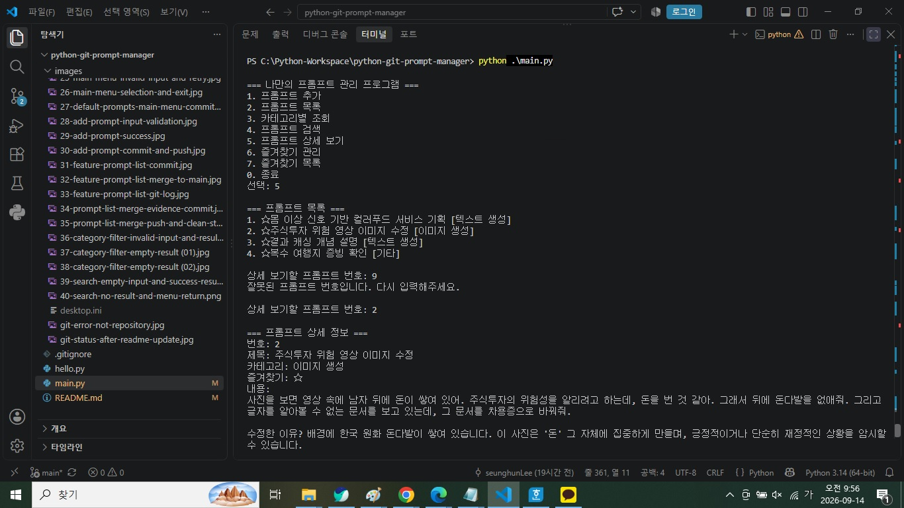

**그림 31. 잘못된 프롬프트 번호 재입력 및 정상 번호 선택 후 상세 정보 출력**

위 화면에서는 다음 내용을 확인할 수 있습니다.

- 메인 메뉴에서 `5. 프롬프트 상세 보기` 선택

- 기본 프롬프트 목록 4개 표시

- 존재하지 않는 번호 `9` 입력

- `잘못된 프롬프트 번호입니다. 다시 입력해주세요.` 안내 출력

- 정상 번호 `2` 재입력

- 선택한 프롬프트의 번호·제목·카테고리·즐겨찾기 표시

- 상세 내용 출력 시작

이를 통해 **목록 확인 → 잘못된 번호 검증 → 정상 번호 재입력 → 상세 데이터 선택** 흐름이 정상적으로 동작하는 것을 확인했습니다.

---

#### 📷 전체 프롬프트 내용 및 메인 메뉴 복귀 확인


**그림 32. 선택한 프롬프트의 전체 내용 출력 및 메인 메뉴 복귀 확인**

두 번째 화면에서는 선택한 `주식투자 위험 영상 이미지 수정` 프롬프트의 전체 내용이 실제 저장된 상태 그대로 출력되는 것을 확인했습니다.

내용에는 주식투자 위험성을 표현하기 위해 영상 속 돈다발을 제거하고 문서를 차용증으로 변경하도록 요청한 내용과, 해당 수정을 요청한 이유까지 모두 표시되었습니다.

따라서 상세 보기 기능이 프롬프트 내용을 일부만 표시하거나 생략하는 것이 아니라 `content`에 저장된 전체 내용을 정상적으로 출력하는 것을 확인했습니다.

또한 상세 정보 출력이 끝난 뒤 다음 메인 메뉴가 다시 표시되었습니다.

```text

=== 나만의 프롬프트 관리 프로그램 ===

```

이를 통해 상세 보기 기능 수행 후 프로그램이 종료되지 않고 메인 메뉴로 정상 복귀하는 것도 확인했습니다.

---

### 14.9 구현 결과 정리**

이번 프롬프트 상세 보기 기능에서는 다음 항목을 실제 실행으로 확인했습니다.

| 확인 항목 | 결과 |
|---|---|
| 프롬프트 목록 표시 | ✅ 정상 |
| 프롬프트 번호 입력 | ✅ 정상 |
| 잘못된 번호 재입력 | ✅ 정상 |
| 선택한 프롬프트 번호 출력 | ✅ 정상 |
| 제목 출력 | ✅ 정상 |
| 카테고리 출력 | ✅ 정상 |
| 즐겨찾기 상태 `★ / ☆` 출력 | ✅ 정상 |
| 전체 프롬프트 내용 출력 | ✅ 정상 |
| 상세 보기 후 메인 메뉴 복귀 | ✅ 정상 |
| 빈 목록 예외 처리 코드 | ✅ 구현 |
| 입력 중단 예외 처리 | ✅ 구현 |

이번 기능을 통해 단순히 목록에서 제목만 확인하는 것을 넘어, 사용자가 원하는 프롬프트를 번호로 선택하고 저장된 전체 정보를 확인할 수 있게 되었습니다.

또한 정상 번호만 테스트하지 않고 존재하지 않는 번호 `9`를 먼저 입력하여 잘못된 번호 처리 기능도 함께 검증했습니다.

전체 흐름은 다음과 같습니다.

**메인 메뉴 → 프롬프트 목록 표시 → 잘못된 번호 처리 → 정상 번호 선택 → 상세 정보 및 전체 내용 출력 → 메인 메뉴 복귀**

---

## 15. 즐겨찾기 관리

자주 사용하는 프롬프트를 별도로 확인할 수 있도록 즐겨찾기 관리 기능과 즐겨찾기 목록 기능을 구현했습니다.

각 프롬프트는 다음과 같이 `favorite` 값을 가지고 있습니다.

```python
"favorite": False
```

`False`는 즐겨찾기가 아닌 상태를 의미하고, `True`는 즐겨찾기로 등록된 상태를 의미합니다.

화면에서는 Boolean 값을 그대로 보여주는 대신 다음 기호를 사용했습니다.

| 값 | 화면 표시 | 의미 |
|---|---|---|
| `False` | ☆ | 즐겨찾기 아님 |
| `True` | ★ | 즐겨찾기 등록 |

메인 메뉴에서는 다음 두 기능을 사용합니다.

```text
6. 즐겨찾기 관리
7. 즐겨찾기 목록
```

전체 흐름은 다음과 같습니다.

**프롬프트 번호 선택 → 즐겨찾기 상태 변경 → ☆/★ 표시 확인 → 즐겨찾기 목록에서 반영 결과 확인**

---

### 15.1 Boolean을 이용한 즐겨찾기 상태 관리

즐겨찾기 기능에서는 각 프롬프트의 `favorite` 값을 Boolean 자료형으로 관리합니다.

Boolean은 참과 거짓 두 가지 상태를 나타내는 자료형입니다.

Python에서는 다음 두 값으로 표현합니다.

```python
True
False
```

이번 프로그램에서는 다음과 같이 사용합니다.

```text
False → 즐겨찾기 아님
True  → 즐겨찾기 등록
```

새로운 프롬프트를 추가할 때는 기본적으로 다음과 같이 저장합니다.

```python
"favorite": False
```

따라서 사용자가 직접 즐겨찾기로 지정하기 전까지는 모든 새 프롬프트가 ☆ 상태로 시작합니다.

---

### 15.2 즐겨찾기 상태 변경 함수

프롬프트의 즐겨찾기 상태를 변경하기 위해 `toggle_favorite()` 함수를 구현했습니다.

```python
def toggle_favorite():
    """선택한 프롬프트의 즐겨찾기 상태를 반대로 변경한다."""
```

먼저 등록된 프롬프트가 없는지 확인합니다.

```python
if not prompts:
    print("등록된 프롬프트가 없습니다.")
    return
```

등록된 프롬프트가 있다면 기존 `show_prompt_list()` 함수를 사용하여 목록을 보여줍니다.

```python
show_prompt_list()
```

사용자는 목록을 확인한 뒤 즐겨찾기 상태를 변경할 프롬프트 번호를 입력합니다.

```python
choice = input("\n즐겨찾기를 변경할 프롬프트 번호: ").strip()
```

---

### 15.3 프롬프트 번호 검증

사용자가 입력한 번호가 실제 프롬프트 범위에 있는지 확인합니다.

```python
if choice.isdigit():
    number = int(choice)

    if 1 <= number <= len(prompts):
```

숫자가 아니거나 실제 존재하지 않는 번호라면 다음 안내 메시지를 출력합니다.

```text
잘못된 프롬프트 번호입니다. 다시 입력해주세요.
```

이 검증은 `while True` 반복문 안에서 수행되므로 잘못된 번호를 입력해도 기능이 종료되지 않고 다시 입력할 수 있습니다.

실제 테스트에서도 존재하지 않는 번호인 `9`를 먼저 입력하여 잘못된 번호 처리 기능을 확인했습니다.

---

### 15.4 즐겨찾기 Toggle 동작

유효한 프롬프트 번호를 입력하면 선택한 프롬프트를 가져옵니다.

```python
prompt = prompts[number - 1]
```

그 다음 다음 코드로 현재 즐겨찾기 상태를 반대로 변경합니다.

```python
prompt["favorite"] = not prompt["favorite"]
```

여기서 `not`은 Boolean 값을 반대로 바꾸는 연산자입니다.

따라서 다음과 같이 동작합니다.

```text
False → True
True → False
```

이처럼 하나의 선택 동작으로 두 상태를 서로 바꾸는 방식을 **Toggle(토글)**이라고 합니다.

즐겨찾기가 등록된 경우에는 다음 메시지를 출력합니다.

```text
즐겨찾기: ★
즐겨찾기에 추가되었습니다.
```

반대로 이미 즐겨찾기된 프롬프트를 다시 선택하면 다음처럼 해제됩니다.

```text
즐겨찾기: ☆
즐겨찾기에서 해제되었습니다.
```

따라서 별도의 “추가 메뉴”와 “삭제 메뉴”를 각각 만들지 않고 같은 기능에서 즐겨찾기 등록과 해제를 모두 처리할 수 있습니다.

---

### 15.5 즐겨찾기 목록 필터링

즐겨찾기로 등록된 프롬프트만 확인할 수 있도록 `show_favorites()` 함수를 구현했습니다.

```python
def show_favorites():
    """즐겨찾기로 등록된 프롬프트만 출력한다."""
```

다음 List Comprehension을 사용하여 `favorite` 값이 `True`인 프롬프트만 선택합니다.

```python
favorite_prompts = [
    (index, prompt)
    for index, prompt in enumerate(prompts, start=1)
    if prompt["favorite"]
]
```

여기서는 프롬프트 자체뿐 아니라 원래 번호도 함께 저장합니다.

따라서 전체 목록의 2번 프롬프트가 즐겨찾기되었다면 즐겨찾기 목록에서도 다음처럼 원래 번호 `2`가 유지됩니다.

```text
2. ★ 주식투자 위험 영상 이미지 수정 [이미지 생성]
```

원래 번호를 유지하면 즐겨찾기 목록을 확인한 뒤 다시 상세 보기나 즐겨찾기 관리 기능에서 같은 번호를 사용할 수 있다는 장점이 있습니다.

---

### 15.6 즐겨찾기 항목이 없는 경우 처리

프로그램을 처음 실행하면 모든 기본 프롬프트의 `favorite` 값은 `False`입니다.

따라서 아직 즐겨찾기를 설정하지 않은 상태에서 `7. 즐겨찾기 목록`을 선택하면 결과가 없습니다.

이 경우 빈 화면을 보여주는 대신 다음 조건으로 안내 메시지를 출력합니다.

```python
if not favorite_prompts:
    print("즐겨찾기한 프롬프트가 없습니다.")
    return
```

화면에는 다음과 같이 표시됩니다.

```text
=== 즐겨찾기 목록 ===
즐겨찾기한 프롬프트가 없습니다.
```

이를 통해 사용자는 프로그램 오류가 아니라 아직 즐겨찾기로 등록된 데이터가 없다는 사실을 알 수 있습니다.

---

### 15.7 메인 메뉴 연결

메인 메뉴에서 `6`번을 선택하면 즐겨찾기 상태 변경 기능이 실행됩니다.

```python
elif choice == "6":
    toggle_favorite()
```

`7`번을 선택하면 즐겨찾기로 등록된 프롬프트만 출력합니다.

```python
elif choice == "7":
    show_favorites()
```

두 함수 모두 실행이 끝나면 `main()`의 반복문으로 돌아가므로 별도의 복귀 메뉴를 작성하지 않아도 메인 메뉴가 다시 표시됩니다.

---

### 15.8 프로그램 실행 중에만 상태 유지

이번 과제의 기본 동작에서는 즐겨찾기 상태를 파일에 자동 저장하지 않습니다.

예를 들어 프로그램 실행 중 2번 프롬프트를 즐겨찾기로 변경하면 해당 실행 동안에는 다음 상태가 유지됩니다.

```text
2. ★ 주식투자 위험 영상 이미지 수정
```

그러나 프로그램을 종료한 뒤 다시 실행하면 기본 데이터에 작성된 다음 값으로 다시 시작합니다.

```python
"favorite": False
```

따라서 기본 기능에서는 프로그램을 종료하면 즐겨찾기 상태도 초기화됩니다.

이는 데이터를 자동으로 JSON 파일에 저장하거나 자동으로 불러오지 않고 **프로그램 실행 중에만 변경된 데이터를 유지하는 현재 과제의 기본 동작**과 같습니다.

추후 Bonus 기능으로 JSON 저장·불러오기를 구현하더라도 기본 실행 동작과 충돌하지 않도록 사용자가 직접 저장 또는 불러오기를 선택하는 별도 기능으로 구현할 수 있습니다.

---

### 15.9 실제 실행 테스트

즐겨찾기 관리 기능과 즐겨찾기 목록 기능을 구현한 뒤 실제 실행 테스트를 수행했습니다.

다음 명령어로 프로그램을 실행했습니다.

```bash
python .\main.py
```

이번 테스트는 프로그램을 중간에 종료하지 않고 **한 번의 실행 상태에서 연속으로 수행**했습니다.

입력 순서는 다음과 같습니다.

```text
7
6
9
2
7
6
2
7
0
```

이를 통해 다음 내용을 순서대로 검증했습니다.

1. 초기 즐겨찾기 없음 확인
2. 잘못된 프롬프트 번호 `9` 재입력 처리
3. 2번 프롬프트의 `False → True` 변경
4. 즐겨찾기 표시 `☆ → ★` 변경
5. 즐겨찾기 목록에 2번 프롬프트가 실제로 반영되는지 확인
6. 같은 2번 프롬프트를 다시 선택하여 `True → False` 변경
7. 즐겨찾기 표시 `★ → ☆` 변경
8. 즐겨찾기 목록이 다시 비어 있는 상태인지 확인
9. `0`을 입력하여 프로그램 정상 종료

---

#### 테스트 1 — 초기 즐겨찾기 없음 확인

프로그램을 처음 실행한 뒤 메인 메뉴에서 다음 번호를 선택했습니다.

```text
7
```

기본 프롬프트 4개의 `favorite` 값은 모두 `False`이므로 실제 실행 결과 다음과 같이 표시되었습니다.

```text
=== 즐겨찾기 목록 ===
즐겨찾기한 프롬프트가 없습니다.
```

이후 프로그램이 종료되지 않고 다시 메인 메뉴로 복귀했습니다.

#### 📷 초기 즐겨찾기 없음 확인

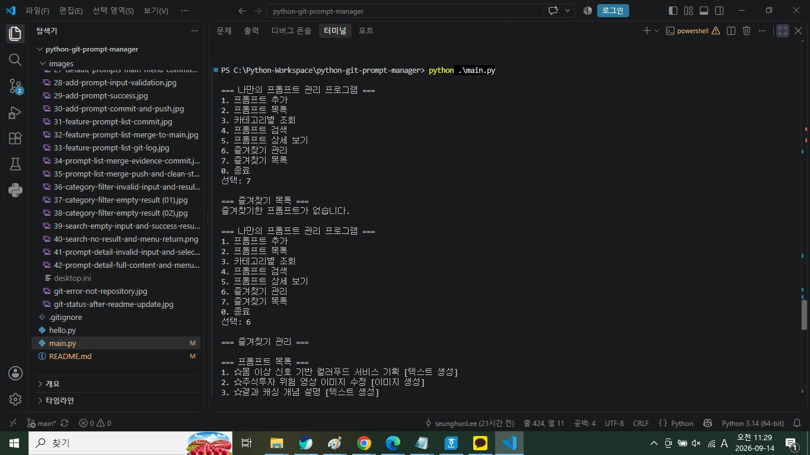

**그림 33. 프로그램 최초 실행 상태에서 즐겨찾기 목록이 비어 있음을 확인**

위 화면에서는 `7. 즐겨찾기 목록`을 선택했을 때 아직 즐겨찾기로 등록된 프롬프트가 없다는 안내가 정상적으로 표시되는 것을 확인할 수 있습니다.

또한 안내 메시지 출력 후 다시 메인 메뉴가 표시되고 `6. 즐겨찾기 관리` 기능으로 이동할 수 있어 프로그램이 정상적으로 계속 실행되는 것도 확인했습니다.

---

#### 테스트 2 — 잘못된 번호 처리 후 즐겨찾기 등록

메인 메뉴에서 다음 번호를 선택했습니다.

```text
6
```

즐겨찾기 관리 화면에는 현재 등록된 프롬프트 목록이 표시되었습니다.

먼저 실제 목록에 존재하지 않는 번호인 `9`를 입력했습니다.

```text
즐겨찾기를 변경할 프롬프트 번호: 9
```

실제 실행 결과 다음 메시지가 표시되었습니다.

```text
잘못된 프롬프트 번호입니다. 다시 입력해주세요.
```

프로그램은 즐겨찾기 관리 기능을 종료하지 않고 다시 번호를 입력할 수 있도록 했습니다.

이어서 정상 번호인 `2`를 입력했습니다.

```text
즐겨찾기를 변경할 프롬프트 번호: 2
```

실행 결과는 다음과 같았습니다.

```text
제목: 주식투자 위험 영상 이미지 수정
즐겨찾기: ★
즐겨찾기에 추가되었습니다.
```

2번 프롬프트의 기존 상태는 `False`였으므로 `not` 연산에 의해 `True`로 변경되었고, 화면 표시도 `☆`에서 `★`로 변경되었습니다.

#### 📷 잘못된 번호 검증 및 즐겨찾기 등록

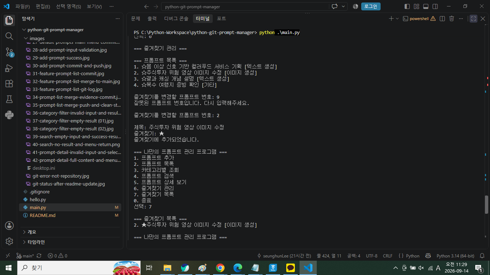

**그림 34. 잘못된 프롬프트 번호 재입력 후 2번 프롬프트 즐겨찾기 등록 성공**

위 화면에서는 다음 흐름을 확인할 수 있습니다.

- `6. 즐겨찾기 관리` 선택
- 전체 프롬프트 목록 표시
- 존재하지 않는 번호 `9` 입력
- 잘못된 번호 안내 메시지 출력
- 정상 번호 `2` 재입력
- `주식투자 위험 영상 이미지 수정` 선택
- 즐겨찾기 상태 `☆ → ★` 변경
- `즐겨찾기에 추가되었습니다.` 메시지 출력

이를 통해 **잘못된 입력 검증과 즐겨찾기 등록 기능이 모두 정상적으로 동작하는 것**을 확인했습니다.

---

#### 테스트 3 — 즐겨찾기 목록 실제 반영 확인

즐겨찾기 등록 후 다시 메인 메뉴에서 다음 번호를 선택했습니다.

```text
7
```

실제 실행 결과 다음 항목이 출력되었습니다.

```text
=== 즐겨찾기 목록 ===
2. ★ 주식투자 위험 영상 이미지 수정 [이미지 생성]
```

전체 프롬프트 중 `favorite=True`가 된 2번 프롬프트만 즐겨찾기 목록에 표시되었습니다.

또한 즐겨찾기 전용 목록에서도 별도의 새 번호를 부여하지 않고 전체 목록에서 사용하던 원래 번호 `2`가 그대로 유지되었습니다.

#### 📷 즐겨찾기 목록 반영 확인


**그림 35. 즐겨찾기로 등록한 2번 프롬프트가 즐겨찾기 목록에 실제 반영된 결과**

이 화면을 통해 즐겨찾기 변경 메시지만 출력되는 것이 아니라 실제 `favorite` 값의 변경 결과가 이후 `7. 즐겨찾기 목록` 기능에도 반영되는 것을 확인했습니다.

즉 다음 데이터 흐름이 정상적으로 연결되어 있습니다.

**2번 프롬프트 선택 → `favorite=False`에서 `True`로 변경 → ★ 표시 → 즐겨찾기 목록에서 해당 항목만 필터링하여 출력**

---

#### 테스트 4 — 즐겨찾기 해제 및 빈 목록 복귀

즐겨찾기 등록이 정상적으로 반영된 것을 확인한 뒤 다시 메인 메뉴에서 `6. 즐겨찾기 관리`를 선택했습니다.

이번에는 이미 즐겨찾기로 등록되어 있는 같은 2번 프롬프트를 다시 선택했습니다.

```text
즐겨찾기를 변경할 프롬프트 번호: 2
```

실행 결과는 다음과 같았습니다.

```text
제목: 주식투자 위험 영상 이미지 수정
즐겨찾기: ☆
즐겨찾기에서 해제되었습니다.
```

기존 `True` 상태가 `not` 연산을 통해 다시 `False`로 변경된 것을 확인했습니다.

그 다음 메인 메뉴에서 다시 `7. 즐겨찾기 목록`을 선택했습니다.

```text
=== 즐겨찾기 목록 ===
즐겨찾기한 프롬프트가 없습니다.
```

앞에서 즐겨찾기로 등록했던 2번 프롬프트가 정상적으로 해제되었기 때문에 즐겨찾기 목록이 다시 비어 있는 상태로 돌아왔습니다.

마지막으로 다음 번호를 입력했습니다.

```text
0
```

실행 결과 다음 메시지가 표시되었습니다.

```text
프로그램을 종료합니다.
```

#### 📷 즐겨찾기 해제, 빈 목록 복귀 및 정상 종료

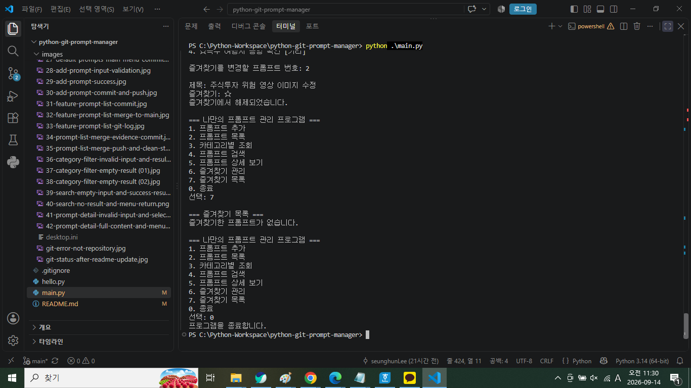

**그림 36. 즐겨찾기 해제 후 빈 목록 복귀 및 프로그램 정상 종료 확인**

위 화면에서는 다음 전체 흐름을 확인할 수 있습니다.

- 이미 즐겨찾기된 2번 프롬프트 재선택
- 즐겨찾기 상태 `★ → ☆` 변경
- `즐겨찾기에서 해제되었습니다.` 안내
- `7. 즐겨찾기 목록` 재실행
- `즐겨찾기한 프롬프트가 없습니다.` 표시
- 메인 메뉴 복귀
- `0` 선택
- 프로그램 정상 종료

이를 통해 즐겨찾기 기능이 단순히 `False → True` 한 방향으로만 동작하는 것이 아니라 **`False ↔ True` 양방향 Toggle 기능으로 정상 작동하는 것**을 실제 실행으로 검증했습니다.

---

### 15.10 현재 즐겨찾기 기능의 범위와 한계

현재 구현한 기본 즐겨찾기 기능은 다음을 지원합니다.

| 기능 | 지원 여부 |
|---|---|
| 즐겨찾기 등록 | ✅ 지원 |
| 즐겨찾기 해제 | ✅ 지원 |
| 잘못된 프롬프트 번호 재입력 | ✅ 지원 |
| 즐겨찾기된 프롬프트만 조회 | ✅ 지원 |
| 즐겨찾기 없음 안내 | ✅ 지원 |
| 전체 목록의 원래 번호 유지 | ✅ 지원 |
| 프로그램 실행 중 상태 유지 | ✅ 지원 |
| 프로그램 재시작 후 자동 유지 | ❌ 기본 기능에서는 지원하지 않음 |

현재 단계에서는 프로그램 실행 중에만 즐겨찾기 상태를 유지합니다.

프로그램을 종료하면 기본 데이터의 `favorite=False` 상태로 다시 시작합니다.

실제 테스트에서도 한 번의 프로그램 실행 안에서 `False → True → False` 순서로 상태가 정상적으로 유지·변경되는 것을 확인했습니다.

이 동작은 과제의 기본 기능 요구사항과 맞으며, 영구 저장은 이후 Bonus JSON 저장·불러오기 기능과 분리하여 구현하는 것이 적절합니다.

이번 실제 테스트를 통해 다음 전체 흐름을 확인했습니다.

**즐겨찾기 없음 확인 → 즐겨찾기 관리 진입 → 잘못된 번호 처리 → 즐겨찾기 등록 → 즐겨찾기 목록 반영 → 같은 프롬프트 재선택 → 즐겨찾기 해제 → 빈 목록 복귀 → 정상 종료**

---

## 16. 함수 분리와 코드 구조

이번 프로그램에서는 모든 기능을 하나의 큰 함수에 작성하지 않고, 역할에 따라 여러 함수로 나누어 구현했습니다.

함수(Function)는 특정 작업을 수행하는 코드를 하나의 이름으로 묶은 것입니다.

예를 들어 프롬프트 목록을 출력하는 코드가 필요할 때마다 같은 코드를 반복해서 작성하는 대신 `show_prompt_list()`라는 함수를 한 번 만들어 두고 필요한 곳에서 호출할 수 있습니다.

이처럼 기능별로 함수를 분리하면 다음과 같은 장점이 있습니다.

- 각 코드가 어떤 역할을 하는지 쉽게 파악할 수 있습니다.
- 문제가 발생했을 때 수정해야 할 위치를 찾기 쉽습니다.
- 같은 기능을 여러 곳에서 다시 사용할 수 있습니다.
- 하나의 함수가 너무 길어지는 것을 방지할 수 있습니다.
- 새로운 기능을 추가할 때 기존 코드에 미치는 영향을 줄일 수 있습니다.

이번 과제에서도 모든 코드를 하나의 함수에 작성하지 않고 기능별로 분리하도록 요구하고 있으므로, 실제 프로그램도 각 역할에 맞는 함수로 구성했습니다.

---

### 16.1 현재 프로그램의 함수 구성

현재 `main.py`에서 사용하는 주요 함수는 다음과 같습니다.

| 함수 | 역할 |
|---|---|
| `show_menu()` | 메인 메뉴 출력 |
| `get_non_empty_input()` | 빈 값을 허용하지 않고 입력을 반복해서 받음 |
| `select_category()` | 프롬프트 추가 시 기본 카테고리 선택 또는 직접 입력 |
| `add_prompt()` | 새로운 프롬프트 추가 |
| `show_prompt_list()` | 전체 프롬프트 목록 출력 |
| `get_available_categories()` | 기본 카테고리와 사용자 정의 카테고리를 함께 수집 |
| `select_category_for_filter()` | 카테고리별 조회에 사용할 카테고리 선택 |
| `show_prompts_by_category()` | 선택한 카테고리의 프롬프트만 출력 |
| `search_prompts()` | 제목 또는 내용에 검색어가 포함된 프롬프트 검색 |
| `show_prompt_detail()` | 선택한 프롬프트의 전체 상세 정보 출력 |
| `toggle_favorite()` | 선택한 프롬프트의 즐겨찾기 상태 변경 |
| `show_favorites()` | 즐겨찾기로 등록된 프롬프트만 출력 |
| `main()` | 메인 메뉴와 각 기능을 연결하고 프로그램 실행 흐름 관리 |

실제 프로그램에는 단순히 메뉴별 기능 함수만 있는 것이 아니라, 여러 기능에서 공통으로 사용할 수 있는 보조 함수도 함께 분리했습니다.

---

### 16.2 메인 메뉴 출력 함수

메인 메뉴 출력은 `show_menu()`가 담당합니다.

```python
def show_menu():
    """메인 메뉴를 출력한다."""
    print("\n=== 나만의 프롬프트 관리 프로그램 ===")
    print("1. 프롬프트 추가")
    print("2. 프롬프트 목록")
    print("3. 카테고리별 조회")
    print("4. 프롬프트 검색")
    print("5. 프롬프트 상세 보기")
    print("6. 즐겨찾기 관리")
    print("7. 즐겨찾기 목록")
    print("0. 종료")
```

메뉴 출력 코드를 `main()` 안에 직접 모두 작성하지 않고 별도 함수로 분리했습니다.

따라서 메뉴 문구를 수정해야 하는 경우 `show_menu()` 한 곳만 수정하면 됩니다.

---

### 16.3 공통 입력 검증 함수

프롬프트 제목, 내용, 직접 입력 카테고리, 검색어 등에서는 빈 값을 입력하지 못하도록 해야 합니다.

이 기능을 매번 따로 작성하지 않고 다음 공통 함수를 사용했습니다.

```python
def get_non_empty_input(message):
    """빈 값을 허용하지 않고 입력을 반복해서 받는다."""
    while True:
        try:
            value = input(message).strip()
        except (EOFError, KeyboardInterrupt):
            return None

        if value:
            return value

        print("빈 값은 입력할 수 없습니다. 다시 입력해주세요.")
```

이 함수는 입력값에서 앞뒤 공백을 제거한 뒤 실제 내용이 있는지 확인합니다.

입력값이 비어 있으면 다음 메시지를 출력하고 다시 입력을 받습니다.

```text
빈 값은 입력할 수 없습니다. 다시 입력해주세요.
```

현재 이 함수는 프롬프트 추가와 검색 기능 등에서 재사용됩니다.

예를 들어 프롬프트 추가에서는 다음과 같이 사용합니다.

```python
title = get_non_empty_input("제목: ")
content = get_non_empty_input("내용: ")
```

검색에서는 다음처럼 같은 함수를 다시 사용합니다.

```python
keyword = get_non_empty_input("검색어: ")
```

이처럼 같은 입력 검증 코드를 여러 기능에서 반복 작성하지 않고 하나의 함수로 재사용했습니다.

---

### 16.4 프롬프트 추가 기능의 함수 분리

프롬프트 추가 기능에서는 카테고리 선택과 실제 프롬프트 추가 작업을 서로 다른 함수로 나누었습니다.

카테고리 선택은 다음 함수가 담당합니다.

```python
select_category()
```

실제 새로운 프롬프트 Dictionary를 만들고 `prompts` List에 추가하는 작업은 다음 함수가 담당합니다.

```python
add_prompt()
```

전체 흐름은 다음과 같습니다.

```text
add_prompt()
    ↓
get_non_empty_input()
    ↓
select_category()
    ↓
새 Dictionary 생성
    ↓
prompts.append()
```

따라서 `add_prompt()` 하나에 입력 검증, 카테고리 출력, 데이터 저장 코드를 모두 길게 작성하지 않고 역할을 나누었습니다.

---

### 16.5 프롬프트 목록 함수 재사용

전체 프롬프트 목록은 `show_prompt_list()` 함수에서 출력합니다.

```python
def show_prompt_list():
    """등록된 프롬프트 목록을 번호, 제목, 카테고리, 즐겨찾기와 함께 출력한다."""
```

이 함수는 메인 메뉴의 `2. 프롬프트 목록` 기능에서만 사용하는 것이 아니라 다른 기능에서도 재사용합니다.

예를 들어 프롬프트 상세 보기에서는 먼저 사용자가 선택할 번호를 확인할 수 있도록 전체 목록을 보여줍니다.

```python
show_prompt_list()
```

즐겨찾기 관리 기능에서도 같은 방식으로 전체 목록을 다시 사용합니다.

```python
show_prompt_list()
```

즉 동일한 목록 출력 코드를 상세 보기 함수와 즐겨찾기 함수에 각각 다시 작성하지 않았습니다.

이것이 함수를 분리한 가장 대표적인 재사용 사례입니다.

---

### 16.6 카테고리별 조회 기능의 역할 분리

카테고리별 조회는 하나의 함수에서 모든 작업을 처리하지 않고 세 단계로 나누었습니다.

첫 번째 함수는 사용할 수 있는 카테고리를 수집합니다.

```python
get_available_categories()
```

두 번째 함수는 사용자가 조회할 카테고리를 선택하도록 합니다.

```python
select_category_for_filter()
```

세 번째 함수는 실제로 선택한 카테고리의 프롬프트를 필터링하여 출력합니다.

```python
show_prompts_by_category()
```

전체 흐름은 다음과 같습니다.

```text
get_available_categories()
        ↓
select_category_for_filter()
        ↓
show_prompts_by_category()
```

이렇게 나누면 카테고리 목록을 만드는 코드와 사용자 입력을 받는 코드, 실제 데이터 필터링 코드를 각각 독립적으로 확인할 수 있습니다.

---

### 16.7 검색 기능 분리

검색 기능은 `search_prompts()` 함수가 담당합니다.

```python
def search_prompts():
    """제목 또는 내용에 검색어가 포함된 프롬프트를 찾는다."""
```

검색어 입력에는 기존의 `get_non_empty_input()` 함수를 재사용합니다.

```python
keyword = get_non_empty_input("검색어: ")
```

따라서 검색 함수에서는 빈 입력 검증 코드를 다시 만들지 않고 실제 검색 작업에 집중할 수 있습니다.

검색 함수에서는 다음 작업을 담당합니다.

```text
검색어 입력
→ casefold() 처리
→ 제목 검색
→ 내용 검색
→ 결과 존재 여부 확인
→ 결과 출력
```

---

### 16.8 상세 보기 기능 분리

프롬프트 상세 정보 출력은 `show_prompt_detail()` 함수가 담당합니다.

```python
def show_prompt_detail():
    """선택한 프롬프트의 상세 정보를 출력한다."""
```

이 함수에서도 기존 `show_prompt_list()`를 재사용합니다.

```text
show_prompt_list()
        ↓
프롬프트 번호 입력
        ↓
번호 유효성 검사
        ↓
선택한 프롬프트 확인
        ↓
전체 내용 출력
```

따라서 전체 목록 기능과 상세 정보 기능이 서로 연결되지만 각각의 역할은 분리되어 있습니다.

---

### 16.9 즐겨찾기 기능 분리

즐겨찾기는 상태를 변경하는 기능과 즐겨찾기된 항목을 조회하는 기능을 서로 다른 함수로 나누었습니다.

즐겨찾기 상태 변경:

```python
toggle_favorite()
```

즐겨찾기 목록 출력:

```python
show_favorites()
```

`toggle_favorite()`는 선택한 프롬프트의 다음 값을 변경합니다.

```python
prompt["favorite"] = not prompt["favorite"]
```

반면 `show_favorites()`는 `favorite=True`인 프롬프트만 골라서 출력합니다.

즉 다음 두 역할을 분리했습니다.

```text
toggle_favorite()
→ 데이터의 즐겨찾기 상태 변경

show_favorites()
→ 현재 즐겨찾기 상태를 기준으로 목록 조회
```

등록과 조회를 한 함수에 모두 넣지 않았기 때문에 각 함수의 목적이 명확합니다.

---

### 16.10 `main()` 함수의 역할

`main()` 함수는 각 기능의 세부 내용을 직접 구현하는 함수가 아니라 프로그램의 전체 실행 흐름을 관리하는 역할을 합니다.

메뉴를 출력한 뒤 사용자의 선택에 따라 앞에서 만든 함수를 호출합니다.

핵심 구조는 다음과 같습니다.

```python
def main():
    while True:
        show_menu()

        choice = input("선택: ").strip()

        if choice == "1":
            add_prompt()

        elif choice == "2":
            show_prompt_list()

        elif choice == "3":
            show_prompts_by_category()

        elif choice == "4":
            search_prompts()

        elif choice == "5":
            show_prompt_detail()

        elif choice == "6":
            toggle_favorite()

        elif choice == "7":
            show_favorites()

        elif choice == "0":
            print("프로그램을 종료합니다.")
            break
```

즉 `main()`은 각 기능의 실제 처리 코드를 직접 가지고 있기보다 **어떤 메뉴 번호가 어떤 함수를 실행할지 연결하는 역할**을 합니다.

이 구조 덕분에 사용자가 새로운 메뉴 기능을 추가하더라도 해당 기능의 함수를 별도로 작성하고 `main()`에서 연결하면 됩니다.

---

### 16.11 함수 호출 구조

현재 프로그램의 주요 함수 관계를 간단하게 표현하면 다음과 같습니다.

```text
main()
│
├── show_menu()
│
├── add_prompt()
│   ├── get_non_empty_input()
│   └── select_category()
│       └── get_non_empty_input()
│
├── show_prompt_list()
│
├── show_prompts_by_category()
│   └── select_category_for_filter()
│       └── get_available_categories()
│
├── search_prompts()
│   └── get_non_empty_input()
│
├── show_prompt_detail()
│   └── show_prompt_list()
│
├── toggle_favorite()
│   └── show_prompt_list()
│
└── show_favorites()
```

이 구조를 보면 하나의 함수 안에 모든 작업이 몰려 있는 것이 아니라, 필요한 기능을 서로 호출하면서 프로그램이 동작한다는 것을 확인할 수 있습니다.

---

### 16.12 함수 분리의 실제 장점

이번 프로그램을 기능별 함수로 나누면서 다음과 같은 장점을 확인할 수 있었습니다.

| 장점 | 이번 프로그램의 사례 |
|---|---|
| 가독성 | 함수 이름만 보아도 역할을 어느 정도 알 수 있음 |
| 재사용 | `show_prompt_list()`를 상세 보기와 즐겨찾기 관리에서도 사용 |
| 입력 검증 공통화 | `get_non_empty_input()`을 추가 기능과 검색 기능에서 함께 사용 |
| 수정 용이 | 특정 기능 변경 시 해당 함수 중심으로 수정 가능 |
| 오류 추적 | 문제가 발생한 기능의 함수를 중심으로 확인 가능 |
| 기능 확장 | 새 기능을 함수로 작성한 뒤 `main()`에 연결 가능 |

특히 `show_prompt_list()`와 `get_non_empty_input()`처럼 여러 기능에서 실제로 재사용한 함수가 있기 때문에 단순히 “함수를 여러 개 만들었다”는 것뿐 아니라 **중복 코드를 줄이기 위해 함수 분리를 실제로 활용했다는 점**을 확인할 수 있습니다.

---

### 16.13 현재 코드 구조의 한계

현재 프로그램은 학습용 콘솔 프로그램이므로 모든 기능을 하나의 `main.py` 파일 안에서 함수 단위로 나누었습니다.

프로그램 규모가 더 커진다면 다음과 같이 여러 Python 파일로 다시 분리할 수도 있습니다.

```text
main.py
prompt_manager.py
input_utils.py
storage.py
```

예를 들어 프롬프트 데이터 관리 기능과 입력 검증 기능을 별도 Module로 분리하면 코드 규모가 커져도 관리하기 쉬워집니다.

하지만 현재 과제 규모에서는 파일을 지나치게 세분화하는 것보다 **하나의 `main.py` 안에서 기능별 함수가 명확하게 분리되어 있는 구조가 초보자가 전체 흐름을 이해하기에 더 적절하다**고 판단했습니다.

---

### 16.14 구현 결과 정리

현재 프로그램에서는 메뉴별 기능과 공통 기능을 각각 함수로 분리했습니다.

실제 사용 중인 함수는 다음과 같습니다.

```text
show_menu()
get_non_empty_input()
select_category()
add_prompt()
show_prompt_list()
get_available_categories()
select_category_for_filter()
show_prompts_by_category()
search_prompts()
show_prompt_detail()
toggle_favorite()
show_favorites()
main()
```

이를 통해 과제에서 요구하는 **모든 코드를 하나의 함수에 작성하지 않고 기능별로 분리하는 구조**를 구현했습니다.

특히 다음과 같은 재사용 관계를 만들었습니다.

```text
get_non_empty_input()
→ 프롬프트 추가와 검색에서 재사용

show_prompt_list()
→ 전체 목록, 상세 보기, 즐겨찾기 관리에서 재사용

get_available_categories()
→ 카테고리 선택 기능에서 재사용
```

따라서 현재 프로그램은 다음 구조로 정리할 수 있습니다.

**메뉴 제어 → 공통 입력 처리 → 기능별 함수 실행 → 필요한 공통 함수 재사용 → 결과 출력 → 메인 메뉴 복귀**

---

## 17. 조건문과 반복문

이번 프로그램에서는 사용자의 입력에 따라 서로 다른 기능을 실행하고, 잘못된 입력이 들어오면 다시 입력을 받으며, 여러 프롬프트를 순서대로 처리하기 위해 조건문과 반복문을 사용했습니다.

Python의 조건문과 반복문은 단순히 문법을 연습하기 위해 사용한 것이 아니라 실제 프롬프트 관리 프로그램의 흐름을 제어하기 위해 사용했습니다.

현재 `main.py`에서는 다음과 같은 제어문을 사용합니다.

```text
if / elif / else
while
for
try / except
break
return
```

각 문법이 이번 프로그램에서 어떤 역할을 하는지 실제 코드와 연결하여 설명합니다.

---

### 17.1 `if / elif / else` — 조건에 따라 다른 기능 실행

조건문은 특정 조건이 맞는지 확인한 뒤 실행할 코드를 결정하는 문법입니다.

이번 프로그램에서 가장 대표적인 조건문은 `main()` 함수의 메뉴 처리 부분입니다.

```python
if choice == "1":
    add_prompt()

elif choice == "2":
    show_prompt_list()

elif choice == "3":
    show_prompts_by_category()

elif choice == "4":
    search_prompts()

elif choice == "5":
    show_prompt_detail()

elif choice == "6":
    toggle_favorite()

elif choice == "7":
    show_favorites()

elif choice == "0":
    print("프로그램을 종료합니다.")
    break

else:
    print("잘못된 메뉴 번호입니다. 다시 입력해주세요.")
```

사용자가 입력한 `choice` 값에 따라 실행할 함수가 달라집니다.

```text
1 → 프롬프트 추가
2 → 프롬프트 목록
3 → 카테고리별 조회
4 → 프롬프트 검색
5 → 프롬프트 상세 보기
6 → 즐겨찾기 관리
7 → 즐겨찾기 목록
0 → 프로그램 종료
그 외 → 잘못된 메뉴 번호 안내
```

즉 `if / elif / else`는 메인 메뉴에서 사용자의 선택과 실제 기능을 연결하는 역할을 합니다.

---

### 17.2 `if` — 입력값과 데이터 상태 검사

조건문은 메뉴 선택뿐 아니라 입력값이 올바른지 확인하거나 데이터가 존재하는지 판단할 때도 사용했습니다.

예를 들어 프롬프트 목록 기능에서는 다음 조건을 확인합니다.

```python
if not prompts:
    print("등록된 프롬프트가 없습니다.")
    return
```

`not prompts`는 `prompts` List가 비어 있는지를 확인하는 조건입니다.

프롬프트가 하나도 없으면 목록 출력 작업을 계속하지 않고 안내 메시지를 표시한 뒤 함수를 종료합니다.

상세 보기와 즐겨찾기 관리에서도 같은 방식으로 데이터 존재 여부를 먼저 확인합니다.

---

### 17.3 번호 범위 확인

상세 보기와 즐겨찾기 관리에서는 사용자가 입력한 번호가 실제 프롬프트 범위에 포함되는지 확인해야 합니다.

먼저 입력값이 숫자인지 확인합니다.

```python
if choice.isdigit():
```

숫자인 경우 정수로 변환합니다.

```python
number = int(choice)
```

그 다음 실제 프롬프트 번호 범위에 포함되는지 검사합니다.

```python
if 1 <= number <= len(prompts):
```

예를 들어 프롬프트가 4개라면 다음 번호만 유효합니다.

```text
1
2
3
4
```

`9`와 같은 번호를 입력하면 조건을 통과하지 못하고 다음 안내 메시지가 표시됩니다.

```text
잘못된 프롬프트 번호입니다. 다시 입력해주세요.
```

따라서 조건문은 사용자의 잘못된 번호 입력 때문에 프로그램에서 오류가 발생하는 것을 방지하는 역할도 합니다.

---

### 17.4 즐겨찾기 상태에 따른 조건 표현식

즐겨찾기 상태는 Boolean 값인 `True` 또는 `False`로 저장합니다.

화면에는 Boolean 값을 그대로 출력하지 않고 다음과 같이 `★`와 `☆`로 바꾸어 표시합니다.

```python
favorite_mark = "★" if prompt["favorite"] else "☆"
```

동작은 다음과 같습니다.

```text
favorite=True  → ★
favorite=False → ☆
```

즐겨찾기 관리 기능에서는 상태 변경 결과 메시지도 조건에 따라 다르게 출력합니다.

```python
favorite_state = (
    "즐겨찾기에 추가되었습니다."
    if prompt["favorite"]
    else "즐겨찾기에서 해제되었습니다."
)
```

따라서 같은 즐겨찾기 관리 기능 안에서도 현재 데이터 상태에 따라 서로 다른 결과를 사용자에게 안내합니다.

---

### 17.5 `while` — 필요한 입력이 들어올 때까지 반복

`while`은 특정 조건이 유지되는 동안 코드를 반복해서 실행하는 문법입니다.

이번 프로그램에서는 주로 다음 두 가지 목적으로 사용했습니다.

```text
1. 프로그램 전체를 계속 실행
2. 올바른 입력이 들어올 때까지 다시 입력
```

가장 대표적인 코드는 `main()` 함수입니다.

```python
while True:
    show_menu()
```

`while True`는 조건이 항상 참이므로 프로그램이 계속 반복됩니다.

따라서 하나의 기능을 실행한 뒤 함수가 끝나면 다시 `main()`의 반복문으로 돌아와 메인 메뉴가 표시됩니다.

사용자가 `0`을 입력했을 때만 다음 `break`가 실행됩니다.

```python
break
```

이 구조 때문에 각 기능마다 별도의 “메인 메뉴로 돌아가기” 코드를 작성하지 않아도 됩니다.

---

### 17.6 빈 입력 재요청을 위한 `while`

`get_non_empty_input()` 함수에서도 `while True`를 사용합니다.

```python
def get_non_empty_input(message):
    while True:
        try:
            value = input(message).strip()
        except (EOFError, KeyboardInterrupt):
            return None

        if value:
            return value

        print("빈 값은 입력할 수 없습니다. 다시 입력해주세요.")
```

사용자가 아무 내용도 입력하지 않고 Enter를 누르면 `value`가 비어 있으므로 함수가 종료되지 않습니다.

대신 다음 메시지를 출력합니다.

```text
빈 값은 입력할 수 없습니다. 다시 입력해주세요.
```

그리고 반복문의 처음으로 돌아가 다시 입력을 받습니다.

정상적인 값을 입력했을 때만 다음 코드가 실행됩니다.

```python
return value
```

따라서 빈 제목, 빈 내용, 빈 검색어 등이 등록되는 것을 방지할 수 있습니다.

---

### 17.7 잘못된 번호 재입력을 위한 `while`

카테고리 선택에서도 같은 구조를 사용했습니다.

```python
while True:
    choice = input("선택: ").strip()

    if choice.isdigit():
        number = int(choice)

        if 1 <= number <= len(categories):
            return categories[number - 1]

    print("잘못된 카테고리 번호입니다. 다시 입력해주세요.")
```

잘못된 번호를 입력하면 함수가 끝나지 않고 다시 입력을 받습니다.

실제 테스트에서도 존재하지 않는 카테고리 번호 `9`를 입력한 뒤 정상 번호를 다시 입력할 수 있음을 확인했습니다.

상세 보기와 즐겨찾기 관리의 번호 입력도 같은 방식으로 구현했습니다.

---

### 17.8 `for` — 여러 데이터를 하나씩 처리

`for` 반복문은 List처럼 여러 개의 데이터가 있을 때 각 데이터를 하나씩 순서대로 처리하는 데 사용합니다.

예를 들어 프롬프트 목록 기능에서는 다음 코드를 사용합니다.

```python
for index, prompt in enumerate(prompts, start=1):
    favorite_mark = "★" if prompt["favorite"] else "☆"

    print(
        f"{index}. "
        f"{favorite_mark} "
        f"{prompt['title']} "
        f"[{prompt['category']}]"
    )
```

`prompts` List에 저장된 프롬프트를 처음부터 마지막까지 하나씩 가져와 화면에 출력합니다.

`enumerate(..., start=1)`을 사용했기 때문에 사람이 보기 쉬운 번호인 `1, 2, 3, 4` 형태로 표시됩니다.

---

### 17.9 카테고리 목록 구성에서의 `for`

사용자가 직접 입력한 카테고리까지 조회할 수 있도록 `get_available_categories()`에서도 `for` 반복문을 사용합니다.

```python
for prompt in prompts:
    category = prompt["category"]

    if category not in categories:
        categories.append(category)
```

전체 프롬프트를 하나씩 확인하면서 기존 카테고리 목록에 없는 값만 추가합니다.

따라서 직접 입력한 카테고리가 여러 프롬프트에 반복되어 있더라도 중복해서 추가되지 않습니다.

여기에서는 `for` 반복문과 `if` 조건문을 함께 사용했습니다.

---

### 17.10 List Comprehension을 이용한 조건 필터링

카테고리별 조회, 검색, 즐겨찾기 목록에서는 List Comprehension도 사용했습니다.

List Comprehension은 반복문과 조건식을 이용해 필요한 데이터만 새로운 List로 만드는 Python 표현 방식입니다.

카테고리별 조회에서는 다음과 같이 사용합니다.

```python
filtered_prompts = [
    prompt
    for prompt in prompts
    if prompt["category"] == category
]
```

전체 `prompts` 가운데 사용자가 선택한 카테고리와 같은 데이터만 `filtered_prompts`에 저장합니다.

검색 기능에서도 같은 방식으로 제목 또는 내용에 검색어가 포함된 프롬프트만 선택합니다.

```python
search_results = [
    prompt
    for prompt in prompts
    if normalized_keyword in prompt["title"].casefold()
    or normalized_keyword in prompt["content"].casefold()
]
```

즐겨찾기 목록에서는 `favorite=True`인 데이터만 선택합니다.

```python
favorite_prompts = [
    (index, prompt)
    for index, prompt in enumerate(prompts, start=1)
    if prompt["favorite"]
]
```

따라서 반복문을 단순 출력뿐 아니라 조건에 맞는 데이터를 찾아내는 작업에도 활용했습니다.

---

### 17.11 `try / except` — 입력 중단 예외 처리

사용자가 입력 중 `Ctrl+C`를 누르거나 EOF 입력이 발생하면 일반적으로 Python 프로그램에서 오류 메시지가 나타날 수 있습니다.

이번 프로그램에서는 이를 그대로 노출하지 않도록 `try / except`를 사용했습니다.

예를 들어 메인 메뉴에서는 다음과 같이 처리합니다.

```python
try:
    choice = input("선택: ").strip()
except (EOFError, KeyboardInterrupt):
    print("\n프로그램을 종료합니다.")
    break
```

`input()`이 정상적으로 실행되면 사용자의 값을 `choice`에 저장합니다.

입력 도중 `EOFError` 또는 `KeyboardInterrupt`가 발생하면 프로그램에 긴 오류 메시지를 표시하는 대신 안내 메시지를 출력하고 반복문을 종료합니다.

비슷한 예외 처리는 다음 기능에도 적용했습니다.

```text
프롬프트 입력
카테고리 선택
카테고리별 조회
상세 보기
즐겨찾기 관리
```

이를 통해 사용자가 입력을 중단하더라도 가능한 범위에서 프로그램이 정리된 방식으로 종료되거나 현재 기능을 취소하도록 했습니다.

---

### 17.12 `break` — 반복문 자체 종료

`break`는 현재 실행 중인 반복문을 즉시 끝내는 명령입니다.

메인 메뉴에서 사용자가 `0`을 입력하면 다음 코드가 실행됩니다.

```python
elif choice == "0":
    print("프로그램을 종료합니다.")
    break
```

`main()`의 `while True`가 종료되면서 프로그램도 끝납니다.

입력 도중 `Ctrl+C` 또는 EOF가 발생했을 때도 같은 방식으로 `break`를 사용합니다.

따라서 `break`는 **프로그램 전체 메뉴 반복을 종료할 때** 사용했습니다.

---

### 17.13 `return` — 현재 함수 종료

`return`은 현재 실행 중인 함수를 종료하고 호출한 위치로 돌아가는 데 사용합니다.

예를 들어 검색 결과가 하나도 없으면 다음 코드가 실행됩니다.

```python
if not search_results:
    print(f"\n'{keyword}'에 대한 검색 결과가 없습니다.")
    return
```

검색 결과가 없는데 이후 출력 코드를 계속 실행할 필요가 없으므로 함수가 바로 종료됩니다.

상세 보기에서도 정상적인 프롬프트를 출력한 뒤 다음과 같이 함수를 종료합니다.

```python
return
```

`break`와 `return`은 비슷하게 보이지만 역할이 다릅니다.

| 문법 | 이번 프로그램에서의 의미 |
|---|---|
| `break` | 현재 반복문을 끝냄 |
| `return` | 현재 함수를 끝냄 |

예를 들어 메인 프로그램 자체의 `while` 반복을 끝낼 때는 `break`를 사용하고, 프롬프트 추가나 검색 같은 개별 기능을 끝낼 때는 `return`을 사용합니다.

---

### 17.14 조건문과 반복문이 실제로 연결되는 방식

이번 프로그램의 기본 실행 흐름을 제어문 관점에서 정리하면 다음과 같습니다.

```text
while True
    ↓
메인 메뉴 반복
    ↓
사용자 입력
    ↓
if / elif / else
    ↓
선택한 기능 실행
    ↓
기능 내부의 if로 입력·데이터 검사
    ↓
for 또는 List Comprehension으로 데이터 처리
    ↓
필요하면 while로 재입력
    ↓
return으로 기능 종료
    ↓
main()의 while로 복귀
```

사용자가 종료를 선택하면 다음과 같이 흐름이 끝납니다.

```text
0 입력
  ↓
elif choice == "0"
  ↓
break
  ↓
main() 반복 종료
  ↓
프로그램 종료
```

따라서 조건문과 반복문은 각각 따로 사용한 것이 아니라 프로그램 전체 흐름 안에서 서로 연결되어 동작합니다.

---

### 17.15 구현 결과 정리

현재 프로그램에서 조건문과 반복문은 다음 목적으로 사용했습니다.

| 문법 | 실제 사용 목적 |
|---|---|
| `if` | 데이터 존재 여부, 입력값, 번호 범위, 즐겨찾기 상태 확인 |
| `elif` | 메인 메뉴 번호별 기능 연결 |
| `else` | 잘못된 메뉴 번호 처리 |
| `while` | 메인 메뉴 반복 및 올바른 입력이 들어올 때까지 재요청 |
| `for` | 프롬프트와 카테고리를 하나씩 순서대로 처리 |
| List Comprehension | 카테고리·검색·즐겨찾기 조건에 맞는 데이터만 선택 |
| `try / except` | 입력 중단 예외 처리 |
| `break` | 메인 메뉴 반복 및 프로그램 종료 |
| `return` | 현재 기능의 실행 종료 |

이를 통해 Python 문법을 단순한 예제 수준으로 사용한 것이 아니라 **사용자 입력 검증, 메뉴 이동, 데이터 검색, 필터링, 오류 방지, 프로그램 종료와 같은 실제 프로그램 동작에 연결하여 사용했습니다.**

---

## 18. 프로그램 실행 중 데이터 유지와 종료 시 초기화 ★중요

이번 프로그램의 기본 데이터는 Python 코드 안의 `prompts` List에 저장되어 있습니다.

프로그램이 시작되면 이전 AI 미션에서 실제로 사용한 기본 프롬프트 4개가 먼저 생성됩니다.

각 프롬프트는 다음과 같은 Dictionary 구조를 사용합니다.

```python
{
    "title": "...",
    "content": "...",
    "category": "...",
    "favorite": False,
}
```

현재 기본 데이터에는 다음 4개의 프롬프트가 들어 있습니다.

```text
1. 몸 이상 신호 기반 컬러푸드 서비스 기획
2. 주식투자 위험 영상 이미지 수정
3. 결과 캐싱 개념 설명
4. 복수 여행지 증빙 확인
```

기본 프롬프트의 즐겨찾기 값은 모두 다음과 같이 시작합니다.

```python
"favorite": False
```

---

### 18.1 프로그램 실행 중 새 프롬프트 유지

새로운 프롬프트를 추가하면 다음 코드가 실행됩니다.

```python
prompts.append(new_prompt)
```

`append()`는 새 데이터를 현재 `prompts` List의 마지막에 추가합니다.

예를 들어 프로그램을 실행한 뒤 새로운 프롬프트를 하나 추가하면 기존 4개에 새 데이터가 추가됩니다.

```text
프로그램 시작
    ↓
기본 프롬프트 4개
    ↓
새 프롬프트 1개 추가
    ↓
실행 중 프롬프트 5개
```

프로그램을 종료하지 않는 동안에는 같은 `prompts` List를 계속 사용하므로 새로 추가한 프롬프트를 목록, 검색, 상세 보기 등의 다른 기능에서도 사용할 수 있습니다.

즉 새로 추가된 데이터는 **현재 프로그램이 실행되는 동안 메모리에 유지**됩니다.

---

### 18.2 즐겨찾기 상태도 실행 중 유지

즐겨찾기 관리에서는 선택한 프롬프트의 `favorite` 값을 다음 코드로 변경합니다.

```python
prompt["favorite"] = not prompt["favorite"]
```

처음 값이 다음과 같다면:

```text
False
```

즐겨찾기에 등록했을 때:

```text
True
```

로 바뀝니다.

화면에서도 다음과 같이 표시됩니다.

```text
☆ → ★
```

같은 프로그램 실행 상태에서 즐겨찾기 목록을 확인하면 변경된 `True` 값이 그대로 유지되어 해당 프롬프트가 표시됩니다.

실제 즐겨찾기 테스트에서도 한 번의 프로그램 실행 안에서 다음 흐름을 확인했습니다.

```text
초기 favorite=False
        ↓
2번 프롬프트 선택
        ↓
False → True
        ↓
☆ → ★
        ↓
즐겨찾기 목록에 표시
```

따라서 프롬프트 추가 데이터뿐 아니라 즐겨찾기 상태도 현재 프로그램 실행 중에는 유지됩니다.

---

### 18.3 다시 변경하면 같은 실행 중 즉시 반영

즐겨찾기 기능은 단순히 `False → True`로 한 번만 변경하는 기능이 아니라 Toggle 방식으로 구현했습니다.

같은 프롬프트를 다시 선택하면:

```text
True → False
```

로 변경됩니다.

화면 표시 역시:

```text
★ → ☆
```

로 돌아갑니다.

실제 테스트에서는 다음 흐름까지 연속으로 확인했습니다.

```text
False
  ↓
True
  ↓
즐겨찾기 목록에 표시
  ↓
다시 같은 프롬프트 선택
  ↓
False
  ↓
즐겨찾기 목록에서 제외
```

이 과정이 프로그램을 재실행하지 않고 한 번의 실행 상태에서 이루어졌으므로, 프로그램이 실행 중인 동안 변경된 상태를 실제로 계속 사용하고 있음을 확인할 수 있습니다.

---

### 18.4 프로그램 종료 후 초기화되는 이유

현재 프로그램은 데이터베이스나 자동 JSON 저장 파일을 사용하지 않습니다.

기본 데이터는 `main.py`의 다음 구조에서 프로그램 실행 시 만들어집니다.

```python
prompts = [
    {
        "title": "...",
        "content": "...",
        "category": "...",
        "favorite": False,
    },
    ...
]
```

프로그램 실행 중에는 이 List의 내용이 변경될 수 있습니다.

예를 들어:

```text
새 프롬프트 추가
favorite 값 변경
```

과 같은 작업이 가능합니다.

하지만 이러한 변경 내용은 현재 실행 중인 Python 프로그램의 메모리에 존재하는 값입니다.

프로그램을 종료하면 해당 실행에서 사용하던 메모리의 데이터도 함께 사라집니다.

다음에 다시:

```bash
python .\main.py
```

를 실행하면 `main.py`가 처음부터 다시 실행되면서 코드에 작성된 기본 `prompts` List가 새로 생성됩니다.

따라서 추가한 프롬프트나 변경된 즐겨찾기 상태가 자동으로 복원되지 않습니다.

---

### 18.5 실행 흐름으로 이해하기

전체 과정을 간단하게 표현하면 다음과 같습니다.

```text
프로그램 실행
      ↓
main.py의 기본 prompts 생성
      ↓
기본 프롬프트 4개
favorite=False
      ↓
프롬프트 추가 또는 즐겨찾기 변경
      ↓
실행 중 변경 상태 유지
      ↓
목록·검색·상세 보기·즐겨찾기에서
변경된 데이터 사용 가능
      ↓
0번 선택
      ↓
프로그램 종료
      ↓
현재 실행의 메모리 데이터 소멸
      ↓
python .\main.py 다시 실행
      ↓
코드에 작성된 기본 prompts 다시 생성
      ↓
기본 상태에서 다시 시작
```

---

### 18.6 이것은 오류가 아니라 과제의 기본 동작

프로그램 종료 후 데이터가 초기화된다고 해서 프로그램이 데이터를 잘못 처리하는 것은 아닙니다.

현재 프로그램은 **프로그램 실행 중에만 데이터를 유지하는 메모리 기반 구조**입니다.

따라서 다음 두 동작은 서로 모순되지 않습니다.

```text
실행 중
→ 새 프롬프트와 즐겨찾기 변경사항 유지

프로그램 종료 후 다시 실행
→ 기본 데이터 상태로 초기화
```

현재 README 초안에서도 이 동작을 중요한 과제 요구사항으로 구분해 두었으며, 기본 기능에서는 프로그램을 종료하면 초기 상태로 돌아가는 구조를 유지합니다.

---

### 18.7 실제 즐겨찾기 테스트와의 관계

즐겨찾기 기능 테스트에서는 프로그램을 중간에 종료하지 않고 다음 순서로 실행했습니다.

```text
7
6
9
2
7
6
2
7
0
```

이 테스트에서 다음 상태 변화가 확인되었습니다.

```text
즐겨찾기 없음
    ↓
2번 프롬프트 추가
    ↓
★ 상태 유지
    ↓
즐겨찾기 목록에서 확인
    ↓
2번 프롬프트 다시 선택
    ↓
☆ 상태로 해제
    ↓
즐겨찾기 목록이 다시 비어 있음
    ↓
프로그램 종료
```

이 결과는 **한 번의 프로그램 실행 안에서는 변경된 상태가 다음 기능에서도 그대로 사용된다**는 것을 보여줍니다.

---

### 18.8 프롬프트 추가 기능과의 관계

프롬프트 추가 기능도 같은 원리로 동작합니다.

새 프롬프트를 만들면 다음 코드로 현재 List에 추가합니다.

```python
prompts.append(new_prompt)
```

새로 추가된 프롬프트의 기본 즐겨찾기 값은 다음과 같습니다.

```python
"favorite": False
```

따라서 실행 중에는 새 데이터가 기존 프롬프트와 동일한 구조로 관리됩니다.

```text
기본 프롬프트
+
실행 중 추가한 프롬프트
=
현재 실행에서 사용하는 prompts List
```

하지만 추가된 데이터를 파일에 자동 저장하는 코드는 없으므로 프로그램 종료 후에는 코드에 작성된 기본 프롬프트 상태에서 다시 시작합니다.

---

### 18.9 JSON Bonus를 구현할 때 주의할 점

추후 Bonus 기능으로 JSON 저장과 불러오기를 추가할 수 있습니다.

하지만 기본 프로그램을 시작하자마자 JSON 파일을 자동으로 불러오도록 만들면 현재의 기본 동작이 바뀔 수 있습니다.

예를 들어 자동 저장·자동 불러오기를 적용하면:

```text
프로그램 종료
    ↓
다시 실행
    ↓
이전 추가 데이터 자동 복원
```

형태가 됩니다.

이는 현재 기본 기능의:

```text
프로그램 종료
    ↓
다시 실행
    ↓
기본 데이터로 시작
```

구조와 다릅니다.

따라서 Bonus JSON 기능을 구현한다면 기본 동작을 변경하지 않도록 다음과 같이 **사용자가 직접 선택하는 별도 기능**으로 만드는 것이 안전합니다.

```text
JSON 저장
→ 사용자가 명시적으로 선택

JSON 불러오기
→ 사용자가 명시적으로 선택
```

이렇게 하면 필수 기능의 메모리 기반 동작을 그대로 유지하면서 필요할 때만 데이터를 파일에 저장하거나 불러올 수 있습니다.

---

### 18.10 현재 방식의 장점

현재 메모리 기반 구조는 초보자가 Python의 List와 Dictionary가 프로그램 실행 중 어떻게 변경되는지 이해하기 쉽다는 장점이 있습니다.

별도의 파일 저장 기능이나 Database를 사용하지 않아도 다음 흐름을 직접 확인할 수 있습니다.

```text
List 생성
→ Dictionary 추가
→ 값 변경
→ 다른 함수에서 변경된 값 확인
```

또한 이번 과제에서 학습하려는 Python의 기본 자료구조와 프로그램 상태 변화를 직접 확인하기에 적합합니다.

---

### 18.11 현재 방식의 한계

반대로 프로그램을 종료하면 새로 추가한 데이터와 변경한 즐겨찾기 상태가 사라진다는 한계가 있습니다.

실제 장기간 사용하는 프로그램이라면 다음과 같은 영구 저장 방식이 필요할 수 있습니다.

```text
JSON
CSV
Database
```

하지만 현재 과제에서는 이 한계를 오류로 보지 않고 **필수 기능과 Bonus 저장 기능을 구분하는 기준**으로 사용합니다.

---

### 18.12 구현 결과 정리

현재 프로그램의 데이터 상태는 다음과 같이 정리할 수 있습니다.

| 상황 | 결과 |
|---|---|
| 프로그램 최초 실행 | 기본 프롬프트 4개 생성 |
| 새 프롬프트 추가 | 현재 `prompts` List에 추가 |
| 추가 후 다른 메뉴 사용 | 추가된 데이터 유지 |
| 즐겨찾기 등록 | `favorite=False → True` |
| 같은 실행에서 즐겨찾기 목록 확인 | 변경 상태 유지 |
| 즐겨찾기 해제 | `favorite=True → False` |
| 프로그램 종료 | 현재 실행의 메모리 데이터 소멸 |
| 프로그램 다시 실행 | 코드에 작성된 기본 데이터로 시작 |
| 자동 JSON 저장/불러오기 | 현재 기본 기능에는 사용하지 않음 |

따라서 현재 프로그램의 기본 데이터 처리 구조는 다음 한 문장으로 정리할 수 있습니다.

**프로그램이 실행되는 동안에는 새로 추가한 프롬프트와 변경된 즐겨찾기 상태를 메모리에서 유지하고, 프로그램을 종료한 뒤 다시 실행하면 `main.py`에 정의된 기본 프롬프트 상태에서 새로 시작합니다.**

이 구조를 통해 과제에서 요구하는 기본 데이터 관리 동작을 유지하면서, 추후 Bonus에서 영구 저장 기능을 별도로 확장할 수 있도록 구성했습니다.

---

## 19. Git과 GitHub

이번 과제에서는 Python 프로그램을 작성하는 것뿐 아니라 Git과 GitHub를 이용하여 개발 과정을 단계별로 기록했습니다.

Git은 내 컴퓨터에서 파일의 변경 이력을 관리하는 버전 관리 도구이고, GitHub는 Git으로 관리한 Repository를 온라인에 저장하고 공유할 수 있는 서비스입니다.

이번 프로젝트에서는 다음과 같은 흐름으로 Git과 GitHub를 사용했습니다.

```text
Python 코드 작성
    ↓
git status로 변경사항 확인
    ↓
git add로 Commit 대상 준비
    ↓
git commit으로 변경 이력 저장
    ↓
git push로 GitHub에 전송
```

또한 프롬프트 목록 기능은 별도의 `feature/prompt-list` Branch에서 개발한 뒤 `main` Branch로 Merge하여 Branch 개발 과정도 직접 수행했습니다.

---

### 19.1 Git을 사용한 이유

프로그램을 개발하면서 파일을 계속 수정하면 어느 시점에 어떤 기능을 추가했는지 확인하기 어려울 수 있습니다.

Git을 사용하면 변경사항을 Commit 단위로 기록할 수 있기 때문에 다음과 같은 장점이 있습니다.

- 어떤 기능을 언제 추가했는지 확인할 수 있습니다.
- 문제가 발생했을 때 이전 변경 기록을 확인할 수 있습니다.
- 기능별로 작업 내용을 구분할 수 있습니다.
- Branch를 이용하여 기존 코드와 분리된 공간에서 새로운 기능을 개발할 수 있습니다.
- GitHub와 연결하여 로컬 개발 내용을 온라인 Repository에도 보관할 수 있습니다.

이번 프로젝트에서는 단순히 최종 `main.py`만 제출하는 것이 아니라 **프로그램이 어떤 순서로 발전했는지 Git 변경 이력으로 확인할 수 있도록 기능 단위 Commit을 남겼습니다.**

---

### 19.2 Git과 GitHub의 차이

Git과 GitHub는 이름이 비슷하지만 역할이 다릅니다.

| 구분 | 역할 | 이번 프로젝트에서의 사용 |
|---|---|---|
| Git | 내 컴퓨터에서 파일 변경 이력을 관리 | Commit, Branch, Merge, Log 관리 |
| GitHub | Git Repository를 온라인에 저장·공유 | 프로젝트 Push 및 제출용 Repository |
| GitHub CLI | 터미널에서 GitHub 기능을 사용할 수 있도록 지원 | 로그인, Repository 생성 및 연결 |

Git 자체만으로도 로컬에서 Commit과 Branch를 관리할 수 있습니다.

GitHub는 이 Git Repository를 인터넷의 원격 저장소에 올려 다른 컴퓨터에서도 확인하거나 다른 사람과 공유할 수 있도록 합니다.

이번 과제에서는 GitHub CLI도 추가로 사용하여 Repository 생성과 GitHub 인증 과정을 Terminal에서 직접 수행했습니다.

---

### 19.3 Repository란?

Repository는 Git이 프로젝트 파일과 변경 이력을 관리하는 저장 공간입니다.

이번 프로젝트에서는 다음 명령어로 현재 폴더를 Git Repository로 만들었습니다.

```bash
git init
```

프로젝트 폴더는 다음과 같습니다.

```text
C:\Python-Workspace\python-git-prompt-manager
```

`git init`을 실행한 뒤부터 이 폴더 안의 파일 변경사항을 Git으로 관리할 수 있게 되었습니다.

---

### 19.4 Staging Area와 `git add`

파일을 수정했다고 해서 바로 Commit에 포함되는 것은 아닙니다.

먼저 Commit에 포함할 변경사항을 Staging Area에 등록합니다.

이번 프로젝트에서는 다음 명령어를 반복적으로 사용했습니다.

```bash
git add .
git status
```

`git add .`은 현재 프로젝트의 변경사항을 다음 Commit에 포함할 수 있도록 준비합니다.

`git status`는 어떤 파일이 수정되었는지, 어떤 파일이 Staging되어 있는지, 현재 작업 폴더가 Clean 상태인지 확인하는 데 사용했습니다.

이번 프로젝트에서는 기능 구현 후 곧바로 Commit하지 않고 다음 순서를 사용했습니다.

```text
코드 수정
    ↓
실행 테스트
    ↓
증빙 이미지 저장
    ↓
README 수정
    ↓
git add .
    ↓
git status
    ↓
Commit 대상 확인
    ↓
git commit
```

이 방식을 사용하여 의도하지 않은 파일이 Commit되는 것을 줄였습니다.

---

### 19.5 Commit

Commit은 현재 Staging Area에 준비된 변경사항을 하나의 개발 기록으로 저장하는 작업입니다.

예를 들어 프로젝트의 첫 Commit은 다음과 같이 작성했습니다.

```bash
git commit -m "chore: initialize Python project"
```

이후 기능을 구현할 때도 다음처럼 기능 내용을 알아볼 수 있는 메시지를 사용했습니다.

```text
feat: add prompt creation
feat: add prompt list
feat: add category filter
feat: add prompt search
feat: add prompt detail view
feat: add favorite management
```

단순히 `update`, `수정`, `test`처럼 어떤 작업인지 알기 어려운 메시지보다 Commit 메시지만 읽어도 변경 내용을 이해할 수 있도록 작성했습니다.

---

### 19.6 Push와 원격 Repository

로컬 Git Repository에서 만든 Commit은 `git push`를 사용하여 GitHub에 전송했습니다.

첫 Push에서는 다음 명령어를 사용했습니다.

```bash
git push -u origin main
```

여기서:

| 항목 | 의미 |
|---|---|
| `git push` | 로컬 Commit을 GitHub로 전송 |
| `-u` | 로컬 Branch와 원격 Branch의 추적 관계 설정 |
| `origin` | GitHub 원격 Repository 이름 |
| `main` | 전송할 Branch |

첫 Push에서 추적 관계를 설정한 뒤에는 다음처럼 간단히 사용할 수 있었습니다.

```bash
git push
```

Push가 끝난 뒤에는 다음 명령어로 동기화 상태를 확인했습니다.

```bash
git status
```

정상적으로 동기화되고 변경사항이 남아 있지 않을 때 다음 메시지를 확인했습니다.

```text
Your branch is up to date with 'origin/main'.

nothing to commit, working tree clean
```

---

### 19.7 Branch와 Checkout

Branch는 기존 코드를 그대로 유지하면서 새로운 기능을 별도의 작업 공간에서 개발할 수 있도록 하는 Git 기능입니다.

이번 과제에서 프롬프트 목록 기능은 과제 요구사항에 따라 `main` Branch에서 바로 개발하지 않고 별도 Branch를 만들었습니다.

```bash
git checkout -b feature/prompt-list
```

이 명령은 다음 두 작업을 한 번에 수행합니다.

```text
feature/prompt-list Branch 생성
+
feature/prompt-list Branch로 이동
```

현재 Branch는 다음 명령어로 다시 확인했습니다.

```bash
git branch --show-current
```

실행 결과:

```text
feature/prompt-list
```

가 표시되는 것을 확인한 뒤 해당 Branch에서 프롬프트 목록 기능을 구현하고 Commit했습니다.

---

### 19.8 Merge

`feature/prompt-list`에서 목록 기능 개발과 Commit을 완료한 뒤 `main`으로 돌아왔습니다.

```bash
git checkout main
```

그 다음 다음 명령어로 목록 기능을 `main`에 합쳤습니다.

```bash
git merge feature/prompt-list
```

실제 Merge에서는 다음 결과가 표시되었습니다.

```text
Fast-forward
```

Fast-forward는 Merge 실패가 아닙니다.

`main` Branch에 서로 충돌하는 별도의 Commit이 없었기 때문에 `main`이 `feature/prompt-list`의 최신 Commit 위치까지 이동하는 방식으로 정상 Merge된 것입니다.

따라서 이번 프로젝트에서는 다음 Branch 작업 흐름을 실제로 수행했습니다.

```text
main
  ↓
feature/prompt-list 생성
  ↓
목록 기능 개발
  ↓
feature/prompt-list에서 Commit
  ↓
main으로 Checkout
  ↓
feature/prompt-list Merge
  ↓
Git Log 확인
  ↓
GitHub Push
```

---

### 19.9 Git Log

Commit 기록은 다음 명령어로 확인할 수 있습니다.

```bash
git log --oneline --graph --all --decorate
```

각 옵션의 의미는 다음과 같습니다.

| 옵션 | 의미 |
|---|---|
| `--oneline` | Commit 하나를 한 줄로 간단히 표시 |
| `--graph` | Commit 관계를 그래프 형태로 표시 |
| `--all` | 여러 Branch의 기록을 함께 표시 |
| `--decorate` | `HEAD`, `main`, `origin/main`, Branch 이름 표시 |

프롬프트 목록 기능 Merge 후 실제 Git Log에서는 `main`과 `feature/prompt-list`가 같은 목록 기능 Commit을 가리키는 것을 확인했습니다.


**그림 47. Git Log를 이용한 `main`과 `feature/prompt-list`의 Commit 위치 확인**

해당 화면을 통해 단순히 Merge 명령어가 실행된 것뿐 아니라 Git 변경 이력에서도 목록 기능 Commit이 정상적으로 반영된 것을 확인했습니다.

---

### 19.10 과제에서 요구하는 주요 Git 명령어 점검

과제에서는 다음 Git 명령어를 각각 최소 한 번 이상 사용하는 것이 중요합니다.

| Git 명령어 | 의미 | 현재 수행 상태 |
|---|---|---|
| `git init` | 현재 폴더를 Git Repository로 초기화 | ✅ 완료 |
| `git add` | 변경사항을 Staging Area에 등록 | ✅ 완료 |
| `git commit` | 변경사항을 Commit으로 기록 | ✅ 완료 |
| `git push` | 로컬 Commit을 GitHub로 전송 | ✅ 완료 |
| `git pull` | GitHub의 변경사항을 로컬로 가져오기 | ⏳ 아직 최종 확인 필요 |
| `git checkout` | 다른 Branch로 이동 | ✅ 완료 |
| `git clone` | 원격 Repository를 새 폴더에 복제 | ⏳ Chapter 22에서 수행 예정 |
| `git merge` | 다른 Branch의 변경사항을 현재 Branch에 합치기 | ✅ 완료 |

현재까지 완료하지 않은 항목을 완료한 것처럼 작성하지 않았습니다.

`git clone`은 다음 Chapter에서 자신의 Repository가 아닌 공개 Sample Repository를 대상으로 수행할 예정입니다.

`git pull`도 실제 실행 결과를 확인한 뒤 완료 상태로 변경합니다.

---

### 19.11 현재 Git/GitHub 작업 결과

현재까지 실제로 수행한 Git/GitHub 흐름을 정리하면 다음과 같습니다.

```text
Git 설치 및 설정
    ↓
git init
    ↓
.gitignore 작성
    ↓
git add
    ↓
git commit
    ↓
GitHub CLI 설치 및 로그인
    ↓
GitHub Repository 생성
    ↓
origin 연결
    ↓
git push -u origin main
    ↓
기능별 개발
    ↓
기능별 Commit
    ↓
feature/prompt-list 생성
    ↓
목록 기능 Branch 개발
    ↓
git checkout main
    ↓
git merge feature/prompt-list
    ↓
git log 확인
    ↓
계속된 기능별 Commit 및 Push
```

이 과정을 통해 Git 명령어를 단순히 외우는 것이 아니라 **실제 Python 프로그램의 기능 개발 과정과 연결하여 사용했습니다.**

---

## 20. 실제 Git 작업 과정

이번 프로젝트에서는 먼저 모든 기능을 만든 뒤 한 번에 Commit하는 방식이 아니라 기능이 발전하는 순서에 맞춰 Git 기록을 남겼습니다.

Git 작업의 전체 흐름을 실제 수행 순서 중심으로 정리하면 다음과 같습니다.

---

### 20.1 프로젝트 초기 설정

프로젝트 작업 폴더를 만든 뒤 Git 설정을 확인하고 Repository를 초기화했습니다.

```bash
git config --global user.name
git config --global user.email
git config --global init.defaultBranch
git init
git branch --show-current
```

현재 Branch가 `main`인지 확인한 뒤 프로젝트 파일을 Git으로 관리하기 시작했습니다.

---

### 20.2 `.gitignore` 설정

처음 `git add .`을 실행했을 때 Windows 시스템 파일인 `desktop.ini`도 Commit 대상에 포함된 것을 발견했습니다.

따라서 `.gitignore`에 다음 항목을 추가했습니다.

```gitignore
desktop.ini
```

수정 후 `git status`를 다시 확인하여 `desktop.ini`가 Commit 대상에서 제외되었는지 검증했습니다.

이 작업은 다음 순서로 진행했습니다.

```text
git add .
    ↓
git status
    ↓
불필요한 desktop.ini 발견
    ↓
.gitignore 수정
    ↓
git status 재확인
    ↓
desktop.ini 제외 확인
```

---

### 20.3 첫 Commit

프로젝트 초기 구조를 다음 Commit으로 기록했습니다.

```bash
git commit -m "chore: initialize Python project"
```

이후 다음 명령어로 첫 Commit이 실제 Git 기록에 저장되었는지 확인했습니다.

```bash
git log --oneline
```

---

### 20.4 GitHub 연결 및 첫 Push

GitHub CLI를 설치하고 인증한 뒤 GitHub Repository를 생성했습니다.

```bash
gh repo create python-git-prompt-manager --public --source=. --remote=origin
```

원격 Repository 연결 상태는 다음 명령어로 확인했습니다.

```bash
git remote -v
```

GitHub 설정 관련 내용을 Commit한 뒤 처음으로 GitHub에 Push했습니다.

```bash
git push -u origin main
```

이때 로컬 `main`과 GitHub `origin/main` 사이의 추적 관계도 함께 설정했습니다.

---

### 20.5 기본 데이터와 메인 메뉴 개발

기본 프롬프트 데이터와 메인 메뉴 기능을 구현하고 별도의 기능 Commit으로 기록했습니다.

```text
feat: add default prompts and main menu
```

기본 데이터에는 이전 AI 작업에서 실제로 사용한 프롬프트 4개를 사용했습니다.

---

### 20.6 프롬프트 추가 기능 개발

프롬프트의 제목, 내용, 카테고리를 입력하여 새로운 데이터를 추가하는 기능을 구현했습니다.

빈 제목과 빈 내용 입력을 방지하고, 잘못된 카테고리 번호 입력 시 다시 입력하도록 검증 기능도 포함했습니다.

기능을 테스트한 뒤 다음 Commit을 생성했습니다.

```text
feat: add prompt creation
```

---

### 20.7 프롬프트 목록 기능 Branch 개발

과제에서 Branch 사용을 요구한 프롬프트 목록 기능은 별도의 Branch를 생성했습니다.

```bash
git checkout -b feature/prompt-list
```

현재 Branch를 확인했습니다.

```bash
git branch --show-current
```

목록 기능을 구현하고 실행 테스트한 뒤 해당 Branch에서 다음 Commit을 생성했습니다.

```text
feat: add prompt list
```

---

### 20.8 `main` Branch Merge

목록 기능 Commit 후 작업 폴더가 Clean 상태인지 확인했습니다.

```bash
git status
```

그 다음 `main` Branch로 이동했습니다.

```bash
git checkout main
```

목록 기능 Branch를 Merge했습니다.

```bash
git merge feature/prompt-list
```

실제 결과는 `Fast-forward` 방식으로 정상 병합되었습니다.

이후 다음 명령어로 Branch와 Commit 위치를 다시 검증했습니다.

```bash
git log --oneline --graph --all --decorate
```

---

### 20.9 카테고리별 조회 기능 개발

카테고리 선택, 잘못된 번호 재입력, 해당 카테고리 필터링, 빈 결과 안내 기능을 구현했습니다.

실행 테스트에서는 `텍스트 생성` 카테고리가 정상 조회되는 것과 데이터가 없는 `페르소나` 카테고리의 빈 결과 처리까지 확인했습니다.

기능 완료 후 다음 Commit을 생성했습니다.

```text
feat: add category filter
```

---

### 20.10 프롬프트 검색 기능 개발

제목 또는 내용에 검색어가 포함된 프롬프트를 찾는 기능을 구현했습니다.

빈 검색어 방지와 검색 결과 없음 안내를 포함하고, 영문 검색에서는 `casefold()`를 사용하여 대소문자 차이를 줄였습니다.

실행 테스트 후 다음 Commit을 생성했습니다.

```text
feat: add prompt search
```

---

### 20.11 프롬프트 상세 보기 기능 개발

프롬프트 번호를 입력하여 제목, 카테고리, 즐겨찾기, 전체 내용을 확인하는 기능을 구현했습니다.

존재하지 않는 번호를 입력했을 때 다시 입력할 수 있도록 검증 기능도 포함했습니다.

실제 실행 결과를 확인한 뒤 다음 Commit을 생성했습니다.

```text
feat: add prompt detail view
```

---

### 20.12 즐겨찾기 관리 및 목록 기능 개발

선택한 프롬프트의 `favorite` 값을 다음 코드로 Toggle하도록 구현했습니다.

```python
prompt["favorite"] = not prompt["favorite"]
```

한 번 선택하면:

```text
False → True
☆ → ★
```

다시 선택하면:

```text
True → False
★ → ☆
```

로 변경됩니다.

즐겨찾기 목록에서도 변경 상태가 즉시 반영되는 것을 확인했습니다.

기능 완료 후 다음 Commit을 생성했습니다.

```text
feat: add favorite management
```

---

### 20.13 기능 구현 후 반복한 Git 작업

각 기능을 구현할 때 기본적으로 다음 순서를 반복했습니다.

```text
기능 코드 작성
    ↓
python .\main.py
    ↓
정상·오류 상황 테스트
    ↓
증빙 화면 저장
    ↓
README에 실제 결과 기록
    ↓
git add .
    ↓
git status
    ↓
Commit 대상 확인
    ↓
git commit
    ↓
git push
    ↓
git status
    ↓
working tree clean 확인
```

이 방식의 장점은 코드만 Commit하는 것이 아니라 **기능 구현, 실제 테스트, 증빙, 설명 문서가 하나의 개발 과정으로 연결된다는 것**입니다.

---

### 20.14 현재까지 완료된 Git 작업 흐름

현재까지 실제 수행한 전체 흐름은 다음과 같이 정리할 수 있습니다.

```text
프로젝트 생성
    ↓
Git 환경 설정
    ↓
git init
    ↓
.gitignore 작성 및 검증
    ↓
첫 Commit
    ↓
GitHub CLI 설치·인증
    ↓
GitHub Repository 생성
    ↓
Remote 연결
    ↓
첫 Push
    ↓
기본 프롬프트 + 메인 메뉴
    ↓
프롬프트 추가
    ↓
feature/prompt-list Branch 생성
    ↓
프롬프트 목록 기능 개발
    ↓
Branch Commit
    ↓
checkout main
    ↓
merge feature/prompt-list
    ↓
Git Log 검증
    ↓
카테고리별 조회
    ↓
프롬프트 검색
    ↓
상세 보기
    ↓
즐겨찾기 관리·목록
    ↓
각 단계 Commit 및 GitHub Push
```

다음 단계에서는 아직 확인하지 않은 `git clone`과 `git pull`도 실제 명령 실행 결과를 기준으로 문서화합니다.

---

## 21. 의미 있는 Commit 기록

이번 과제에서는 단순히 Commit 개수만 늘리는 것이 아니라 **프로그램 개발 과정에서 실제 기능이나 문서 상태가 변경된 시점에 의미 있는 Commit을 만드는 것**을 기준으로 작업했습니다.

Commit 메시지는 가능하면 다음 형식을 사용했습니다.

```text
종류: 작업 내용
```

예:

```text
feat: add prompt search
```

여기서 `feat`는 새로운 기능을 추가했다는 의미이고, `add prompt search`는 어떤 기능이 추가되었는지를 설명합니다.

---

### 21.1 Commit 메시지 종류

이번 프로젝트에서 주로 사용한 Commit 메시지 접두어는 다음과 같습니다.

| 종류 | 의미 | 예 |
|---|---|---|
| `chore` | 프로젝트 초기 설정이나 구조 작업 | `chore: initialize Python project` |
| `feat` | 새로운 프로그램 기능 추가 | `feat: add prompt search` |
| `docs` | README와 증빙 등 문서 작업 | `docs: add first push evidence` |

이처럼 Commit 메시지 앞부분만 보아도 작업 성격을 구분할 수 있도록 했습니다.

---

### 21.2 실제 생성한 주요 Commit

현재까지 실제 개발 과정에서 다음과 같은 Commit을 생성했습니다.

```text
chore: initialize Python project
docs: document GitHub setup process
docs: add first push evidence
docs: verify GitHub repository display
feat: add default prompts and main menu
feat: add prompt creation
feat: add prompt list
docs: add prompt list merge evidence
docs: update README and prompt list evidence
feat: add category filter
feat: add prompt search
feat: add prompt detail view
feat: add favorite management
```

위 기록만 기준으로 해도 **10개 이상의 의미 있는 Commit을 실제 개발 과정에서 생성**했습니다.

단순히 제출 직전에 Commit 수를 맞추기 위해 빈 Commit을 만든 것이 아니라 다음과 같이 기능과 작업 단계가 실제로 달라질 때 기록했습니다.

```text
프로젝트 초기화
GitHub 설정
첫 Push 증빙
GitHub 표시 확인
기본 데이터와 메뉴
프롬프트 추가
프롬프트 목록
Branch·Merge 증빙
카테고리별 조회
검색
상세 보기
즐겨찾기
```

---

### 21.3 기능 Commit과 문서 Commit을 구분한 이유

프로그램 기능을 추가한 작업과 README·증빙을 정리한 작업은 성격이 다릅니다.

예를 들어:

```text
feat: add prompt search
```

는 `main.py`에 검색 기능을 구현한 기능 Commit입니다.

반면:

```text
docs: add prompt list merge evidence
```

는 Branch·Merge 과정에서 생성한 증빙 이미지와 설명을 README에 기록한 문서 Commit입니다.

두 종류를 구분하면 Git Log를 보았을 때:

```text
이 Commit은 코드 기능을 추가했는가?
또는 문서를 정리했는가?
```

를 쉽게 판단할 수 있습니다.

---

### 21.4 기능 단위 Commit의 장점

기능별로 Commit을 구분하면 문제가 생겼을 때 전체 프로젝트를 한 번에 살펴보지 않고 관련 변경 이력을 좁혀 볼 수 있습니다.

예를 들어 검색 기능에서 문제가 발생한다면 다음 Commit을 중심으로 변경 내용을 확인할 수 있습니다.

```text
feat: add prompt search
```

상세 보기 기능이라면:

```text
feat: add prompt detail view
```

를 확인할 수 있습니다.

따라서 Commit 메시지는 단순한 메모가 아니라 **프로젝트 개발 이력을 찾기 위한 제목 역할**도 합니다.

---

### 21.5 Branch 작업과 Commit의 관계

프롬프트 목록 기능은 `feature/prompt-list` Branch에서 다음 Commit을 생성했습니다.

```text
feat: add prompt list
```

그 다음:

```bash
git checkout main
git merge feature/prompt-list
```

순서로 `main`에 병합했습니다.

따라서 해당 기능은 단순히 Commit 메시지만 존재하는 것이 아니라 다음 개발 흐름을 실제로 거쳤습니다.

```text
별도 Branch 생성
    ↓
기능 개발
    ↓
Branch에서 Commit
    ↓
main으로 이동
    ↓
Merge
```

이 과정은 과제에서 요구한 Branch 활용을 실제 Git 작업으로 수행한 사례입니다.

---

### 21.6 Git Log로 Commit 기록 확인

Commit 기록을 확인하기 위해 다음 명령어를 사용했습니다.

```bash
git log --oneline --graph --all --decorate
```


**그림 48. Git Log를 이용한 기능별 Commit 및 Branch 기록 확인**

이 화면에서는 당시 `feat: add prompt list`까지의 Commit과 `main`, `feature/prompt-list`, `origin/main` 위치를 확인했습니다.

이후 카테고리별 조회, 검색, 상세 보기, 즐겨찾기 기능 Commit이 추가되었으므로 **최종 제출 전 Git Log를 다시 실행하여 전체 Commit 기록을 한 번 더 캡처할 예정입니다.**

최종 확인 명령은 다음과 같습니다.

```bash
git log --oneline --graph --all --decorate
```

최종 Git Log에서는 다음 내용을 확인합니다.

1. 의미 있는 Commit이 10개 이상 존재하는지
2. `feat: add prompt list` 기록이 존재하는지
3. `feature/prompt-list` Branch 기록이 확인되는지
4. 이후 카테고리·검색·상세 보기·즐겨찾기 Commit이 존재하는지
5. Commit 메시지만 보고 각 작업 내용을 구분할 수 있는지

---

### 21.7 현재 Commit 기록 평가

현재 Commit 구성은 단순히 다음과 같은 메시지를 반복하지 않습니다.

```text
update
update2
수정
최종
진짜최종
```

대신 다음처럼 작업 목적이 드러나는 메시지를 사용했습니다.

```text
feat: add category filter
feat: add prompt search
feat: add prompt detail view
feat: add favorite management
```

따라서 다른 사람이 Git Log만 확인하더라도 프로그램이 어떤 순서로 발전했는지 비교적 쉽게 이해할 수 있습니다.

---

### 21.8 현재 상태와 최종 확인 계획

현재까지 의미 있는 Commit 10개 이상을 실제 작업 과정에서 확보했습니다.

다만 과제 최종 증빙은 중간 단계의 Git Log가 아니라 **모든 필수 기능과 남은 Git 실습까지 완료한 후의 최종 Git Log**를 사용하는 편이 더 적절합니다.

따라서 현재 `33-feature-prompt-list-git-log.jpg`는 Branch와 Merge 과정을 설명하는 증빙으로 유지하고, 모든 작업이 끝난 뒤 별도의 최종 Git Log 화면을 추가합니다.

최종적으로 다음 흐름을 확인할 예정입니다.

```text
기능 개발 완료
    ↓
공개 Sample Repository Clone
    ↓
git pull 사용 확인
    ↓
README 최종 정리
    ↓
최종 Commit 및 Push
    ↓
git status
    ↓
git log --oneline --graph --all --decorate
    ↓
10개 이상 의미 있는 Commit + Branch 기록 확인
```

따라서 현재 Chapter 21은 **실제 생성한 Commit을 기준으로 작성했으며, 최종 Git Log 증빙만 모든 작업 완료 후 추가하는 구조**로 정리했습니다.

---


## 22. 공개 샘플 Repository Clone 및 `git pull` 실습

과제에서는 자신의 GitHub Repository가 아니라 다른 사람이 공개한 Sample Repository를 하나 선택하여 `git clone`으로 내려받고, 해당 Repository의 파일 구조와 Git Commit 기록을 확인하도록 요구합니다.

이번 과제에서는 GitHub의 공개 Sample Repository인 다음 Repository를 사용했습니다.

```text
octocat/Hello-World
```

자신이 만든 `python-git-prompt-manager` Repository를 다시 Clone한 것이 아니라, GitHub에 공개되어 있는 별도의 Sample Repository를 사용했습니다.

---

### 22.1 Clone이란?

Git에서 **Clone(클론)**은 GitHub와 같은 원격 저장소에 있는 Repository를 내 컴퓨터로 복제하여 로컬 Repository를 만드는 작업입니다.

일반적인 파일 다운로드와 달리 `git clone`은 다음 정보를 함께 가져옵니다.

- 프로젝트 파일
- Commit 기록
- Branch 정보
- 원격 Repository 연결 정보

쉽게 표현하면 다음과 같습니다.

```text
GitHub의 공개 Repository
        ↓
git clone
        ↓
파일 + Commit 기록 + Branch 정보
        ↓
내 컴퓨터의 로컬 Repository
```

따라서 Clone이 완료된 뒤에는 별도의 Git 초기화 없이 바로 `git log`, `git branch`, `git remote -v` 같은 Git 명령어를 사용할 수 있습니다.

---

### 22.2 공개 Sample Repository Clone

현재 과제 Repository 안에 또 다른 Git Repository를 넣지 않기 위해 한 단계 위 작업 폴더인 `C:\Python-Workspace`에서 Clone을 수행했습니다.

```powershell
cd C:\Python-Workspace
git clone https://github.com/octocat/Hello-World.git
cd .\Hello-World
```

실행 결과 다음과 같이 정상적으로 Clone되었습니다.

```text
Cloning into 'Hello-World'...
Receiving objects: 100% (13/13), done.
```

---

### 22.3 원격 Repository 확인

Clone한 Repository가 실제로 `octocat/Hello-World`에서 내려받은 것인지 확인하기 위해 다음 명령어를 실행했습니다.

```bash
git remote -v
```

실행 결과:

```text
origin  https://github.com/octocat/Hello-World.git (fetch)
origin  https://github.com/octocat/Hello-World.git (push)
```

이를 통해 자신의 Repository가 아니라 공개 Sample Repository가 연결되어 있음을 확인했습니다.

---

### 22.4 Clone한 파일 구조 확인

Clone한 Repository의 실제 파일을 확인하기 위해 다음 명령어를 실행했습니다.

```powershell
dir
```

실행 결과 `Hello-World` 폴더 안에 `README` 파일이 존재하는 것을 확인했습니다.

---

### 22.5 Git Commit과 Branch 기록 확인

Clone한 Repository에는 파일뿐 아니라 기존 Git Commit 기록도 함께 포함됩니다.

이를 확인하기 위해 다음 명령어를 실행했습니다.

```bash
git log --oneline --graph --all --decorate -10
```

각 부분의 의미는 다음과 같습니다.

| 명령 및 옵션 | 의미 |
|---|---|
| `git log` | Commit 기록을 확인 |
| `--oneline` | Commit 하나를 한 줄로 간단히 표시 |
| `--graph` | Branch와 Commit 관계를 선 그래프로 표시 |
| `--all` | 현재 Branch뿐 아니라 다른 Branch 기록도 함께 표시 |
| `--decorate` | Commit 옆에 Branch와 원격 Branch 이름을 표시 |
| `-10` | 최근 Commit을 최대 10개까지만 표시 |

쉽게 풀면 다음과 같습니다.

> **이 Repository의 최근 Commit을 최대 10개까지, Branch 이름과 관계를 포함하여 간단한 그래프 형태로 보여준다.**

실제 화면에서는 다음과 같은 정보를 확인했습니다.

```text
HEAD -> master
origin/master
origin/HEAD
origin/octocat-patch-1
origin/test
```

`HEAD -> master`는 현재 로컬 Repository에서 보고 있는 Branch가 `master`라는 의미입니다.

현재 과제 Repository에서는 기본 Branch로 `main`을 사용하지만 Repository마다 기본 Branch 이름은 다를 수 있으므로, Sample Repository에서 `master`가 표시되는 것은 정상입니다.

---

### 22.6 공개 Sample Repository Clone 실습 증빙


**그림 49. 공개 Sample Repository Clone 후 Remote·파일 구조·Git Log 확인**

위 화면에서 다음 과정을 한 번에 확인할 수 있습니다.

- `git clone https://github.com/octocat/Hello-World.git` 실행
- `Cloning into 'Hello-World'...` 정상 출력
- `git remote -v`를 통한 원격 Repository 주소 확인
- `dir`을 통한 Clone된 파일 구조 확인
- `git log --oneline --graph --all --decorate -10`을 통한 Commit 및 Branch 기록 확인

이를 통해 `git clone`은 단순히 파일만 다운로드하는 것이 아니라 **파일, Commit 이력, Branch 정보, 원격 Repository 연결 정보까지 함께 가져오는 명령어**라는 점을 실제로 확인했습니다.

---

### 22.7 일반 다운로드와 Clone의 차이

| 구분 | 일반 파일 다운로드 | `git clone` |
|---|---|---|
| 프로젝트 파일 | 가져옴 | 가져옴 |
| Commit 기록 | 보통 가져오지 않음 | 함께 가져옴 |
| Branch 정보 | 없음 | 함께 가져옴 |
| 원격 Repository 연결 | 없음 | 자동 설정 |
| `git log` 사용 | 불가능할 수 있음 | 바로 사용 가능 |
| 이후 Git 작업 | 별도 설정 필요 | 바로 가능 |

따라서 Git 프로젝트의 변경 이력을 확인하거나 다른 컴퓨터에서 개발을 이어갈 때는 일반 다운로드보다 `git clone`이 적합합니다.

---

### 22.8 `git pull`이란?

공개 Sample Repository 확인을 마친 뒤 다시 현재 과제 Repository로 돌아와 `git pull`도 실제로 사용했습니다.

```powershell
cd C:\Python-Workspace\python-git-prompt-manager
git status
git pull
git status
```

`git pull`은 GitHub와 같은 원격 Repository의 최신 Commit을 확인하고, 필요한 변경사항이 있으면 현재 로컬 Branch로 가져와 반영하는 명령어입니다.

쉽게 표현하면 다음과 같습니다.

```text
GitHub의 origin/main
        ↓
git pull
        ↓
원격의 최신 Commit 확인
        ↓
필요한 변경사항을 로컬 main에 반영
```

`git push`와 방향을 비교하면 다음과 같습니다.

| 명령어 | 방향 | 역할 |
|---|---|---|
| `git push` | 로컬 → GitHub | 로컬에서 만든 Commit을 원격 Repository에 전송 |
| `git pull` | GitHub → 로컬 | 원격 Repository의 최신 Commit을 로컬로 가져옴 |

---

### 22.9 실제 `git pull` 실행 결과

`git pull`을 실행한 결과 다음 메시지가 표시되었습니다.

```text
Already up to date.
```

이 메시지는 오류가 아니라, 현재 GitHub의 `origin/main`에 로컬 Repository가 아직 가지고 있지 않은 새로운 Commit이 없다는 의미입니다.

즉 원격 Repository에서 새로 가져올 변경사항이 없었기 때문에 추가 Merge 없이 정상적으로 종료되었습니다.

한편 `git status`에는 다음과 같이 로컬에서 아직 Commit하지 않은 변경사항이 표시되었습니다.

```text
modified: README.md

Untracked files:
    images/47-public-sample-repository-clone-files-and-git-log.jpg
```

이 상태 역시 오류가 아닙니다.

- `README.md`는 기존에 Git이 관리하던 파일을 수정했기 때문에 `modified`로 표시되었습니다.
- 47번 이미지는 새로 생성되었지만 아직 Git에 등록하지 않았기 때문에 `Untracked files`로 표시되었습니다.

즉 다음 두 문장은 서로 다른 의미를 가집니다.

```text
Your branch is up to date with 'origin/main'.
```

→ 로컬 `main`과 원격 `origin/main`이 같은 Commit을 기준으로 하고 있음

```text
modified: README.md
Untracked files: ...
```

→ 로컬 작업 폴더에는 아직 Commit하지 않은 변경사항이 있음

따라서 원격 Branch와 Commit 기준으로 동기화되어 있어도, 현재 수정 중인 파일이 있으면 `working tree clean` 상태가 아닐 수 있습니다.

---

### 22.10 `git pull` 실행 및 로컬 변경사항 확인 증빙


**그림 50. `git pull`의 `Already up to date.` 결과와 로컬 미Commit 변경사항 확인**

위 화면에서는 다음 내용을 함께 확인할 수 있습니다.

- 공개 Sample Repository 작업 후 현재 과제 Repository로 복귀
- 현재 Branch가 `main`임을 확인
- 로컬 `main`과 `origin/main`이 같은 Commit 상태임을 확인
- `README.md`가 수정된 상태임을 확인
- 47번 증빙 이미지가 `Untracked files`로 표시된 상태 확인
- `git pull` 실행
- `Already up to date.` 결과 확인
- `git pull` 후에도 로컬의 미Commit 변경사항은 그대로 유지되는 것을 확인

이 화면은 `git pull`이 성공했다고 해서 로컬에서 작성 중인 파일까지 자동으로 Commit되거나 사라지는 것은 아니라는 점도 보여줍니다.

따라서 이번 실습을 통해 **원격 Commit 동기화 상태와 로컬 작업 파일 상태는 서로 구분해서 확인해야 한다**는 점을 실제 작업으로 확인했습니다.

---

### 22.11 Chapter 22 실습 결과 정리

| 확인 항목 | 결과 |
|---|---|
| 자신의 Repository가 아닌 공개 Repository 사용 | ✅ |
| `git clone` 실제 실행 | ✅ |
| 원격 Repository 주소 확인 | ✅ |
| Clone된 파일 구조 확인 | ✅ |
| Commit 기록 확인 | ✅ |
| Branch 정보 확인 | ✅ |
| `git log --oneline --graph --all --decorate -10` 사용 | ✅ |
| 현재 과제 Repository로 복귀 | ✅ |
| `git pull` 실제 실행 | ✅ |
| `Already up to date.` 결과 확인 | ✅ |
| 로컬 변경사항과 원격 동기화 상태의 차이 확인 | ✅ |

이번 Chapter에서는 공개 Repository를 직접 Clone하고 파일·Commit·Branch 정보를 확인한 뒤, 현재 과제 Repository에서 `git pull`까지 실제로 사용했습니다.

이를 통해 다음 전체 흐름을 확인했습니다.

```text
공개 Sample Repository 선택
        ↓
git clone
        ↓
Remote·파일 구조·Git Log 확인
        ↓
현재 과제 Repository로 복귀
        ↓
git status
        ↓
git pull
        ↓
Already up to date.
        ↓
git status
        ↓
원격 Commit 동기화 상태와 로컬 미Commit 변경사항 확인
```

---

## 23. `.gitignore`

`.gitignore`는 Git으로 관리할 필요가 없는 파일이나 폴더를 추적 대상에서 제외하기 위한 설정 파일입니다.

이번 프로젝트에서는 Python 실행 과정이나 Windows, VS Code가 자동으로 생성할 수 있는 불필요한 파일이 GitHub Repository에 포함되지 않도록 `.gitignore`를 작성했습니다.

현재 프로젝트에서 사용한 주요 설정은 다음과 같습니다.

```gitignore
__pycache__/
*.pyc
.venv/
.vscode/
.DS_Store
Thumbs.db
desktop.ini
```

---

### 23.1 `.gitignore`가 필요한 이유

프로그램을 개발하다 보면 직접 작성하지 않았지만 운영체제나 개발 도구가 자동으로 만드는 파일이 생길 수 있습니다.

예를 들어 다음과 같은 파일은 실제 Python 프로그램 기능과 직접적인 관계가 없습니다.

- `desktop.ini` — Windows가 폴더 설정 정보를 저장하기 위해 생성
- `Thumbs.db` — Windows가 이미지 미리보기 정보를 저장하기 위해 생성
- `__pycache__/` — Python이 실행 과정에서 생성할 수 있는 캐시 폴더
- `*.pyc` — Python이 생성할 수 있는 바이트코드 파일
- `.venv/` — Python 가상환경 폴더
- `.vscode/` — VS Code의 개인별 작업 환경 설정이 저장될 수 있는 폴더
- `.DS_Store` — macOS에서 생성될 수 있는 폴더 설정 파일

이러한 파일까지 Git에 계속 기록하면 실제 코드 변경사항과 관계없는 파일이 Commit에 포함될 수 있습니다.

따라서 이번 프로젝트에서는 `.gitignore`를 사용하여 **과제 수행과 프로그램 실행에 필요한 파일만 Git으로 관리**하도록 구성했습니다.

---

### 23.2 실제로 발견한 `desktop.ini`

프로젝트 초기 파일을 Staging Area에 등록하기 위해 다음 명령어를 실행했습니다.

```bash
git add .
git status
```

처음 확인했을 때 Windows가 자동으로 생성한 다음 파일도 Commit 대상에 포함되어 있었습니다.

```text
images/desktop.ini
```

`desktop.ini`는 프롬프트 관리 프로그램을 실행하는 데 필요한 파일이 아니므로 `.gitignore`에 다음 항목을 추가했습니다.

```gitignore
desktop.ini
```

이후 다시 `git status`를 실행하여 `desktop.ini`가 Git의 Commit 대상에서 제외되었는지 확인했습니다.

이 과정은 README의 앞부분인 `3.3 Git 추적 대상 등록 및 .gitignore 확인`에서도 실제 화면과 함께 기록했습니다.

---

### 23.3 `.gitignore`는 파일을 삭제하는 기능이 아님

`.gitignore`를 처음 접하면 해당 파일을 컴퓨터에서 삭제하는 기능으로 오해할 수 있습니다.

하지만 `.gitignore`의 역할은 파일을 삭제하는 것이 아닙니다.

```text
실제 컴퓨터의 파일
        ↓
그대로 존재할 수 있음

.gitignore
        ↓
Git의 추적 및 Commit 대상에서 제외
```

예를 들어 `images/desktop.ini`가 실제 폴더 안에 존재하더라도 `git status`에 표시되지 않는다면 `.gitignore`가 정상적으로 적용된 것입니다.

즉 이번 프로젝트에서는 불필요한 시스템 파일을 컴퓨터에서 강제로 삭제하기보다, Git 변경 이력에는 포함하지 않는 방식으로 관리했습니다.

---

### 23.4 실제 적용 과정

이번 프로젝트에서는 다음 순서로 `.gitignore`를 실제 적용했습니다.

```text
프로젝트 파일 작성
        ↓
git add .
        ↓
git status
        ↓
불필요한 desktop.ini 발견
        ↓
.gitignore에 desktop.ini 추가
        ↓
다시 git status
        ↓
desktop.ini가 Git 대상에서 제외된 것을 확인
```

단순히 `.gitignore` 파일을 작성하는 것에서 끝내지 않고, 실제 `git status` 결과가 어떻게 달라지는지 확인했습니다.

---

### 23.5 `.gitignore` 적용 증빙

앞의 Chapter 3.3에서 다음 증빙 화면을 통해 `.gitignore` 적용 과정을 확인했습니다.

- `05-git-add-status.png`  
  → `git add .` 후 `desktop.ini`까지 Git 대상에 포함된 상태 확인
- `06-gitignore-desktop-ini.jpg`  
  → `.gitignore`에 `desktop.ini` 제외 규칙 추가
- `07-gitignore-verification.jpg`  
  → 다시 `git status`를 실행하여 `desktop.ini`가 제외된 상태 확인

같은 내용을 Chapter 23에서 다시 캡처하지 않은 이유는 이미 앞부분에서 **문제 발견 → 설정 수정 → 결과 검증** 과정까지 실제 증빙을 확보했기 때문입니다.

따라서 Chapter 23에서는 기존 증빙을 바탕으로 `.gitignore`의 목적과 실제 적용 원리를 정리했습니다.

---

### 23.6 구현 결과 정리

| 확인 항목 | 결과 |
|---|---|
| 실제 `.gitignore` 파일 사용 | ✅ |
| Python 캐시 파일 제외 | ✅ |
| 가상환경 폴더 제외 | ✅ |
| VS Code 개인 설정 제외 | ✅ |
| Windows 시스템 파일 제외 | ✅ |
| `desktop.ini` 실제 제외 확인 | ✅ |
| `git status`를 통한 적용 결과 검증 | ✅ |

이번 실습을 통해 `.gitignore`는 단순히 과제 제출용으로 만드는 파일이 아니라, **실제 프로젝트에서 불필요한 파일이 Git 변경 이력에 섞이지 않도록 관리하는 설정 파일**이라는 점을 확인했습니다.

---

## 24. 보너스 기능 — 선택 구현 및 실제 테스트 완료

이번 과제의 보너스 기능을 모두 무조건 구현하기보다, 현재 제작한 `나만의 프롬프트 관리 프로그램`의 목적과 자연스럽게 연결되는 기능만 선별하여 구현했습니다.

현재 프로그램은 필수 기능으로 프롬프트 추가, 목록, 카테고리별 조회, 검색, 상세 보기, 즐겨찾기 관리 기능을 제공합니다.

이 구조와 직접 연결되는 보너스 기능으로 **Bonus 2 — CRUD 및 사용 기록**을 선택했습니다.

이번 프로젝트에서 실제로 구현하고 테스트한 보너스 기능은 다음과 같습니다.

1. 프롬프트 수정
2. 프롬프트 삭제
3. 상세 보기 횟수 기록
4. 조회수 기준 Top 5

JSON 자동 저장·자동 불러오기는 이번 프로젝트에서는 구현하지 않았습니다. 필수 기능에서 확인한 **프로그램 실행 중에는 변경사항이 유지되지만 프로그램을 종료하고 다시 실행하면 기본 데이터로 시작하는 동작**을 그대로 유지하기 위해서입니다.

---

### 24.1 보너스 메뉴 확장

필수 메뉴 1~7은 그대로 유지하고, 보너스 기능을 8~10번 메뉴로 추가했습니다.

```text
8. 프롬프트 수정 [Bonus]
9. 프롬프트 삭제 [Bonus]
10. 많이 본 프롬프트 Top 5 [Bonus]
```

필수 기능의 번호와 동작을 바꾸지 않고 뒤에 보너스 메뉴만 추가했기 때문에 기존 기능과 충돌하지 않도록 구성했습니다.

프로그램 실행 후 보너스 메뉴가 실제로 표시되고, 각 메뉴를 선택했을 때 해당 기능으로 이동하는 것을 확인했습니다.

---

### 24.2 프롬프트 수정 — Update

이미 등록된 프롬프트의 제목, 내용, 카테고리를 수정할 수 있도록 `edit_prompt()` 함수를 추가했습니다.

수정 흐름은 다음과 같습니다.

```text
프롬프트 목록 표시
        ↓
수정할 번호 선택
        ↓
번호 유효성 검사
        ↓
현재 정보 확인
        ↓
새 제목·내용·카테고리 입력
        ↓
기존 Dictionary 값 변경
        ↓
수정 결과 출력
        ↓
상세 보기에서 실제 변경 결과 재확인
```

제목과 내용은 기존 `get_non_empty_input()`을 재사용하여 빈 값을 허용하지 않습니다.

카테고리 역시 기존 `select_category()`를 재사용하므로 미리 정의된 카테고리를 선택하거나 직접 입력할 수 있습니다.

선택한 프롬프트 번호는 `selected_number`에 따로 저장하여 이후 수정 결과를 출력할 때도 어떤 항목을 수정했는지 명확하게 확인할 수 있도록 했습니다.

실제 테스트에서는 먼저 존재하지 않는 번호 `9`를 입력했습니다.

```text
수정할 프롬프트 번호: 9
잘못된 프롬프트 번호입니다. 다시 입력해주세요.
```

프로그램이 종료되거나 오류가 발생하지 않고 다시 번호를 입력할 수 있었습니다.

그 다음 정상 번호 `2`를 선택하여 기존 정보를 확인했습니다.

```text
제목: 주식투자 위험 영상 이미지 수정
카테고리: 이미지 생성
```

이후 다음 값으로 수정했습니다.

```text
새 제목:
주식투자 위험 영상 이미지 수정 - 보너스 테스트

새 내용:
주식투자 위험성 안내 영상 이미지 수정 테스트

카테고리:
이미지 생성
```

수정 후 다음과 같이 정상적으로 결과가 출력되었습니다.

```text
프롬프트가 수정되었습니다.
번호: 2
제목: 주식투자 위험 영상 이미지 수정 - 보너스 테스트
카테고리: 이미지 생성
즐겨찾기: ☆
조회수: 0
```

이번 수정 테스트는 새로운 프로그램 실행 세션에서 진행했기 때문에 조회수가 `0`부터 시작하는 것이 정상입니다.

#### 📷 잘못된 번호 입력 후 정상 프롬프트 선택

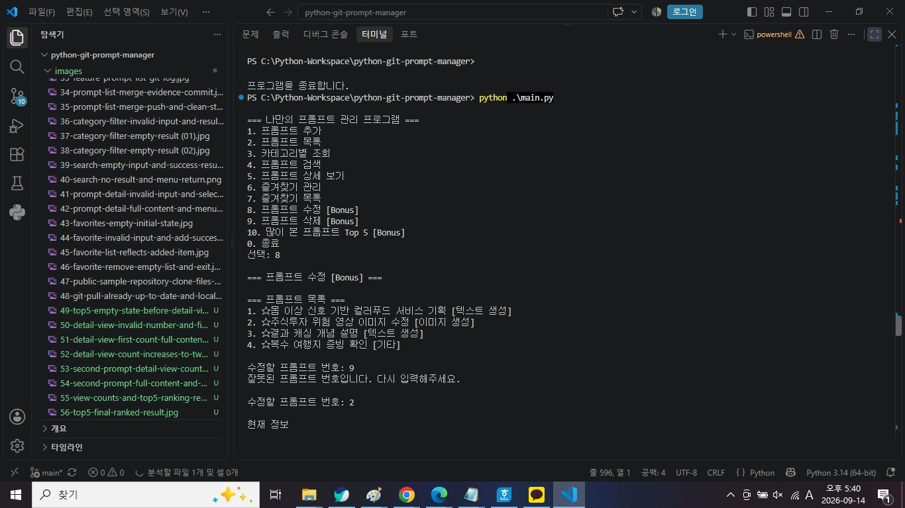

**그림 57. 프롬프트 수정 기능에서 잘못된 번호 처리 후 정상 번호 선택**

위 화면에서 `9`를 입력했을 때 오류 안내가 표시되고, 프로그램이 종료되지 않은 채 다시 `2`번을 선택할 수 있음을 확인했습니다.

#### 📷 기존 정보 확인 및 새 값 입력

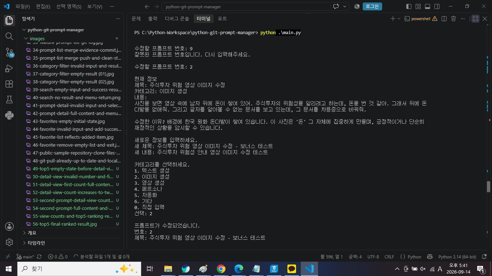

**그림 58. 기존 프롬프트 정보 확인 후 새 제목·내용·카테고리 입력**

수정 전에 기존 제목·카테고리·내용이 표시되고, 그 아래에서 새 제목과 내용을 입력한 뒤 카테고리를 다시 선택하는 과정을 확인했습니다.

#### 📷 수정 성공 및 결과 확인


**그림 59. 프롬프트 수정 성공 결과와 상세 보기 재검증 시작**

수정된 제목이 실제 목록에 반영되었고, 상세 보기 기능을 사용하여 변경된 데이터를 다시 확인했습니다.

#### 📷 상세 보기에서 수정 결과 최종 확인

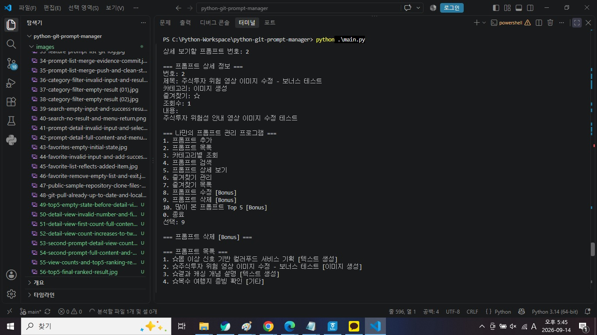

**그림 60. 수정된 제목·내용이 상세 보기에 실제 반영된 결과**

상세 보기 결과 다음 내용이 표시되었습니다.

```text
제목: 주식투자 위험 영상 이미지 수정 - 보너스 테스트
조회수: 1
내용:
주식투자 위험성 안내 영상 이미지 수정 테스트
```

이를 통해 단순히 `프롬프트가 수정되었습니다.`라는 메시지만 출력된 것이 아니라, **실제 List 안의 Dictionary 값이 변경되어 이후 상세 보기에서도 수정된 데이터가 사용되는 것**을 확인했습니다.

이 기능은 CRUD 가운데 **Update(수정)**에 해당합니다.

---

### 24.3 프롬프트 삭제 — Delete

등록된 프롬프트를 삭제할 수 있도록 `delete_prompt()` 함수를 추가했습니다.

삭제할 번호를 선택한 뒤 바로 삭제하지 않고 다음 확인 절차를 거칩니다.

```text
삭제할 번호 선택
        ↓
삭제 대상 제목·카테고리 확인
        ↓
정말 삭제할지 y/n 확인
        ↓
n → 삭제 취소
y → 실제 삭제
        ↓
프롬프트 목록에서 삭제 결과 확인
```

선택한 프롬프트 번호는 `selected_number`에 저장하고, 실제 삭제에는 다음 방식을 사용합니다.

```python
deleted_prompt = prompts.pop(selected_number - 1)
```

`pop()`은 선택한 위치의 Dictionary를 List에서 제거합니다.

삭제 확인 단계에서 `n`을 입력하면 데이터를 삭제하지 않고 메인 메뉴로 돌아오며, `y`를 입력해야 실제 삭제가 수행됩니다.

실제 테스트에서는 수정한 2번 프롬프트를 삭제 대상으로 선택한 뒤 먼저 `n`을 입력했습니다.

```text
정말 삭제하시겠습니까? (y/n): n
프롬프트 삭제를 취소했습니다.
```

이후 다시 삭제 메뉴에 들어가 같은 2번 프롬프트를 선택한 뒤 `y`를 입력했습니다.

```text
정말 삭제하시겠습니까? (y/n): y

'주식투자 위험 영상 이미지 수정 - 보너스 테스트' 프롬프트가 삭제되었습니다.
```

#### 📷 삭제 취소 후 재시도

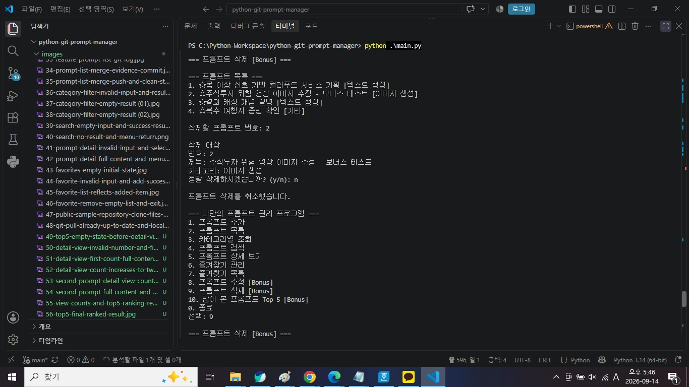

**그림 61. 삭제 대상 확인 후 `n`을 입력하여 삭제 취소**

삭제 전 제목과 카테고리를 다시 확인하고 `n`을 입력했을 때 실제 데이터가 삭제되지 않고 `프롬프트 삭제를 취소했습니다.`라는 안내가 표시되는 것을 확인했습니다.

#### 📷 실제 삭제 성공

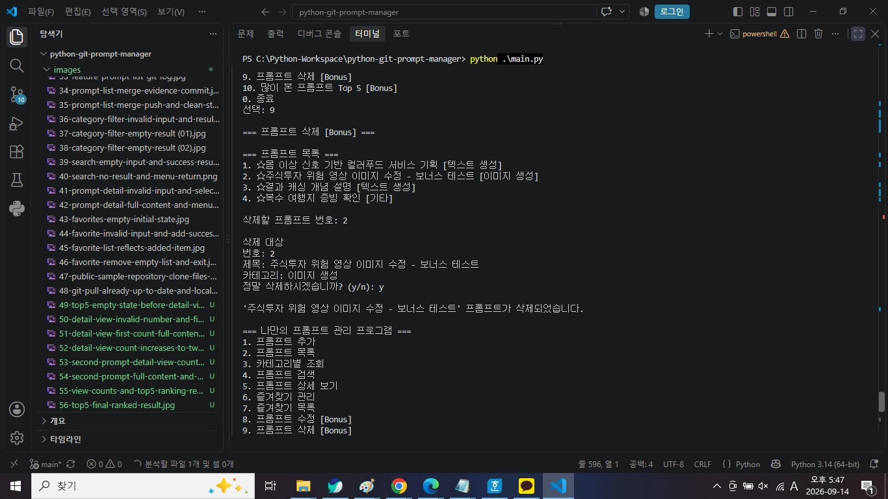

**그림 62. 삭제 확인에서 `y`를 입력하여 실제 프롬프트 삭제**

같은 프롬프트를 다시 선택하고 `y`를 입력하여 실제 삭제가 수행되는 것을 확인했습니다.

#### 📷 삭제 후 목록 반영 및 정상 종료

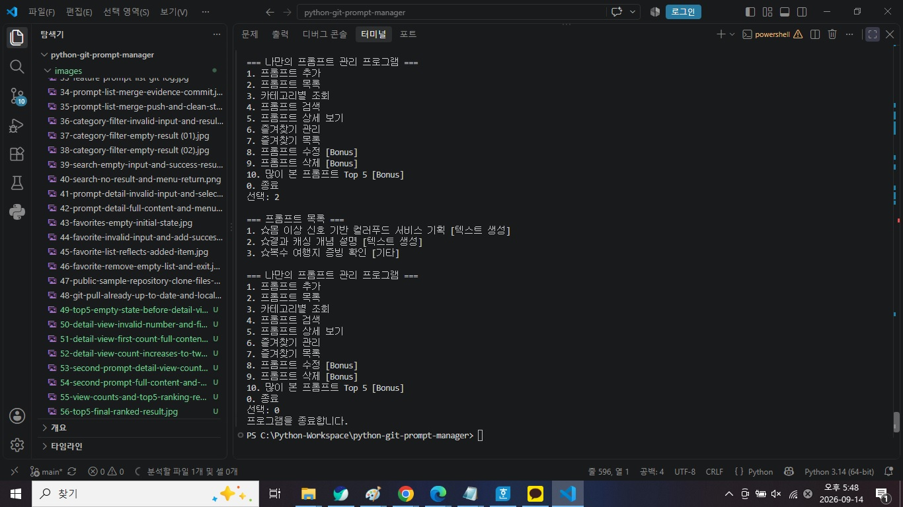

**그림 63. 삭제 후 프롬프트 목록이 4개에서 3개로 감소하고 프로그램이 정상 종료된 결과**

삭제 후 목록은 다음과 같이 변경되었습니다.

```text
1. ☆ 몸 이상 신호 기반 컬러푸드 서비스 기획 [텍스트 생성]
2. ☆ 결과 캐싱 개념 설명 [텍스트 생성]
3. ☆ 복수 여행지 증빙 확인 [기타]
```

삭제 대상이었던 `주식투자 위험 영상 이미지 수정 - 보너스 테스트`가 목록에서 사라졌고, 뒤에 있던 프롬프트 번호도 자동으로 다시 정렬되었습니다.

마지막으로 `0. 종료`를 선택하여 프로그램이 정상적으로 종료되는 것도 확인했습니다.

이 기능은 CRUD 가운데 **Delete(삭제)**에 해당합니다.

---

### 24.4 상세 보기 횟수 기록

각 프롬프트 Dictionary에 다음 값을 추가했습니다.

```python
"view_count": 0
```

프로그램을 처음 실행하면 모든 기본 프롬프트의 조회수는 `0`입니다.

상세 보기에서 정상적인 프롬프트 번호를 선택하면 다음 코드가 실행됩니다.

```python
prompt["view_count"] += 1
```

따라서 단순히 목록이나 검색 결과를 확인한 것은 조회수로 계산하지 않고, `5. 프롬프트 상세 보기`에서 실제 전체 내용을 연 경우에만 조회수가 1씩 증가합니다.

첫 번째 조회수 테스트에서는 다음 순서로 확인했습니다.

```text
Top 5 최초 실행
        ↓
조회 기록 없음 확인
        ↓
상세 보기에서 잘못된 번호 9 입력
        ↓
2번 프롬프트 정상 선택
        ↓
조회수 1
        ↓
2번 프롬프트 다시 상세 보기
        ↓
조회수 2
        ↓
1번 프롬프트 상세 보기
        ↓
조회수 1
```

#### 📷 조회 전 Top 5 초기 상태

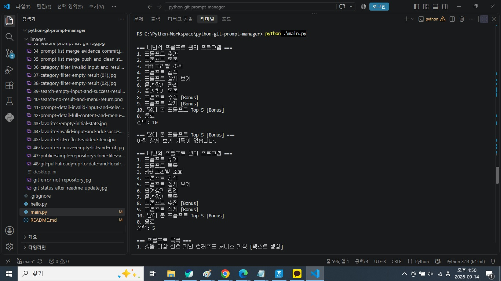

**그림 49. 상세 보기 전 Top 5에 조회 기록이 없는 초기 상태**

프로그램을 실행한 뒤 `10. 많이 본 프롬프트 Top 5`를 먼저 선택했을 때 다음 메시지가 표시되었습니다.

```text
아직 상세 보기 기록이 없습니다.
```

이를 통해 조회 기록이 없는 상태도 별도로 처리하고 있음을 확인했습니다.

#### 📷 잘못된 상세 보기 번호와 첫 조회수 증가

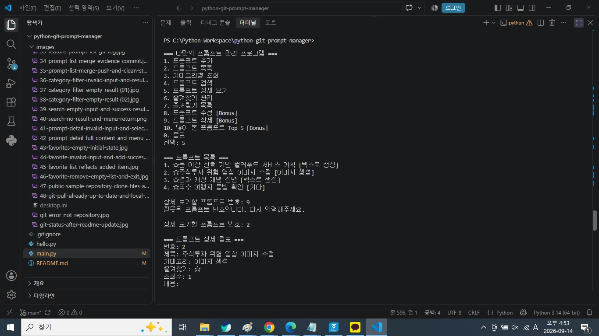

**그림 50. 잘못된 상세 보기 번호 `9` 처리 후 2번 프롬프트 조회수 1 확인**

존재하지 않는 번호를 입력해도 프로그램이 종료되지 않고 다시 입력할 수 있었고, 정상 번호 `2`를 선택한 뒤 조회수가 `1`로 증가했습니다.

#### 📷 첫 상세 조회 전체 내용 및 메뉴 복귀

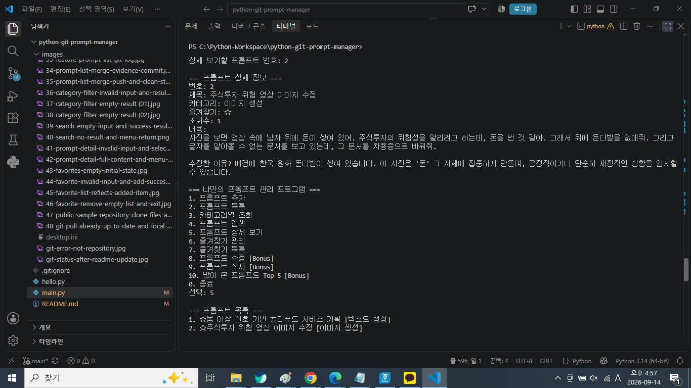

**그림 51. 첫 상세 조회에서 전체 내용 출력 및 메인 메뉴 복귀**

상세 보기에서 제목·카테고리·즐겨찾기·조회수·전체 내용이 출력되고, 기능 수행 후 다시 메인 메뉴로 돌아오는 것을 확인했습니다.

#### 📷 같은 프롬프트 조회수 2로 증가

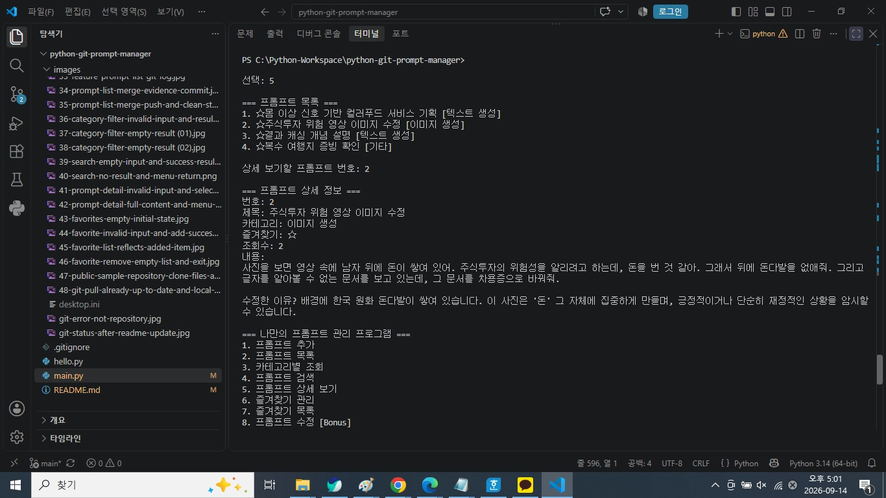

**그림 52. 같은 2번 프롬프트를 다시 상세 조회하여 조회수 2 확인**

동일한 프롬프트를 다시 상세 보기하면 기존 조회수에 1이 추가되어 `2`가 되는 것을 확인했습니다.

#### 📷 다른 프롬프트 조회수 1 기록

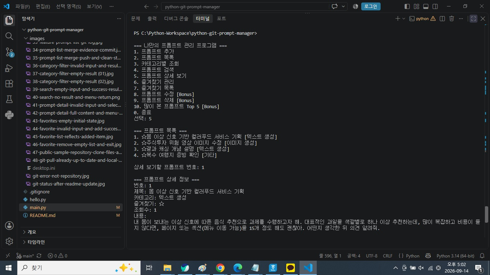

**그림 53. 1번 프롬프트 상세 보기 후 조회수 1 기록**

2번 프롬프트와 별도로 1번 프롬프트도 상세 보기하여 각 프롬프트별로 조회수가 독립적으로 관리되는 것을 확인했습니다.

#### 📷 다른 프롬프트 전체 내용 및 메뉴 복귀

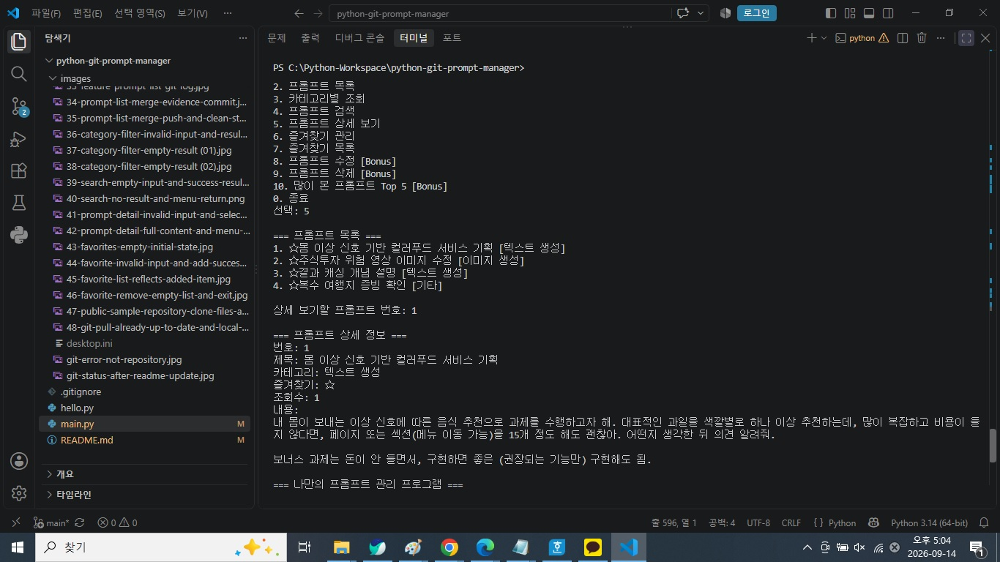

**그림 54. 1번 프롬프트 전체 내용 출력 및 메인 메뉴 복귀**

두 번째 프롬프트의 상세 정보와 전체 내용이 정상적으로 표시되고 기능 수행 후 메인 메뉴로 복귀하는 것을 확인했습니다.

---

### 24.5 조회수 기준 Top 5

상세 보기 횟수를 이용하여 자주 확인한 프롬프트를 조회수 높은 순서로 확인할 수 있도록 `show_top_prompts()` 함수를 추가했습니다.

조회수가 한 번 이상 발생한 프롬프트만 Top 5 후보로 사용합니다.

```python
viewed_prompts = [
    (index, prompt)
    for index, prompt in enumerate(prompts, start=1)
    if prompt["view_count"] > 0
]
```

이후 `sorted()`와 `reverse=True`를 사용하여 조회수가 높은 순서로 정렬합니다.

```python
sorted_prompts = sorted(
    viewed_prompts,
    key=lambda item: item[1]["view_count"],
    reverse=True,
)
```

최종 출력은 최대 5개까지만 제한합니다.

```python
top_prompts = sorted_prompts[:5]
```

실제 테스트에서는 2번 프롬프트를 2회, 1번 프롬프트를 1회 상세 조회한 뒤 Top 5를 실행했습니다.

결과는 다음과 같았습니다.

```text
1위. ☆ 주식투자 위험 영상 이미지 수정 [이미지 생성] - 원본 번호: 2, 조회수: 2
2위. ☆ 몸 이상 신호 기반 컬러푸드 서비스 기획 [텍스트 생성] - 원본 번호: 1, 조회수: 1
```

따라서 조회수 `2 → 1` 순서로 정상 정렬되는 것을 확인했습니다.

#### 📷 조회수와 Top 5 순위 연결 확인

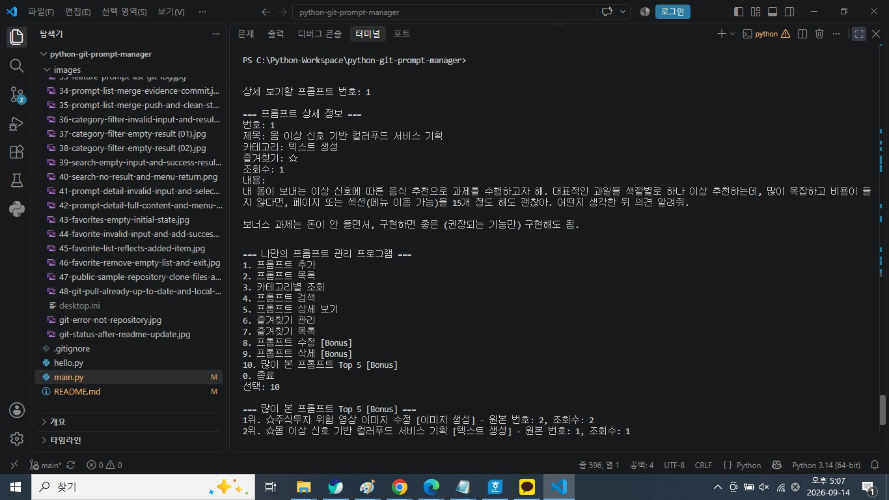

**그림 55. 각 프롬프트의 조회수와 Top 5 순위 결과 연결 확인**

앞에서 확인한 조회수 값이 Top 5 결과의 정렬 기준으로 실제 사용되는 것을 확인했습니다.

#### 📷 Top 5 최종 순위 결과

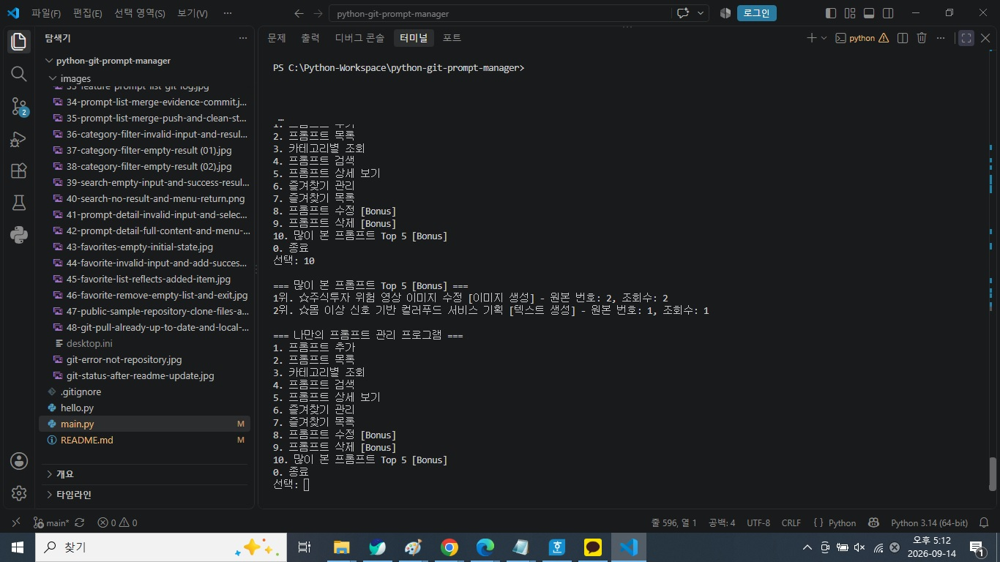

**그림 56. 조회수 기준 Top 5 최종 정렬 결과**

조회수가 높은 2번 프롬프트가 1위, 조회수가 낮은 1번 프롬프트가 2위로 표시되어 조회수 내림차순 정렬이 정상적으로 동작하는 것을 확인했습니다.

---

### 24.6 프로그램 재실행 시 조회수 초기화 확인

Top 5 테스트를 종료한 뒤 프로그램을 다시 실행하여 수정·삭제 기능을 테스트했습니다.

새 실행 세션에서 수정된 프롬프트의 조회수 출력은 다음과 같았습니다.

```text
조회수: 0
```

이는 앞선 실행에서 생성된 조회수 `2`가 파일에 자동 저장되지 않았고, 프로그램을 새로 실행하면서 기본 데이터의 `view_count: 0`부터 다시 시작했다는 의미입니다.

따라서 다음 두 동작을 모두 확인했습니다.

```text
같은 실행 중
→ 상세 보기 횟수가 계속 누적됨

프로그램 종료 후 다시 실행
→ 기본 조회수 0으로 초기화됨
```

이는 이번 프로그램이 JSON 자동 저장을 사용하지 않고 **메모리에서만 실행 중 데이터를 유지하는 구조**라는 점과도 일치합니다.

---

### 24.7 CRUD와 현재 프로그램의 연결

CRUD는 데이터를 관리할 때 자주 사용하는 네 가지 기본 작업입니다.

| CRUD | 의미 | 이번 프로그램 | 실제 구현 여부 |
|---|---|---|---|
| Create | 생성 | 프롬프트 추가 | ✅ |
| Read | 조회 | 목록, 카테고리별 조회, 검색, 상세 보기 | ✅ |
| Update | 수정 | 프롬프트 수정 | ✅ |
| Delete | 삭제 | 프롬프트 삭제 | ✅ |

필수 기능에서 Create와 Read를 구현했고, 이번 Bonus 2에서 Update와 Delete를 추가하여 하나의 프롬프트를 생성·조회·수정·삭제할 수 있는 구조로 확장했습니다.

---

### 24.8 JSON 저장·불러오기를 구현하지 않은 이유

과제에는 JSON 저장·불러오기와 카테고리별 Markdown 내보내기도 보너스 기능으로 제시되어 있습니다.

하지만 이번 프로젝트에서는 보너스 기능을 모두 억지로 구현하기보다 현재 프롬프트 관리 프로그램과 직접 연결되는 기능을 완성도 있게 구현하는 것을 우선했습니다.

이번 프로그램의 기본 동작은 다음과 같습니다.

```text
프로그램 시작
    ↓
기본 프롬프트 생성
    ↓
실행 중 추가·수정·삭제·즐겨찾기·조회수 변경
    ↓
메모리에서만 유지
    ↓
프로그램 종료
    ↓
다시 실행하면 기본 상태
```

자동 JSON 저장과 자동 불러오기를 추가하면 프로그램을 다시 실행했을 때 이전 상태가 남게 되어 지금까지 확인한 필수 동작과 혼동될 수 있습니다.

실제 테스트에서도 첫 번째 실행에서 발생한 조회수가 두 번째 실행에서는 `0`으로 초기화되는 것을 확인했습니다.

따라서 이번에는 JSON 자동 저장·불러오기를 넣지 않고 메모리 기반 구조를 그대로 유지했습니다.

---

### 24.9 실제 보너스 테스트 결과 정리

| 테스트 항목 | 실제 결과 |
|---|---|
| 보너스 메뉴 8~10 표시 | ✅ 정상 |
| 수정에서 존재하지 않는 번호 `9` 입력 | ✅ 오류 안내 후 재입력 |
| 2번 프롬프트 제목 수정 | ✅ 정상 |
| 2번 프롬프트 내용 수정 | ✅ 정상 |
| 카테고리 재선택 | ✅ 정상 |
| 수정 결과 상세 보기 재확인 | ✅ 정상 |
| 상세 보기 첫 조회 | ✅ 조회수 1 |
| 같은 프롬프트 재조회 | ✅ 조회수 2 |
| 다른 프롬프트 조회 | ✅ 별도 조회수 1 |
| 조회 기록 없을 때 Top 5 | ✅ 안내 메시지 |
| Top 5 조회수 내림차순 정렬 | ✅ `2회 → 1회` |
| 삭제 전 `n` 입력 | ✅ 삭제 취소 |
| 삭제 전 `y` 입력 | ✅ 실제 삭제 |
| 삭제 후 목록 확인 | ✅ 4개 → 3개 |
| 삭제 후 번호 재정렬 | ✅ 정상 |
| 프로그램 종료 후 재실행 | ✅ 조회수 기본값 0 |
| 프로그램 정상 종료 | ✅ 정상 |

---

### 24.10 최종 구현 범위

| 보너스 기능 | 최종 상태 |
|---|---|
| 프롬프트 수정 | ✅ 구현 및 실제 테스트 완료 |
| 프롬프트 삭제 | ✅ 구현 및 실제 테스트 완료 |
| 상세 보기 횟수 기록 | ✅ 구현 및 실제 테스트 완료 |
| 조회수 기준 Top 5 | ✅ 구현 및 실제 테스트 완료 |
| JSON 저장 | 이번에는 구현하지 않음 |
| JSON 불러오기 | 이번에는 구현하지 않음 |
| 카테고리별 Markdown 내보내기 | 이번에는 구현하지 않음 |

이번 Bonus 2 구현을 통해 기존 필수 기능을 유지하면서 프롬프트 관리 기능을 **Create → Read → Update → Delete**까지 확장했고, 추가로 상세 보기 횟수와 Top 5 기능을 통해 간단한 사용 기록도 확인할 수 있도록 했습니다.

또한 단순히 기능 코드를 작성하는 데서 끝내지 않고 **잘못된 번호 입력 → 정상 수정 → 상세 보기 재검증 → 삭제 취소 → 실제 삭제 → 목록 반영 → 재실행 초기화**까지 실제 실행 결과를 단계별로 확인했습니다.

이를 통해 현재 프로그램과 직접 연결되는 보너스 기능만 선별하여 구현하면서도, 각 기능이 실제로 정상 동작하는지 증빙 자료와 함께 검증했습니다.

---

### 24.11 Bonus 2 Commit, Push 및 최종 동기화 확인

Bonus 2의 프롬프트 수정·삭제·조회수·Top 5 기능 구현과 실행 테스트를 완료한 뒤, 변경된 `main.py`, `README.md`, 49~63번 증빙 이미지를 Git 변경 이력에 포함했습니다.

먼저 다음 명령어를 실행하여 변경사항을 Staging Area에 등록하고 상태를 확인했습니다.

```bash
git add .
git status
```

확인 결과 다음 항목이 Commit 대상으로 정상 등록되었습니다.

- 수정된 `README.md`
- 수정된 `main.py`
- 새로 추가한 49~63번 Bonus 테스트 증빙 이미지

총 17개의 변경사항이 Staging된 것을 확인한 뒤 다음 Commit을 생성했습니다.

```bash
git commit -m "feat: add prompt CRUD and view statistics"
```

이번 Commit은 문서만 수정한 것이 아니라 실제 프로그램 기능을 추가한 작업이므로 `docs:`가 아니라 `feat:`를 사용했습니다.

Commit 결과 다음과 같이 새로운 변경 이력이 생성되었습니다.

```text
[main dffcfa9] feat: add prompt CRUD and view statistics
17 files changed, 3337 insertions(+), 2850 deletions(-)
```

#### 📷 Bonus 2 기능 Commit 및 Push

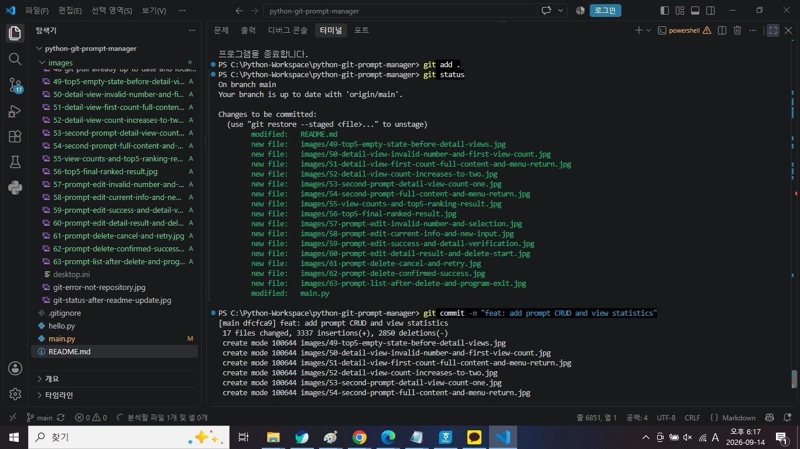

**그림 64. Bonus 2 CRUD·조회 통계 기능 Commit 및 GitHub Push**

위 화면에서는 다음 과정을 확인할 수 있습니다.

- `git commit -m "feat: add prompt CRUD and view statistics"` 실행
- Commit `dffcfa9` 생성
- 49~63번 이미지가 새 파일로 Commit에 포함
- `git push` 실행
- 로컬 `main`의 최신 Commit이 GitHub `origin/main`으로 전송

Push가 완료된 뒤 최종 상태를 다시 확인했습니다.

```bash
git status
```

실행 결과 다음과 같이 표시되었습니다.

```text
On branch main
Your branch is up to date with 'origin/main'.

nothing to commit, working tree clean
```

#### 📷 Push 후 최종 Clean 상태 확인

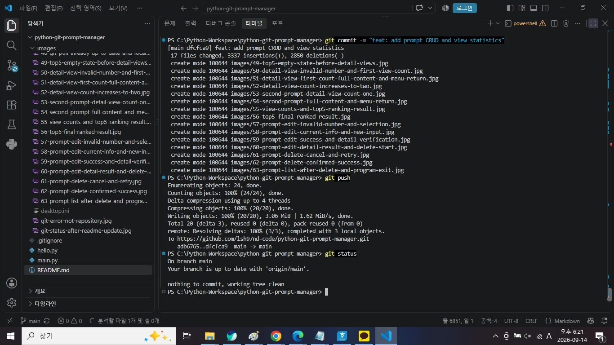

**그림 65. Bonus 2 Push 후 로컬·GitHub 동기화 및 Working Tree Clean 확인**

`Your branch is up to date with 'origin/main'.`은 로컬 `main`과 GitHub의 `origin/main`이 같은 최신 Commit을 가리키고 있다는 의미입니다.

`nothing to commit, working tree clean`은 수정했지만 Commit하지 않은 파일이나 새로 생성했지만 Git에 등록하지 않은 파일이 남아 있지 않다는 의미입니다.

따라서 Bonus 2 작업은 다음 전체 흐름까지 완료했습니다.

```text
기능 구현
    ↓
실행 테스트
    ↓
49~63번 증빙 저장
    ↓
README 문서화
    ↓
git add .
    ↓
git status
    ↓
feat Commit
    ↓
git push
    ↓
git status
    ↓
origin/main과 동기화 + working tree clean
```

---

## 25. 추가 입력 검증 및 실수 방지

이번 프로그램에서는 사용자가 잘못된 값을 입력하더라도 프로그램이 바로 종료되거나 예외가 발생하지 않도록 여러 입력 검증 기능을 적용했습니다.

입력 검증은 단순히 오류 메시지를 출력하는 것이 목적이 아니라, **사용자가 어떤 실수를 할 수 있는지 예상하고 정상적인 입력을 다시 받을 수 있도록 만드는 것**을 목표로 했습니다.

현재 프로그램에서 적용한 주요 입력 검증은 다음과 같습니다.

| 입력 상황 | 처리 방식 | 확인 상태 |
|---|---|---|
| 빈 제목 | 안내 후 다시 입력 | ✅ 실제 테스트 완료 |
| 빈 내용 | 안내 후 다시 입력 | ✅ 실제 테스트 완료 |
| 직접 입력 카테고리 빈 값 | 안내 후 다시 입력 | ✅ 실제 테스트 완료 |
| 빈 검색어 | 안내 후 다시 입력 | ✅ 실제 테스트 완료 |
| 잘못된 메뉴 번호 | 안내 후 메인 메뉴에서 다시 입력 | ✅ 실제 테스트 완료 |
| 존재하지 않는 상세 보기 번호 | 안내 후 같은 기능에서 다시 입력 | ✅ 실제 테스트 완료 |
| 존재하지 않는 수정 번호 | 안내 후 같은 기능에서 다시 입력 | ✅ 실제 테스트 완료 |
| 검색 결과 없음 | 안내 후 메인 메뉴 복귀 | ✅ 실제 테스트 완료 |
| 카테고리 결과 없음 | 안내 후 메인 메뉴 복귀 | ✅ 실제 테스트 완료 |
| 즐겨찾기 목록 없음 | 안내 메시지 출력 | ✅ 실제 테스트 완료 |
| 삭제 여부 잘못 입력 | `y` 또는 `n` 재입력 요구 | 코드 적용 |
| 삭제 취소 | 데이터 유지 후 메인 메뉴 복귀 | ✅ 실제 테스트 완료 |

---

### 25.1 공통 빈 입력 검증

프롬프트 제목, 내용, 직접 입력 카테고리, 검색어처럼 빈 문자열을 허용하면 안 되는 입력에는 공통 함수 `get_non_empty_input()`을 사용했습니다.

```python
def get_non_empty_input(message):
    while True:
        try:
            value = input(message).strip()
        except (EOFError, KeyboardInterrupt):
            return None

        if value:
            return value

        print("빈 값은 입력할 수 없습니다. 다시 입력해주세요.")
```

`strip()`을 사용하여 앞뒤 공백을 제거한 뒤 실제 내용이 있는지 확인합니다.

사용자가 아무것도 입력하지 않고 Enter를 누르거나 공백만 입력하면 다음 메시지를 출력하고 같은 입력을 다시 받습니다.

```text
빈 값은 입력할 수 없습니다. 다시 입력해주세요.
```

이 공통 함수를 사용함으로써 제목, 내용, 카테고리 직접 입력, 검색어에서 같은 검증 코드를 반복해서 작성하지 않고 일관된 방식으로 처리할 수 있습니다.

---

### 25.2 빈 검색어 실제 테스트

검색 기능에서는 이미 빈 입력 검증을 실제로 실행하여 확인했습니다.

메인 메뉴에서 `4. 프롬프트 검색`을 선택한 뒤 검색어를 입력하지 않고 Enter를 눌렀습니다.

실행 결과:

```text
빈 값은 입력할 수 없습니다. 다시 입력해주세요.
```

프로그램은 검색 기능을 종료하지 않고 다시 검색어를 기다렸습니다.

그 다음 정상 검색어 `주식`을 입력하자 해당 프롬프트가 정상적으로 검색되었습니다.

이를 통해 다음 흐름을 확인했습니다.

```text
빈 검색어 입력
        ↓
오류 안내
        ↓
검색어 재입력
        ↓
정상 검색 결과 출력
        ↓
메인 메뉴 복귀
```

이 테스트는 앞의 프롬프트 검색 Chapter에서 이미 실제 증빙 화면으로 확인했으므로 Chapter 25에서는 같은 화면을 다시 중복 삽입하지 않고 기존 증빙을 재사용합니다.

---

### 25.3 존재하지 않는 프롬프트 번호 처리

상세 보기 기능에서는 존재하지 않는 프롬프트 번호를 입력해도 함수가 즉시 종료되지 않고 같은 기능 안에서 다시 번호를 입력할 수 있도록 구현했습니다.

실제 테스트에서 프롬프트가 4개인 상태에서 다음 번호를 입력했습니다.

```text
상세 보기할 프롬프트 번호: 9
잘못된 프롬프트 번호입니다. 다시 입력해주세요.
```

그 후 정상 번호 `2`를 입력하자 상세 정보가 정상적으로 출력되었습니다.

Bonus 수정 기능에서도 같은 방식을 확인했습니다.

```text
수정할 프롬프트 번호: 9
잘못된 프롬프트 번호입니다. 다시 입력해주세요.

수정할 프롬프트 번호: 2
```

따라서 이전 초안의 다음 표현:

```text
존재하지 않는 프롬프트 번호 → 안내 후 다시 메뉴
```

는 실제 프로그램 동작과 맞지 않으므로 다음과 같이 수정했습니다.

```text
존재하지 않는 프롬프트 번호 → 오류 안내 후 같은 기능에서 재입력
```

사용자가 번호 하나를 잘못 입력했다는 이유만으로 처음부터 기능을 다시 선택할 필요가 없도록 만든 것입니다.

---

### 25.4 검색 결과가 없는 경우

검색어가 어떤 프롬프트의 제목이나 내용에도 포함되지 않으면 빈 화면을 보여주는 대신 다음 안내를 출력합니다.

```python
if not search_results:
    print(f"\n'{keyword}'에 대한 검색 결과가 없습니다.")
    return
```

실제 테스트에서는 다음 검색어를 사용했습니다.

```text
우주비행사
```

실행 결과:

```text
'우주비행사'에 대한 검색 결과가 없습니다.
```

검색 결과가 없더라도 오류가 발생하거나 프로그램이 종료되지 않았으며, 안내 후 다시 메인 메뉴로 복귀했습니다.

이를 통해 다음 흐름을 확인했습니다.

```text
검색어 입력
    ↓
검색 결과 없음
    ↓
사용자 안내
    ↓
메인 메뉴 복귀
```

---

### 25.5 카테고리 조회 결과가 없는 경우

선택한 카테고리에 등록된 프롬프트가 하나도 없을 때도 별도의 안내 메시지를 출력하도록 구현했습니다.

```python
if not filtered_prompts:
    print(f"\n'{category}' 카테고리에 등록된 프롬프트가 없습니다.")
    return
```

실제 테스트에서는 기본 프롬프트가 존재하지 않는 `페르소나` 카테고리를 선택했습니다.

실행 결과 등록된 프롬프트가 없다는 안내가 표시되었고, 프로그램이 종료되지 않은 채 메인 메뉴로 돌아왔습니다.

따라서 사용자는 **프로그램이 멈춘 것인지, 실제 데이터가 없는 것인지** 구분할 수 있습니다.

---

### 25.6 즐겨찾기와 삭제 기능의 안전 처리

즐겨찾기 기능에서는 즐겨찾기한 프롬프트가 하나도 없으면 다음 안내 메시지를 표시합니다.

```text
즐겨찾기한 프롬프트가 없습니다.
```

실제 테스트에서 초기 즐겨찾기 목록이 비어 있는 상태와, 즐겨찾기를 해제한 뒤 다시 비어 있는 상태를 모두 확인했습니다.

삭제 기능에서는 사용자가 번호를 선택했다고 해서 즉시 삭제하지 않고 최종 확인을 거칩니다.

```text
정말 삭제하시겠습니까? (y/n):
```

실제 테스트에서는 먼저 `n`을 입력하여 삭제를 취소했고, 목록에 데이터가 그대로 남아 있는 것을 확인했습니다.

그 다음 다시 삭제 기능을 실행하여 `y`를 입력했을 때만 실제 삭제가 이루어졌습니다.

이 방식은 사용자의 실수로 데이터를 바로 삭제하는 것을 줄이기 위한 처리입니다.

---

### 25.7 프로그램이 비어 있는 경우의 방어 코드

프롬프트 목록, 상세 보기, 즐겨찾기 관리, 삭제 등의 기능에서는 데이터가 하나도 없는 상황도 처리합니다.

예를 들어 목록 기능에서는 다음 조건을 먼저 확인합니다.

```python
if not prompts:
    print("등록된 프롬프트가 없습니다.")
    return
```

`not prompts`는 `prompts` List가 비어 있는지 확인합니다.

데이터가 없다면 이후의 번호 선택이나 List 접근을 실행하지 않고 안내 메시지를 출력한 뒤 함수를 종료합니다.

현재 프로그램은 실행 시 기본 프롬프트 4개를 제공하므로 일반 실행에서는 빈 List 상태가 발생하지 않지만, 향후 데이터를 모두 삭제하거나 구조를 확장할 경우에도 예외가 발생하지 않도록 방어 코드를 넣었습니다.

---

### 25.8 잘못된 메뉴·빈 제목·빈 내용·직접 입력 카테고리 실제 테스트

앞에서 이미 검증한 검색, 상세 보기, 카테고리 조회, 즐겨찾기, 삭제 관련 입력 검증은 중복 테스트하지 않았습니다.

Chapter 25에서 아직 실제 화면 증빙이 없었던 다음 네 가지 항목만 한 번의 실행 흐름으로 추가 테스트했습니다.

```text
1. 메인 메뉴에서 존재하지 않는 번호 입력
2. 프롬프트 추가에서 빈 제목 입력
3. 프롬프트 추가에서 빈 내용 입력
4. 카테고리 직접 입력 선택 후 빈 값 입력
```

테스트의 목적은 단순히 오류 메시지가 표시되는지만 확인하는 것이 아니라, **잘못된 입력 이후에도 정상 입력을 다시 받아 기능이 계속 진행되는지** 확인하는 것이었습니다.

---

#### 25.8.1 잘못된 메뉴 번호 처리

프로그램 실행 후 메인 메뉴에서 존재하지 않는 번호 `99`를 입력했습니다.

```text
선택: 99
잘못된 메뉴 번호입니다. 다시 입력해주세요.
```

프로그램은 종료되지 않고 다시 메인 메뉴를 표시했습니다.

이후 `1. 프롬프트 추가`를 선택하여 다음 입력 검증 테스트를 계속 진행했습니다.

#### 📷 잘못된 메뉴 번호 및 빈 제목 검증 시작

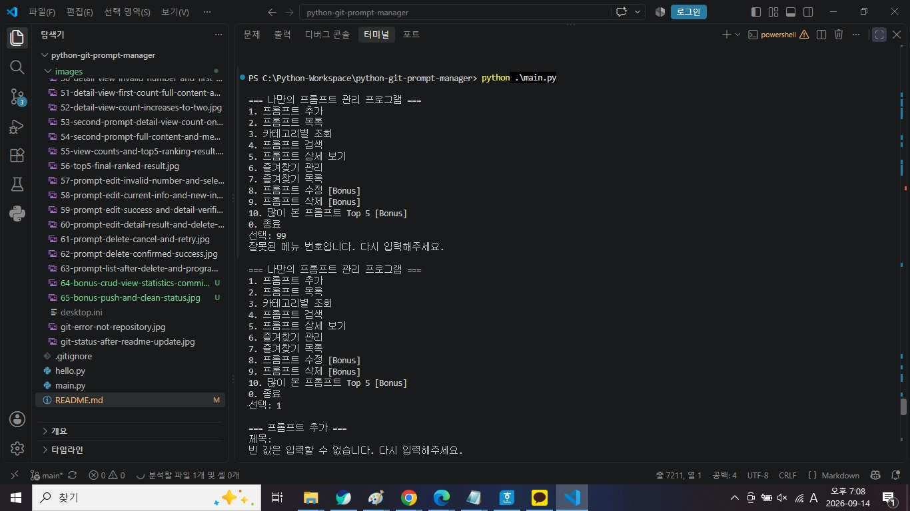

**그림 66. 잘못된 메뉴 번호 `99` 처리 후 프롬프트 추가 기능에서 빈 제목 검증**

위 화면에서는 다음 흐름을 확인할 수 있습니다.

```text
잘못된 메뉴 번호 99 입력
        ↓
오류 안내
        ↓
메인 메뉴 다시 표시
        ↓
1. 프롬프트 추가 선택
        ↓
빈 제목 입력
        ↓
빈 값 안내
```

---

#### 25.8.2 빈 제목 및 빈 내용 검증

프롬프트 추가 기능에서 제목을 입력하지 않고 Enter를 눌렀습니다.

```text
제목:
빈 값은 입력할 수 없습니다. 다시 입력해주세요.
제목: 입력 검증 테스트
```

프로그램은 빈 제목을 등록하지 않고 정상 제목을 다시 입력받았습니다.

그 다음 내용 입력에서도 아무것도 입력하지 않고 Enter를 눌렀습니다.

```text
내용:
빈 값은 입력할 수 없습니다. 다시 입력해주세요.
내용: 빈 입력 검증 테스트 내용
```

빈 내용 역시 그대로 등록되지 않았고, 정상 내용을 다시 입력한 뒤 다음 단계로 진행되었습니다.

이 과정에서 제목과 내용에 동일한 `get_non_empty_input()` 검증 함수가 실제로 적용되는 것을 확인했습니다.

---

#### 25.8.3 직접 입력 카테고리 빈 값 검증

카테고리 선택 화면에서 `0. 직접 입력`을 선택했습니다.

그 후 카테고리 값을 입력하지 않고 Enter를 눌렀습니다.

```text
카테고리 직접 입력:
빈 값은 입력할 수 없습니다. 다시 입력해주세요.
카테고리 직접 입력: 테스트 카테고리
```

프로그램은 빈 카테고리를 허용하지 않았고, 정상 값 `테스트 카테고리`를 다시 입력받았습니다.

#### 📷 빈 제목·내용·직접 입력 카테고리 검증


**그림 67. 빈 제목·빈 내용·직접 입력 카테고리의 재입력 검증**

이 화면에서는 다음 세 입력 검증이 한 번의 프롬프트 추가 과정에서 연속으로 적용되는 것을 확인할 수 있습니다.

```text
빈 제목
→ 안내 후 정상 제목 재입력

빈 내용
→ 안내 후 정상 내용 재입력

직접 입력 카테고리 빈 값
→ 안내 후 정상 카테고리 재입력
```

따라서 `get_non_empty_input()` 공통 함수가 제목, 내용, 직접 입력 카테고리에서 동일하게 동작하는 것을 실제 실행 결과로 검증했습니다.

---

#### 25.8.4 정상 값 재입력 후 프롬프트 추가 성공

잘못된 입력을 모두 수정한 뒤 최종적으로 다음 값이 등록되었습니다.

```text
제목: 입력 검증 테스트
내용: 빈 입력 검증 테스트 내용
카테고리: 테스트 카테고리
즐겨찾기: ☆
조회수: 0
```

실행 결과:

```text
프롬프트가 추가되었습니다.
제목: 입력 검증 테스트
카테고리: 테스트 카테고리
즐겨찾기: ☆
조회수: 0
```

#### 📷 직접 입력 카테고리 재입력 및 추가 성공

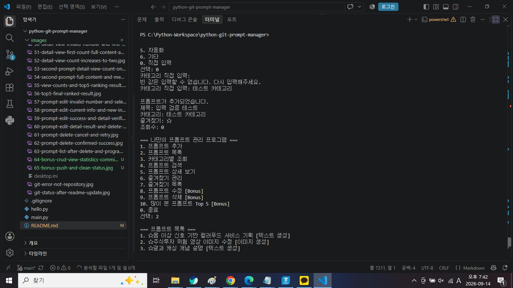

**그림 68. 직접 입력 카테고리 빈 값 재입력 후 프롬프트 추가 성공**

단순히 오류 안내가 나온 것에서 끝나지 않고, 잘못된 값을 정상 값으로 다시 입력한 뒤 새로운 프롬프트가 실제로 추가되는 것까지 확인했습니다.

---

#### 25.8.5 프롬프트 목록에서 실제 반영 확인 및 정상 종료

프롬프트 추가 후 `2. 프롬프트 목록`을 선택하여 방금 추가한 데이터가 실제 List에 반영되었는지 확인했습니다.

목록 마지막에 다음 항목이 표시되었습니다.

```text
5. ☆ 입력 검증 테스트 [테스트 카테고리]
```

기본 프롬프트 4개에 새 프롬프트 1개가 추가되어 총 5개가 표시되었습니다.

이후 `0. 종료`를 선택하여 프로그램이 정상적으로 종료되는 것도 확인했습니다.

#### 📷 입력 검증 후 목록 반영 및 프로그램 종료

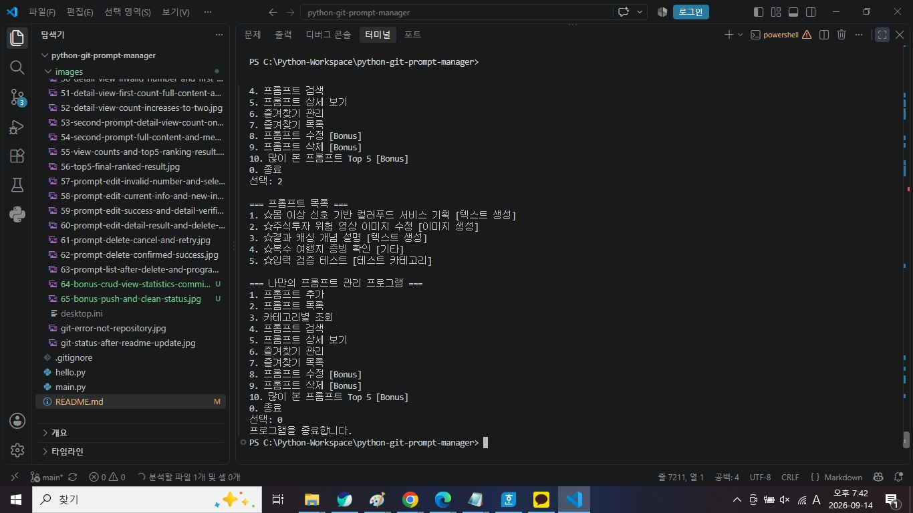

**그림 69. 입력 검증 후 새 프롬프트가 목록에 반영되고 프로그램이 정상 종료된 결과**

이 화면을 통해 다음 전체 흐름을 확인했습니다.

```text
잘못된 입력
    ↓
오류 안내
    ↓
정상 값 재입력
    ↓
프롬프트 추가 성공
    ↓
목록에서 실제 데이터 반영 확인
    ↓
정상 종료
```

따라서 입력 검증 기능은 단순히 잘못된 값을 막는 데 그치지 않고, **사용자가 올바른 값을 다시 입력하여 원래 하려던 작업을 끝까지 완료할 수 있도록 동작**하는 것을 확인했습니다.

---

### 25.9 최종 입력 검증 결과 정리

| 검증 항목 | 구현 | 실제 실행 확인 |
|---|---:|---:|
| 공통 빈 입력 검증 함수 | ✅ | ✅ |
| 빈 제목 재입력 | ✅ | ✅ |
| 빈 내용 재입력 | ✅ | ✅ |
| 직접 입력 카테고리 빈 값 재입력 | ✅ | ✅ |
| 빈 검색어 재입력 | ✅ | ✅ |
| 잘못된 메뉴 번호 처리 | ✅ | ✅ |
| 존재하지 않는 상세 번호 재입력 | ✅ | ✅ |
| 존재하지 않는 수정 번호 재입력 | ✅ | ✅ |
| 검색 결과 없음 안내 | ✅ | ✅ |
| 카테고리 결과 없음 안내 | ✅ | ✅ |
| 즐겨찾기 없음 안내 | ✅ | ✅ |
| 삭제 취소 | ✅ | ✅ |
| 삭제 확인 후 실제 삭제 | ✅ | ✅ |
| 빈 List 방어 처리 | ✅ | 코드 확인 |

Chapter 25에서 추가로 확인할 예정이었던 네 가지 입력 검증까지 실제 실행 테스트를 완료했습니다.

이번 테스트에서는 오류 메시지만 확인하지 않고 다음 과정까지 모두 검증했습니다.

```text
잘못된 메뉴 번호
    ↓
메인 메뉴 재표시

빈 제목·빈 내용·빈 직접 입력 카테고리
    ↓
각 입력 단계에서 정상 값 재입력

정상 값 입력 완료
    ↓
새 프롬프트 추가 성공

프롬프트 목록 확인
    ↓
새 데이터 실제 반영

0. 종료
    ↓
프로그램 정상 종료
```

이를 통해 이번 프로그램이 **잘못된 입력을 단순히 거부하는 것이 아니라, 사용자가 다시 정상 값을 입력해 작업을 계속할 수 있도록 설계되어 있음**을 실제 실행 결과로 확인했습니다.

---

## 26. 테스트 결과 및 증빙

이번 프로젝트에서는 단순히 기능을 실행한 화면만 남기는 것이 아니라, **입력 → 기능 수행 → 결과 확인 → 필요한 경우 목록·Git 상태로 재검증**하는 방식으로 테스트와 증빙을 기록했습니다.

첨부한 `images` 폴더를 기준으로 개발 환경, Git/GitHub, 필수 프로그램 기능, 입력 검증, Bonus 기능까지 실제 수행 화면이 순서대로 저장되어 있습니다.

Chapter 26에서는 앞의 각 Chapter에서 이미 자세히 설명한 화면을 다시 모두 반복하지 않고, **무엇을 테스트했고 어떤 증빙으로 정상 동작을 확인했는지 한눈에 볼 수 있도록 전체 결과를 요약**합니다.

---

### 26.1 테스트 및 증빙 원칙

이번 과제에서는 다음 기준으로 테스트했습니다.

```text
기능 선택
    ↓
입력값 입력
    ↓
프로그램 결과 확인
    ↓
잘못된 입력이 있다면 재입력 동작 확인
    ↓
목록·상세 보기·Git 상태 등으로 실제 반영 여부 재확인
    ↓
증빙 화면 저장
```

예를 들어 프롬프트 추가 기능은 단순히 `프롬프트가 추가되었습니다.`라는 메시지만 확인하지 않았습니다.

```text
프롬프트 추가
    ↓
제목·내용·카테고리 입력
    ↓
추가 성공 메시지
    ↓
프롬프트 목록 다시 확인
    ↓
새 항목이 실제 List에 추가된 것 확인
```

즐겨찾기, 수정, 삭제, 조회수, 입력 검증도 같은 방식으로 **기능 수행 후 실제 데이터가 변경되었는지 다시 확인**했습니다.

---

### 26.2 개발 환경 및 실행 준비 검증

| 테스트 항목 | 확인 결과 | 주요 증빙 |
|---|---|---|
| Python 설치 | ✅ Python 3.14.7 확인 | `02-python-installation.jpg` |
| VS Code 설치 | ✅ 정상 설치 | `03-vscode-installation.jpg` |
| Git 설치 | ✅ Git 2.55.0.windows.4 확인 | `04-git-installation.jpg` |
| Python·Git 버전 확인 | ✅ 정상 | `01-development-environment.png` |
| Git 사용자 이름·이메일 설정 | ✅ 정상 | `01-development-environment.png` |
| 기본 Branch `main` 설정 | ✅ 정상 | `01-development-environment.png` |
| `git init` | ✅ Repository 초기화 | `01-development-environment.png` |
| `hello.py` 실행 | ✅ `Hello` 출력 | `01-development-environment.png` |
| GitHub CLI 설치·인증 | ✅ 로그인 및 인증 완료 | `12`, `16`, `17`번 증빙 |
| GitHub Repository 생성·Remote 연결 | ✅ `origin` 연결 확인 | `18-github-repository-and-remote.jpg` |
| GitHub README 렌더링 | ✅ Markdown 및 이미지 표시 확인 | `23`, `24`번 증빙 |

#### 📷 개발 환경 대표 증빙


**그림 70. Python·Git 환경, Git 설정, `git init`, `Hello` 실행을 함께 확인한 대표 개발 환경 화면**

이 화면은 Python 프로그램을 실행할 수 있는 환경과 Git Repository를 사용할 수 있는 기본 준비가 완료되었음을 보여주는 핵심 증빙입니다.

---

### 26.3 Git 및 GitHub 작업 검증

이번 과제에서 요구된 Git 명령은 단순 설명으로만 작성하지 않고 실제 프로젝트 작업에 사용했습니다.

| Git 작업 | 실제 수행 내용 | 주요 증빙 |
|---|---|---|
| `git init` | 프로젝트 Repository 초기화 | `01-development-environment.png` |
| `git add` | 변경 파일 Staging | `05`, `08`, `09`번 증빙 |
| `git commit` | 기능·문서별 변경 이력 생성 | `11`, `19`, `30`, `31`, `34`, `64`번 증빙 |
| `git push` | 로컬 Commit을 GitHub로 전송 | `20-first-github-push-and-status.jpg`, `35`, `64`, `65`번 증빙 |
| `git pull` | `origin/main` 최신 상태 확인 | `48-git-pull-already-up-to-date-and-local-changes.jpg` |
| `git checkout` | `feature/prompt-list`와 `main` 사이 이동 | `20-feature-prompt-list-branch-created.jpg`, `32`번 증빙 |
| `git clone` | 공개 Sample Repository Clone | `47-public-sample-repository-clone-files-and-git-log.jpg` |
| `git merge` | `feature/prompt-list`를 `main`에 Merge | `32-feature-prompt-list-merge-to-main.jpg` |
| `git log --oneline --graph` | Branch 및 Commit 기록 확인 | `33-feature-prompt-list-git-log.jpg` |
| `.gitignore` | `desktop.ini` 등 불필요 파일 제외 | `06`, `07`번 증빙 |
| Push 후 Clean 상태 | 로컬·원격 동기화 확인 | `22`, `35`, `65`번 증빙 |

특히 프롬프트 목록 기능은 과제 요구사항에 따라 `main`에서 바로 개발하지 않고 `feature/prompt-list` Branch에서 구현·Commit한 뒤 `main`으로 돌아와 Merge했습니다.

#### 📷 Branch 및 Merge 대표 증빙


**그림 71. `feature/prompt-list`에서 개발한 목록 기능을 `main`에 Merge한 결과**

#### 📷 Git Graph 대표 증빙


**그림 72. `git log --oneline --graph --all --decorate`를 사용한 Branch 및 Commit 기록 확인**

이 화면은 Branch에서 기능을 개발한 뒤 `main`에 반영한 이력을 Git 기록에서도 확인한 증빙입니다.

현재 `33-feature-prompt-list-git-log.jpg`는 Branch·Merge 과정을 확인하기 위한 증빙입니다. **최종 제출 직전에는 이후 Bonus와 문서 Commit까지 포함된 최신 Git Graph를 한 번 더 캡처하여 최종 증빙으로 갱신할 예정입니다.**

---

### 26.4 필수 프로그램 기능 테스트 결과

| 기능 | 실제 테스트 내용 | 결과 | 주요 증빙 |
|---|---|---:|---|
| 메인 메뉴 | 메뉴 출력, 잘못된 번호 재입력, 종료 | ✅ | `25`, `26`번 |
| 기본 프롬프트 | 기본 데이터 4개 확인 | ✅ | `27`번 및 목록 증빙 |
| 프롬프트 추가 | 입력 검증 후 새 프롬프트 등록 | ✅ | `28`, `29`번 |
| 프롬프트 목록 | 번호·제목·카테고리·☆ 표시 | ✅ | `21-feature-prompt-list-display.jpg` |
| 카테고리별 조회 | 정상 결과 및 결과 없음 처리 | ✅ | `36`, `37`, `38`번 |
| 제목·내용 검색 | 빈 검색어, 정상 검색, 결과 없음 | ✅ | `39`, `40`번 |
| 상세 보기 | 잘못된 번호 재입력 후 전체 내용 출력 | ✅ | `41`, `42`번 |
| 즐겨찾기 관리 | 잘못된 번호, 추가, 해제 | ✅ | `44`, `46`번 |
| 즐겨찾기 목록 | 초기 빈 상태 및 추가 후 목록 확인 | ✅ | `43`, `45`번 |
| 기능 후 메뉴 복귀 | 각 기능 실행 후 메인 메뉴 재표시 | ✅ | 각 실행 증빙 |
| 종료 | `0` 선택 후 정상 종료 | ✅ | `26`, `46`, `63`, `69`번 |

프롬프트 추가 기능의 경우 입력 후 단순 성공 메시지만 확인하지 않고, 이후 목록을 다시 열어 데이터가 실제로 추가되었는지 확인했습니다.

카테고리 조회·검색·상세 보기·즐겨찾기 역시 정상 결과뿐 아니라 **잘못된 번호, 빈 입력, 결과 없음**과 같은 예외 상황까지 함께 테스트했습니다.

---

### 26.5 입력 검증 테스트 결과

Chapter 25에서 실제 입력 검증을 별도로 정리했으며, 최종 결과는 다음과 같습니다.

| 검증 항목 | 실제 결과 | 주요 증빙 |
|---|---|---|
| 잘못된 메뉴 번호 | 오류 안내 후 메인 메뉴 재표시 | `66`번 |
| 빈 제목 | 안내 후 정상 제목 재입력 | `66`, `67`번 |
| 빈 내용 | 안내 후 정상 내용 재입력 | `67`번 |
| 직접 입력 카테고리 빈 값 | 안내 후 정상 카테고리 재입력 | `67`, `68`번 |
| 빈 검색어 | 안내 후 검색어 재입력 | `39`번 |
| 존재하지 않는 상세 번호 | 안내 후 같은 기능에서 재입력 | `41`, `50`번 |
| 존재하지 않는 수정 번호 | 안내 후 같은 기능에서 재입력 | `57`번 |
| 검색 결과 없음 | 안내 후 메뉴 복귀 | `40`번 |
| 카테고리 결과 없음 | 안내 후 메뉴 복귀 | `37`, `38`번 |
| 즐겨찾기 없음 | 빈 목록 안내 | `43`, `46`번 |
| 삭제 취소 | `n` 입력 시 데이터 유지 | `61`번 |
| 삭제 확인 | `y` 입력 시 실제 삭제 | `62`, `63`번 |

#### 📷 입력 검증 후 실제 데이터 반영 대표 증빙


**그림 73. 잘못된 입력을 모두 수정한 뒤 새 프롬프트가 실제 목록에 반영되고 정상 종료된 결과**

이를 통해 입력 검증이 단순히 잘못된 입력을 막는 데서 끝나지 않고, 사용자가 정상 값을 다시 입력해 원래 작업을 끝까지 완료할 수 있도록 동작함을 확인했습니다.

---

### 26.6 Bonus 2 테스트 결과

현재 프로그램의 목적과 직접 연결되는 Bonus 2 기능으로 프롬프트 수정·삭제·상세 보기 횟수·Top 5를 구현했습니다.

| Bonus 기능 | 실제 테스트 | 결과 | 주요 증빙 |
|---|---|---:|---|
| 상세 보기 횟수 | 같은 프롬프트를 반복 조회하여 `1 → 2` 증가 | ✅ | `50`, `52`번 |
| 프롬프트별 조회수 | 다른 프롬프트는 별도로 `1` 기록 | ✅ | `53`, `54`번 |
| Top 5 초기 상태 | 조회 기록 없을 때 안내 | ✅ | `49`번 |
| Top 5 정렬 | 조회수 `2 → 1` 순으로 정렬 | ✅ | `55`, `56`번 |
| 프롬프트 수정 | 잘못된 번호 후 정상 수정 | ✅ | `57`, `58`, `59`번 |
| 수정 결과 재검증 | 상세 보기에서 수정된 제목·내용 확인 | ✅ | `60`번 |
| 삭제 취소 | `n` 입력 후 데이터 유지 | ✅ | `61`번 |
| 실제 삭제 | `y` 입력 후 삭제 | ✅ | `62`번 |
| 삭제 결과 재검증 | 목록 `4개 → 3개` 확인 | ✅ | `63`번 |
| 재실행 초기화 | 새 실행에서 조회수 `0`부터 시작 | ✅ | 수정·삭제 테스트 실행 결과 |
| Bonus Commit/Push | 기능·증빙 GitHub 반영 | ✅ | `64`, `65`번 |

#### 📷 Top 5 대표 증빙


**그림 74. 상세 보기 횟수에 따라 조회수 기준으로 정렬된 Top 5 결과**

#### 📷 Bonus 기능 Git 최종 상태


**그림 75. Bonus 2 Commit·Push 후 `origin/main` 동기화 및 Working Tree Clean 확인**

---

### 26.7 공개 Sample Repository 및 `git pull` 검증

과제에서 요구한 공개 Repository Clone도 별도의 폴더에서 실제로 수행했습니다.

```text
octocat/Hello-World
```

Clone 후 파일 목록, Remote, Commit Log까지 확인했습니다.

#### 📷 공개 Sample Repository Clone


**그림 76. 공개 `octocat/Hello-World` Repository Clone 후 파일·Remote·Git Log 확인**

원래 과제 Repository로 돌아온 뒤에는 `git pull`을 실제 사용했습니다.

```text
git pull
Already up to date.
```

#### 📷 `git pull` 실행 결과


**그림 77. `git pull`을 사용하여 `origin/main`의 최신 상태를 확인한 결과**

`Already up to date.`는 명령이 실패했다는 의미가 아니라, 원격 Repository와 현재 로컬 Branch 사이에 새로 가져올 Commit이 없었다는 의미입니다.

---

### 26.8 핵심 제출 증빙 정리

과제에서 특히 중요한 증빙을 유형별로 정리하면 다음과 같습니다.

| 제출 증빙 유형 | 대표 이미지 | 확인 내용 |
|---|---|---|
| 개발 환경 | `01-development-environment.png` | Python·Git 버전, Git 설정, `git init`, Python 실행 |
| 프로그램 실행 | `21-feature-prompt-list-display.jpg`, `29-add-prompt-success.jpg`, `45-favorite-list-reflects-added-item.jpg` | 메뉴·목록·추가·즐겨찾기 등 실제 기능 동작 |
| Branch / Merge | `32-feature-prompt-list-merge-to-main.jpg` | 별도 Branch 개발 후 `main` Merge |
| Git Graph | `33-feature-prompt-list-git-log.jpg` | Commit 및 Branch 기록 |
| 공개 Repository Clone | `47-public-sample-repository-clone-files-and-git-log.jpg` | `git clone` 실제 수행 |
| `git pull` | `48-git-pull-already-up-to-date-and-local-changes.jpg` | 원격 최신 상태 확인 |
| Bonus 기능 | `56`, `60`, `63`번 | 조회수·Top 5·수정·삭제 |
| 입력 검증 | `66`~`69`번 | 잘못된 입력 처리와 정상 데이터 반영 |
| 최종 Git 동기화 | `65-bonus-push-and-clean-status.jpg` | Push 후 `working tree clean` |

---

### 26.9 전체 테스트 결과 요약

| 영역 | 최종 결과 |
|---|---:|
| 개발 환경 구성 | ✅ 정상 |
| Python 프로그램 실행 | ✅ 정상 |
| Git Repository 초기화 | ✅ 정상 |
| GitHub Repository 연결 | ✅ 정상 |
| `init / add / commit / push / pull / checkout / clone / merge` 사용 | ✅ 완료 |
| 별도 Branch에서 목록 기능 개발 | ✅ 완료 |
| 기본 프롬프트 3개 이상 | ✅ 4개 제공 |
| 프롬프트 추가 | ✅ 정상 |
| 프롬프트 목록 | ✅ 정상 |
| 카테고리별 조회 | ✅ 정상 |
| 제목·내용 검색 | ✅ 정상 |
| 상세 보기 | ✅ 정상 |
| 즐겨찾기 추가·해제 및 목록 | ✅ 정상 |
| 입력 검증 및 결과 없음 처리 | ✅ 정상 |
| 기능 실행 후 메뉴 복귀 | ✅ 정상 |
| 종료 기능 | ✅ 정상 |
| Bonus 수정·삭제 | ✅ 정상 |
| Bonus 조회수·Top 5 | ✅ 정상 |
| 프로그램 재실행 시 메모리 데이터 초기화 | ✅ 정상 |
| Push 후 원격 동기화 | ✅ 정상 |

지금까지 수행한 테스트 결과를 기준으로 프로그램의 필수 기능과 선택한 Bonus 기능은 모두 정상적으로 동작했습니다.

다만 **최종 Git Graph는 README Chapter 27~31 정리와 마지막 문서 Commit까지 완료한 뒤 최신 Commit 전체가 보이도록 다시 캡처하는 것이 더 적절합니다.** 따라서 현재 `33-feature-prompt-list-git-log.jpg`는 Branch·Merge 수행 증빙으로 유지하고, 최종 제출 직전에 최신 Git Graph 증빙을 한 번 더 추가합니다.

새 기능 테스트를 다시 반복하기보다는 이후 Chapter에서는 지금까지 확보한 결과를 바탕으로 **문제 해결 과정 → 장점과 한계 → 과제 요구사항 최종 점검 → GitHub URL → 마무리** 순서로 정리합니다.

---

## 27. 문제 해결 및 시행착오

이번 과제에서는 오류를 일부러 만들기보다 **실제 개발 과정에서 발생한 문제를 발견하고, 원인을 확인한 뒤 수정하고 다시 검증하는 과정**을 기록했습니다.

문제를 해결할 때는 가능한 한 다음 순서로 정리했습니다.

```text
문제 발견
    ↓
원인 확인
    ↓
코드·설정·명령 수정
    ↓
다시 실행 또는 git status로 검증
    ↓
증빙 화면 저장
    ↓
다음 작업 진행
```

또한 코드 수정 과정에서는 Claude의 Code Review 의견도 참고했습니다. 다만 모든 제안을 그대로 적용하지 않고 **과제 요구사항, 현재 코드 복잡도, 실제 오류 여부**를 기준으로 필요한 내용만 선별해서 반영했습니다.

---

### 27.1 Git Repository가 아닌 위치에서 명령을 실행한 문제

#### 문제

Git 관련 명령을 확인하는 과정에서 다음과 같은 오류가 발생했습니다.

```text
fatal: not a git repository
```

이 오류는 Git 자체가 고장 난 것이 아니라, **현재 Terminal 위치가 Git Repository가 아니거나 아직 `git init`을 실행하지 않은 상태**에서 Git Repository가 필요한 명령을 실행했을 때 발생합니다.

#### 원인

Git은 아무 폴더에서나 Branch나 Commit 정보를 관리하는 것이 아니라, `.git` 폴더가 존재하는 Git Repository 안에서 동작합니다.

초기 설정 과정에서는 프로젝트 폴더를 만들고 Git 설정값을 먼저 확인하는 과정이 있었기 때문에, Repository 초기화 전 또는 올바른 프로젝트 폴더가 아닌 위치에서 Git 관련 명령을 실행하면 이 오류가 발생할 수 있었습니다.

#### 해결

먼저 현재 위치를 프로젝트 폴더로 맞춘 뒤 Git Repository를 초기화했습니다.

```powershell
cd C:\Python-Workspace\python-git-prompt-manager
git init
git branch --show-current
```

이후 `main` Branch가 정상적으로 표시되는 것을 확인했습니다.

#### 결과

Git Repository 초기화 이후 Branch 확인, Staging, Commit, Push 등의 Git 명령을 정상적으로 사용할 수 있었습니다.

#### 📷 실제 오류 증빙

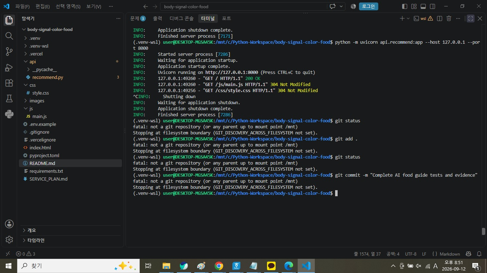

**그림 78. Git Repository가 아닌 상태에서 Git 명령을 실행했을 때 발생한 오류**

#### 배운 점

Git 오류 메시지가 나오면 바로 명령 자체가 틀렸다고 판단하기보다 **현재 Terminal 위치와 Repository 초기화 여부를 먼저 확인해야 한다**는 점을 배웠습니다.

특히 다음 순서가 안전합니다.

```text
현재 폴더 확인
    ↓
프로젝트 폴더로 이동
    ↓
git init 여부 확인
    ↓
Branch·Status 확인
    ↓
다음 Git 작업 진행
```

---

### 27.2 `desktop.ini`가 Commit 대상에 포함된 문제

#### 문제

프로젝트 초기 파일을 Staging Area에 등록하기 위해 다음 명령을 실행했습니다.

```bash
git add .
git status
```

확인 결과 Windows가 자동으로 생성한 다음 파일도 Commit 대상에 포함되어 있었습니다.

```text
images/desktop.ini
```

이 파일은 Python 프로그램이나 과제 수행에 필요한 파일이 아닙니다.

#### 원인

`git add .`은 현재 폴더 아래의 변경 파일을 한꺼번에 Staging하기 때문에, 운영체제가 자동 생성한 파일도 `.gitignore` 규칙이 없으면 함께 포함될 수 있습니다.

#### 해결

`.gitignore`에 다음 항목을 추가했습니다.

```gitignore
desktop.ini
```

이후 다시 다음 명령으로 확인했습니다.

```bash
git add .
git status
```

#### 결과

이전에는 Staging 대상에 나타났던 `desktop.ini`가 더 이상 `git status`에 표시되지 않았고, 과제에 필요한 파일만 Commit 대상으로 남았습니다.

#### 📷 문제 발견


**그림 79. `git add .` 이후 Windows 시스템 파일 `desktop.ini`가 포함된 상태**

#### 📷 `.gitignore` 수정


**그림 80. `.gitignore`에 `desktop.ini` 제외 규칙 추가**

#### 📷 수정 결과 재검증


**그림 81. 다시 `git status`를 실행하여 `desktop.ini`가 제외된 것을 확인**

#### 배운 점

`.gitignore`는 단순히 제출 전에 형식적으로 만드는 파일이 아니라, **실제 프로젝트에서 불필요한 파일이 변경 이력에 들어가는 것을 방지하는 설정**이라는 점을 확인했습니다.

또한 `.gitignore`를 수정한 뒤에는 설정만 믿지 않고 반드시 `git status`로 결과를 다시 확인하는 습관이 필요하다는 점도 배웠습니다.

---

### 27.3 GitHub CLI가 설치되어 있지 않았던 문제

#### 문제

GitHub CLI 상태를 확인하기 위해 다음 명령을 실행했습니다.

```bash
gh --version
```

하지만 처음에는 `gh` 명령어를 인식하지 못했습니다.

#### 원인

Git과 GitHub CLI는 서로 다른 프로그램입니다.

Git이 설치되어 있다고 해서 `gh` 명령어를 바로 사용할 수 있는 것은 아니며, GitHub CLI는 별도로 설치해야 합니다.

#### 해결

Windows의 `winget`을 사용하여 GitHub CLI를 설치했습니다.

```powershell
winget install --id GitHub.cli
```

설치 후 새 Terminal을 열고 다시 확인했습니다.

```bash
gh --version
```

확인 결과 GitHub CLI 버전이 정상적으로 출력되었습니다.

그 다음 `gh auth login`을 사용하여 GitHub.com 인증까지 진행하고 `gh auth status`로 로그인 상태를 다시 검증했습니다.

#### 📷 GitHub CLI 설치 및 정상 동작 확인


**그림 82. GitHub CLI 미설치 상태를 해결하고 `gh --version`으로 정상 동작 확인**

#### 결과

이후 Terminal에서 GitHub Repository 생성, 인증 상태 확인, Remote 연결 등의 작업을 진행할 수 있었습니다.

#### 배운 점

도구 이름이 비슷하더라도 역할이 다를 수 있습니다.

```text
Git
→ 로컬 변경 이력·Branch·Commit 관리

GitHub
→ 원격 Repository 서비스

GitHub CLI(gh)
→ Terminal에서 GitHub 기능을 사용하는 별도 도구
```

따라서 명령어가 인식되지 않을 때는 PATH 문제만 의심하기보다 **해당 프로그램 자체가 설치되어 있는지 먼저 확인**하는 것이 필요합니다.

---

### 27.4 Claude Code Review를 이용한 코드 검증과 선별 반영

이번 과제에서는 기능을 구현한 뒤 Claude의 Code Review 의견을 참고하여 코드 구조와 예외 처리를 다시 확인했습니다.

중요한 점은 **AI의 제안을 모두 그대로 적용하지 않았다는 것**입니다.

Code Review 의견을 다음 세 가지로 구분했습니다.

```text
실제 오류 또는 사용자 경험 문제
→ 바로 수정

현재 동작에는 문제없지만 가독성이 좋아지는 개선
→ 과제 수준과 복잡도를 보고 선택 적용

향후 확장 시 유용하지만 현재 요구사항에는 불필요
→ 지금은 보류
```

#### 실제로 반영한 사례 1 — 취소 메시지 중복 가능성 제거

초기 코드에서는 `get_non_empty_input()`과 `add_prompt()`가 각각 취소 메시지를 출력할 수 있어 같은 상황에서 메시지가 중복될 가능성이 있었습니다.

Code Review를 참고하여 입력 함수는 `None`만 반환하고, 최종 기능 함수가 사용자 메시지를 출력하도록 역할을 분리했습니다.

```python
except (EOFError, KeyboardInterrupt):
    return None
```

그리고 `add_prompt()`에서 한 번만 취소 메시지를 출력하도록 정리했습니다.

```python
if title is None:
    print("\n프롬프트 추가를 취소합니다.")
    return
```

#### 실제로 반영한 사례 2 — `select_category()`의 `None` 반환 명시화

직접 카테고리 입력 도중 입력이 취소되면 `None`이 반환될 수 있기 때문에 다음처럼 의도를 명확하게 했습니다.

```python
category = get_non_empty_input("카테고리 직접 입력: ")

if category is None:
    return None

return category
```

이후 Code Review에서 해당 피드백이 실제 코드에 정상 반영된 것도 다시 확인했습니다.

#### 실제로 반영한 사례 3 — 파일 끝에 잘못 붙은 코드 조각 제거

복사·붙여넣기 과정에서 `main()` 실행 코드 아래에 다음 코드 조각이 잘못 붙은 상태가 Code Review에서 발견되었습니다.

```python
if not prompts:
    print("등록된 프롬프트가 없습니다.")
    return
```

이 코드가 함수 밖에 존재하면 다음 오류가 발생할 수 있습니다.

```text
SyntaxError: 'return' outside function
```

원래 `show_prompt_list()` 안에 있어야 하는 로직이므로 파일 끝에 잘못 붙은 중복 코드 3줄을 제거하고, 파일의 마지막이 다음 구조로 끝나도록 정리했습니다.

```python
if __name__ == "__main__":
    main()
```

#### 반영하지 않은 사례

Code Review에서 목록 출력의 정렬 폭을 맞추거나 별도 `format_favorite()` 함수를 만드는 방법도 제안되었습니다.

하지만 현재 과제에서는 프롬프트 개수가 많지 않고 고정 폭 정렬도 요구하지 않았으며, 사용하지 않는 보조 함수를 미리 추가하면 초보자용 코드가 오히려 복잡해질 수 있다고 판단했습니다.

따라서 **좋은 제안이라도 현재 단계에서 실제 필요성이 없는 내용은 보류**했습니다.

#### 결과

Code Review를 단순히 “AI가 맞다고 하니 수정”하는 방식으로 사용하지 않고,

```text
AI 의견 확인
    ↓
실제 코드와 과제 요구사항 비교
    ↓
필수 수정 / 선택 수정 / 보류 구분
    ↓
필요한 부분만 반영
    ↓
다시 실행 테스트
```

순서로 활용했습니다.

#### 배운 점

AI Code Review는 코드 오류를 찾거나 다른 관점을 얻는 데 유용하지만, 최종 판단은 **현재 요구사항과 실제 프로그램 동작을 기준으로 해야 한다**는 점을 배웠습니다.

또한 수정 후 다시 Code Review를 요청했을 때 이전 피드백이 제대로 반영되었다는 확인을 받을 수 있어, **코드 작성 → 검토 → 수정 → 재검토** 흐름을 경험할 수 있었습니다.

---

### 27.5 README 중복·순서 문제를 작업 중 바로 정리한 과정

README를 기능 구현과 동시에 계속 수정하다 보니 이전 초안과 새로 작성한 Chapter가 겹치거나, Chapter 번호와 내용 순서를 다시 정리해야 하는 상황이 발생했습니다.

특히 긴 README를 한 번에 완성하려고 하면 다음 문제가 생길 수 있었습니다.

```text
이전 초안이 그대로 남음
        ↓
새 Chapter를 추가
        ↓
같은 설명이 중복됨
        ↓
Heading 번호 또는 그림 번호가 어긋남
        ↓
최종 제출 전 수정 범위가 커짐
```

이를 줄이기 위해 이번 과제에서는 Chapter별 기능 구현이 끝날 때마다 다음 방식으로 정리했습니다.

```text
실제 기능 구현
    ↓
실행 테스트
    ↓
증빙 이미지 저장
    ↓
해당 Chapter를 수행 완료형으로 수정
    ↓
중복 문장·예정 문구 제거
    ↓
다음 Chapter 진행
```

예를 들어 Bonus 기능은 처음에는 `구현 예정`으로 작성했지만, 실제 테스트가 끝난 뒤 `구현 및 실제 테스트 완료`로 바꾸고 49~63번 증빙을 기능별 위치에 배치했습니다.

입력 검증 역시 `추가 실행 테스트 예정` 상태로 남겨두었다가 66~69번 테스트가 완료된 뒤 실제 수행 결과로 교체했습니다.

#### 결과

README가 단순한 계획서가 아니라 **실제 수행 상태와 일치하는 작업 기록**이 되도록 유지할 수 있었습니다.

#### 배운 점

긴 README는 마지막에 한 번에 정리하기보다 **기능 구현 상태와 문서 상태를 함께 맞춰가는 방식**이 오류와 중복을 줄이는 데 효과적이었습니다.

---

### 27.6 Terminal 기록은 영구 저장되지 않으므로 단계별 캡처가 중요했던 점

이번 과제를 진행하면서 가장 실무적으로 중요하게 느낀 부분 중 하나는 **Terminal 화면의 작업 기록이 항상 영구적으로 보존되는 것은 아니라는 점**이었습니다.

Terminal에서 명령을 계속 실행하면 이전 출력이 화면 위로 밀려나고, VS Code를 종료하거나 Terminal Session을 새로 만들면 이전 화면을 그대로 다시 확인하기 어렵습니다.

특히 다음과 같은 결과는 작업이 끝난 뒤 나중에 다시 만들려고 하면 당시 상태와 정확히 동일한 화면을 재현하기 어려울 수 있습니다.

```text
오류가 발생한 순간
Git Staging 상태
Commit 직후 결과
Push 결과
Branch 전환·Merge 결과
git pull 결과
잘못된 입력 후 재입력 과정
기능 테스트 중간 상태
```

그래서 이번 과제에서는 중요한 작업이 완료될 때마다 다음 순서로 진행했습니다.

```text
명령 또는 기능 실행
    ↓
결과 확인
    ↓
다음 명령을 실행하기 전에 캡처
    ↓
의미가 드러나는 파일명으로 저장
    ↓
README에서 해당 작업과 연결
    ↓
다음 단계 진행
```

예를 들어 다음과 같은 식으로 파일명을 작성했습니다.

```text
47-public-sample-repository-clone-files-and-git-log.jpg
48-git-pull-already-up-to-date-and-local-changes.jpg
52-detail-view-count-increases-to-two.jpg
62-prompt-delete-confirmed-success.jpg
65-bonus-push-and-clean-status.jpg
69-prompt-list-after-input-validation-and-exit.jpg
```

파일 이름만 보더라도 **어떤 작업의 어떤 결과 화면인지 알 수 있도록 작성**했습니다.

이 방식은 단순히 과제 제출용 사진을 모으는 목적뿐 아니라, 나중에 README를 작성할 때 당시 작업 순서를 복원하는 데도 도움이 되었습니다.

#### 배운 점

개발 과정에서는 최종 코드만 중요한 것이 아니라 **어떤 과정을 거쳐 정상 상태에 도달했는지 기록하는 것도 중요**합니다.

특히 Terminal처럼 화면 기록이 계속 변하는 도구에서는 다음 원칙이 유용했습니다.

```text
중요한 결과가 나오면
"나중에 다시 캡처해야지"라고 미루지 않고
바로 캡처하고 이름을 붙여 저장한다.
```

이 원칙 덕분에 Git 명령, 오류 해결, 기능 테스트, Bonus 검증 과정을 순서대로 README에 연결할 수 있었습니다.

---

### 27.7 문제 해결 과정에서 사용한 공통 원칙

이번 과제에서 실제 문제를 해결하면서 공통적으로 사용한 방법을 정리하면 다음과 같습니다.

| 단계 | 적용 방법 |
|---|---|
| 1. 문제 확인 | 오류 메시지와 현재 화면을 먼저 확인 |
| 2. 현재 상태 확인 | Terminal 위치, Branch, `git status`, 입력값 등을 확인 |
| 3. 원인 분리 | 코드 문제인지, Git 설정 문제인지, 도구 설치 문제인지 구분 |
| 4. 최소 수정 | 문제 해결에 필요한 부분만 수정 |
| 5. 재실행 | 같은 명령 또는 같은 기능을 다시 실행 |
| 6. 결과 검증 | 성공 메시지만 보지 않고 실제 상태까지 재확인 |
| 7. 증빙 저장 | 다음 작업으로 넘어가기 전에 캡처 |
| 8. 문서 반영 | README에 문제 → 원인 → 해결 → 결과 → 배운 점 기록 |

이번 과제를 통해 오류가 발생했을 때 바로 코드를 크게 수정하기보다 **현재 상태를 확인하고, 원인을 좁힌 뒤, 최소한의 수정 후 다시 검증하는 방식**이 더 안전하다는 점을 배웠습니다.

또한 Git 기록, 실행 화면, Code Review를 함께 활용하면 단순히 “최종적으로 된다”는 것보다 **왜 수정했고 어떻게 정상 동작을 확인했는지**까지 설명할 수 있었습니다.

---

## 28. 현재 프로그램의 장점과 한계

현재 프로그램은 Python 기초 문법과 Git/GitHub 학습이라는 과제 목적에 맞추어, 외부 Library나 복잡한 Framework 없이 콘솔 환경에서 동작하도록 구현했습니다.

필수 기능을 먼저 안정적으로 완성한 뒤, 현재 프로그램의 구조와 자연스럽게 연결되는 Bonus 기능만 선별하여 추가했습니다.

따라서 장점과 한계도 단순히 “좋다 / 부족하다”로 평가하기보다, **현재 구현 범위에서 잘된 점과 의도적으로 구현하지 않은 부분을 구분하여 정리**했습니다.

---

### 28.1 장점 — Python 기본 문법으로 핵심 기능 구현

필수 기능과 선택한 Bonus 기능은 별도의 외부 Library 없이 Python 기본 기능만으로 구현했습니다.

주요 사용 요소는 다음과 같습니다.

```text
List
Dictionary
if / elif / else
while / for
function
input()
print()
enumerate()
sorted()
lambda
string.strip()
string.casefold()
```

이를 통해 Python 기초 문법을 단순 예제로 끝내지 않고 실제 프롬프트 관리 기능에 연결했습니다.

예를 들어 여러 프롬프트는 List로 관리하고, 각 프롬프트는 다음 속성을 가진 Dictionary로 구성했습니다.

```python
{
    "title": "...",
    "content": "...",
    "category": "...",
    "favorite": False,
    "view_count": 0,
}
```

따라서 하나의 데이터 구조 안에서 제목, 내용, 카테고리, 즐겨찾기, 조회수를 일관된 방식으로 관리할 수 있습니다.

---

### 28.2 장점 — 기능별 함수 분리

프로그램의 각 기능을 하나의 큰 코드 블록에 작성하지 않고 역할별 함수로 분리했습니다.

대표 함수는 다음과 같습니다.

```text
show_menu()
get_non_empty_input()
select_category()
add_prompt()
show_prompt_list()
show_prompts_by_category()
search_prompts()
show_prompt_detail()
toggle_favorite()
show_favorites()
edit_prompt()
delete_prompt()
show_top_prompts()
main()
```

함수를 나누면 다음 장점이 있습니다.

- 기능별 코드 위치를 쉽게 찾을 수 있습니다.
- 같은 기능을 다른 곳에서 다시 사용할 수 있습니다.
- 오류가 발생했을 때 어느 기능을 확인해야 하는지 범위를 줄일 수 있습니다.
- README에서 각 기능을 코드와 연결하여 설명하기 쉽습니다.

특히 `get_non_empty_input()`과 `select_category()`는 여러 기능에서 재사용할 수 있도록 공통 입력 처리 함수로 분리했습니다.

---

### 28.3 장점 — 입력 검증과 사용자 실수 방지

이번 프로그램은 정상 입력만 가정하지 않고 사용자가 실제로 할 수 있는 실수를 고려했습니다.

실제로 다음 상황을 테스트했습니다.

```text
잘못된 메뉴 번호
빈 제목
빈 내용
빈 검색어
직접 입력 카테고리 빈 값
존재하지 않는 프롬프트 번호
검색 결과 없음
카테고리 결과 없음
즐겨찾기 목록 없음
삭제 취소
```

잘못된 값을 입력했다고 해서 프로그램이 바로 종료되도록 하지 않고, 가능한 경우 안내 메시지를 보여준 뒤 다시 입력할 수 있도록 했습니다.

예를 들어 빈 값을 입력하면:

```text
빈 값은 입력할 수 없습니다. 다시 입력해주세요.
```

라고 안내한 뒤 같은 입력을 다시 받습니다.

존재하지 않는 상세 보기 번호나 수정 번호를 입력한 경우에도 메인 메뉴로 강제로 돌아가지 않고 같은 기능 안에서 다시 번호를 입력하도록 했습니다.

이 구조는 Chapter 25에서 실제 실행 화면으로 검증했습니다.

---

### 28.4 장점 — 검색 기능의 사용성 보완

프롬프트 검색은 제목뿐 아니라 내용까지 함께 검색하도록 구현했습니다.

또한 `casefold()`를 사용하여 영문 검색 시 대소문자 차이에 덜 영향을 받도록 했습니다.

```python
normalized_keyword = keyword.casefold()
```

검색 대상 역시 같은 방식으로 비교합니다.

```python
normalized_keyword in prompt["title"].casefold()
or normalized_keyword in prompt["content"].casefold()
```

따라서 단순한 완전 일치 검색보다 사용하기 편한 부분 문자열 검색을 제공합니다.

검색 결과가 없을 때도 빈 화면 대신 별도 안내 메시지를 출력합니다.

---

### 28.5 장점 — CRUD 구조까지 확장

필수 기능에서는 프롬프트 추가와 조회 기능을 중심으로 구현했습니다.

Bonus 2에서는 현재 프로그램과 직접 연결되는 수정과 삭제 기능을 추가하여 CRUD 구조까지 확장했습니다.

| CRUD | 기능 |
|---|---|
| Create | 프롬프트 추가 |
| Read | 목록, 카테고리별 조회, 검색, 상세 보기 |
| Update | 프롬프트 수정 |
| Delete | 프롬프트 삭제 |

수정 기능에서는 기존 데이터를 선택한 뒤 제목·내용·카테고리를 변경할 수 있고, 삭제 기능에서는 `y/n` 확인을 거쳐 실제 삭제 여부를 결정하도록 했습니다.

따라서 단순 조회 프로그램보다 실제 관리 프로그램에 가까운 구조로 확장되었습니다.

---

### 28.6 장점 — 조회수와 Top 5를 이용한 간단한 사용 기록

각 프롬프트에 다음 값을 추가했습니다.

```python
"view_count": 0
```

상세 보기를 실제로 실행한 경우에만 조회수가 증가합니다.

```python
prompt["view_count"] += 1
```

그리고 조회수가 1 이상인 프롬프트를 정렬하여 최대 5개까지 보여주는 Top 5 기능을 추가했습니다.

실제 테스트에서는 다음 결과를 확인했습니다.

```text
2번 프롬프트 조회수: 2
1번 프롬프트 조회수: 1
```

Top 5 실행 결과 조회수 `2 → 1` 순서로 정상 정렬되었습니다.

이 기능은 복잡한 통계 시스템은 아니지만, 기존 상세 보기 기능을 이용하여 **사용 기록을 하나의 추가 기능으로 자연스럽게 확장했다는 점**이 장점입니다.

---

### 28.7 장점 — 필수 동작과 Bonus 기능을 충돌시키지 않음

과제에서는 프로그램 실행 중 추가한 데이터가 메모리에 유지되고, 프로그램을 종료한 뒤 다시 실행하면 기본 상태로 시작하는 구조가 중요했습니다.

따라서 Bonus 기능을 구현할 때 JSON 자동 저장·자동 불러오기를 억지로 추가하지 않았습니다.

현재 동작은 다음과 같습니다.

```text
프로그램 실행
    ↓
추가·수정·삭제·즐겨찾기·조회수 변경
    ↓
같은 실행 중에는 변경 상태 유지
    ↓
프로그램 종료
    ↓
다시 실행
    ↓
기본 데이터로 초기화
```

실제 테스트에서도 이전 실행의 조회수가 새 실행에서는 다시 `0`부터 시작하는 것을 확인했습니다.

즉 Bonus 기능을 많이 추가하는 것보다 **필수 요구사항과 충돌하지 않는 범위에서 현재 프로그램과 맞는 기능만 선택**했습니다.

---

### 28.8 장점 — Git Branch와 Merge를 실제 개발에 사용

Git 명령어를 단순 연습용으로 한 번씩 입력하는 데서 끝내지 않고, 실제 기능 개발 흐름에 적용했습니다.

프롬프트 목록 기능은 다음 순서로 개발했습니다.

```text
main
    ↓
feature/prompt-list Branch 생성
    ↓
목록 기능 구현
    ↓
Branch에서 테스트
    ↓
Branch에서 Commit
    ↓
main으로 Checkout
    ↓
Merge
    ↓
Git Log 확인
    ↓
GitHub Push
```

따라서 `checkout`, `merge`, `log`, `push`가 실제 기능 개발 과정과 연결되어 있습니다.

또한 Commit 메시지도 작업 성격에 따라 `feat:`, `docs:`, `chore:` 등을 구분하여 사용했습니다.

---

### 28.9 장점 — GitHub와 로컬 상태를 반복 검증

Git 작업 후 단순히 명령을 실행했다는 것으로 끝내지 않고 `git status`, `git log`, GitHub 웹 화면을 통해 결과를 다시 확인했습니다.

예를 들어 Push 후 다음 상태를 확인했습니다.

```text
Your branch is up to date with 'origin/main'.

nothing to commit, working tree clean
```

이를 통해 로컬 `main`과 GitHub의 `origin/main`이 같은 최신 Commit을 가리키고 있으며, Commit하지 않은 변경사항이 남아 있지 않음을 확인했습니다.

공개 Sample Repository Clone과 `git pull`도 실제로 수행했습니다.

이러한 확인 과정은 Git 명령어의 의미를 단순 암기하는 것보다 실제 상태 변화와 연결해서 이해하는 데 도움이 되었습니다.

---

### 28.10 장점 — AI Code Review를 검증 도구로 활용

개발 과정에서 Claude Code Review를 참고하여 코드 구조와 오류 가능성을 추가로 확인했습니다.

실제로 다음과 같은 내용을 점검했습니다.

- 입력 취소 메시지 중복 가능성
- `select_category()`의 `None` 반환 흐름
- 복사·붙여넣기 과정에서 파일 끝에 잘못 붙은 코드
- 함수 구조와 예외 처리
- 목록 출력 방식
- 수정·삭제 기능의 변수 사용 방식

다만 AI의 제안을 모두 그대로 적용하지 않았습니다.

```text
AI 제안
    ↓
실제 코드와 비교
    ↓
과제 요구사항 확인
    ↓
실제 오류인지 판단
    ↓
필요한 부분만 적용
    ↓
다시 테스트
```

예를 들어 현재 프롬프트 수가 많지 않은데도 목록의 열 폭을 맞추는 복잡한 정렬 코드를 추가하는 제안은 필요성이 낮다고 판단하여 적용하지 않았습니다.

따라서 AI를 코드를 대신 결정하는 도구가 아니라 **추가 검토와 오류 탐색을 위한 보조 도구**로 사용했습니다.

---

### 28.11 장점 — 실행 결과와 증빙을 단계별로 기록

Terminal 결과는 계속 변하고 이전 화면이 영구적으로 남지 않을 수 있기 때문에 중요한 작업이 끝날 때마다 바로 캡처했습니다.

특히 다음과 같은 순간을 단계별로 저장했습니다.

```text
오류 발생
Branch 생성
Commit
Merge
Push
Pull
기능 테스트
잘못된 입력 처리
수정·삭제 성공
Working Tree Clean
```

증빙 파일도 다음과 같이 작업 내용이 드러나는 이름을 사용했습니다.

```text
47-public-sample-repository-clone-files-and-git-log.jpg
48-git-pull-already-up-to-date-and-local-changes.jpg
62-prompt-delete-confirmed-success.jpg
65-bonus-push-and-clean-status.jpg
69-prompt-list-after-input-validation-and-exit.jpg
```

이 방법은 최종 제출 증빙뿐 아니라 README를 작성할 때 당시 작업 순서를 다시 확인하는 데도 도움이 되었습니다.

---

### 28.12 한계 — 프로그램 종료 시 변경 데이터가 저장되지 않음

현재 프로그램은 메모리 기반으로 동작합니다.

따라서 실행 중 추가·수정·삭제한 데이터, 즐겨찾기 상태, 조회수는 프로그램을 종료하면 사라집니다.

```text
프로그램 실행 중
→ 변경사항 유지

프로그램 종료
→ 메모리 데이터 소멸

다시 실행
→ 기본 프롬프트 상태
```

이번 과제에서는 이 동작이 필수 요구사항과 일치하기 때문에 오류가 아닙니다.

그러나 실제 장기 사용 프로그램으로 확장한다면 JSON, CSV, SQLite 또는 Database 같은 영구 저장 방식이 필요합니다.

---

### 28.13 한계 — JSON 저장·불러오기 미구현

과제의 Bonus 후보에는 JSON 저장·불러오기가 있었지만 이번 프로젝트에서는 구현하지 않았습니다.

이유는 자동 저장·자동 불러오기를 추가할 경우 현재 프로그램의 기본 동작인 **종료 후 초기화**와 혼동될 수 있기 때문입니다.

또한 이번에는 모든 Bonus 기능을 많이 구현하는 것보다 현재 프로그램의 목적과 직접 연결되는 CRUD와 조회 통계를 완성하는 것을 우선했습니다.

향후 확장한다면 자동 저장이 아니라 사용자가 명시적으로 선택하는 다음 구조가 적합합니다.

```text
저장 메뉴 선택
→ JSON 파일 저장

불러오기 메뉴 선택
→ JSON 파일 읽기
```

이렇게 하면 기본 메모리 동작과 파일 저장 기능을 구분하기 쉽습니다.

---

### 28.14 한계 — 검색 기능의 범위가 기본 문자열 검색에 한정됨

현재 검색은 제목과 내용에 입력한 문자열이 포함되어 있는지 확인하는 방식입니다.

따라서 다음 기능은 지원하지 않습니다.

- 오타 자동 수정
- 유사어 검색
- 형태소 분석
- 띄어쓰기 자동 보정
- 특수문자 정규화
- 정규식 검색
- 의미 기반 Semantic Search

현재 과제 규모에서는 단순하고 이해하기 쉬운 부분 문자열 검색이 적합하지만, 데이터가 많아지면 검색 품질을 높이기 위한 추가 기능이 필요합니다.

---

### 28.15 한계 — Console UI 중심

현재 프로그램은 Terminal에서 번호와 글자를 입력하는 Console 프로그램입니다.

따라서 Python 기본 문법과 데이터 처리 흐름을 학습하기에는 적합하지만, 일반 사용자가 마우스로 버튼을 누르는 GUI 또는 Web 서비스와 비교하면 사용성이 제한됩니다.

향후 발전 방향으로는 다음과 같은 형태를 고려할 수 있습니다.

```text
Python Tkinter GUI
또는
Web Frontend + Python Backend
```

하지만 이번 과제에서는 Console 프로그램 구현이 목적이므로 GUI를 추가하지 않았습니다.

---

### 28.16 한계 — 대규모 데이터 관리에는 적합하지 않음

현재 프롬프트는 Python List 안에 저장됩니다.

데이터가 몇 개 또는 수십 개 수준일 때는 구조가 단순하고 이해하기 쉽지만, 프롬프트가 수천 개 이상으로 늘어나면 다음 문제가 생길 수 있습니다.

```text
전체 List 순회 증가
검색 속도 저하 가능
데이터 영구 저장 불가
동시 사용자 처리 불가
복잡한 조건 검색 어려움
```

따라서 대규모 프로그램으로 발전한다면 Database와 별도의 데이터 계층을 사용하는 것이 적합합니다.

---

### 28.17 한계 — Top 5는 현재 실행 세션만 기준으로 함

Top 5는 현재 실행 중 발생한 `view_count` 값만 사용합니다.

프로그램을 종료하면 조회수가 초기화되므로 장기간의 인기 프롬프트 통계는 제공하지 않습니다.

현재 기능의 의미는 다음과 같습니다.

```text
이번 실행에서
어떤 프롬프트를 많이 상세 조회했는지 확인
```

장기간 통계를 제공하려면 조회수를 파일이나 Database에 저장하는 기능이 추가로 필요합니다.

---

### 28.18 장점과 한계 최종 정리

| 구분 | 내용 |
|---|---|
| 장점 | 외부 Library 없이 Python 기본 문법으로 구현 |
| 장점 | List + Dictionary 구조를 실제 데이터 관리에 적용 |
| 장점 | 기능별 함수 분리 |
| 장점 | 빈 입력·잘못된 번호·결과 없음 등 입력 검증 |
| 장점 | 제목과 내용 검색 + `casefold()` 적용 |
| 장점 | 즐겨찾기 추가·해제 및 목록 |
| 장점 | CRUD 구조 완성 |
| 장점 | 상세 보기 조회수 및 Top 5 |
| 장점 | 필수 동작과 충돌하지 않는 Bonus 선택 |
| 장점 | 별도 Branch 개발 및 Merge 실제 수행 |
| 장점 | Git/GitHub 상태를 명령 실행 후 재검증 |
| 장점 | Claude Code Review를 선별적으로 활용 |
| 장점 | Terminal 결과를 단계별 증빙으로 기록 |
| 한계 | 프로그램 종료 시 실행 중 변경 데이터 초기화 |
| 한계 | JSON 저장·불러오기 미구현 |
| 한계 | 기본 문자열 검색 중심 |
| 한계 | Console UI 중심 |
| 한계 | 대규모 데이터 관리에 적합하지 않음 |
| 한계 | Top 5가 현재 실행 세션 기준 |

현재 프로그램은 대규모 실서비스를 목표로 한 프로그램은 아니지만, **Python 기초 자료구조와 제어문을 실제 기능으로 연결하고 Git/GitHub의 Branch·Commit·Merge·Push 흐름을 함께 실습한다는 과제 목적에는 적합한 구조**로 완성했습니다.

또한 현재 한계를 숨기기보다 왜 해당 기능을 구현하지 않았는지와 향후 어떤 방향으로 확장할 수 있는지를 구분하여 정리했습니다.

---

## 29. 과제 요구사항 최종 점검표

Chapter 29에서는 과제 요구사항을 현재 실제 수행 상태와 대조했습니다.

단순히 모든 항목을 `✅`로 표시하지 않고, **실제로 완료하고 README·코드·실행 화면으로 확인할 수 있는 항목은 `✅`, 최종 제출 직전에 한 번 더 만들어야 하는 증빙은 `⏳`**로 구분했습니다.

현재 프로그램 기능 자체와 필수 Git 실습, GitHub URL 기재, Chapter 31 작성까지 완료된 상태입니다. 남은 작업은 **최종 Git 동기화·Push 후 최신 Git Graph 증빙과 GitHub README 최종 확인**입니다.

---

### 29.1 개발 환경

| 요구사항 | 상태 | 현재 증빙 |
|---|---:|---|
| Python 3.10 이상 | ✅ | `01-development-environment.png`, `02-python-installation.jpg` — Python 3.14.7 |
| VS Code 설치 | ✅ | `03-vscode-installation.jpg` |
| VS Code Python Extension | ✅ | Chapter 3 개발환경 기록 및 VS Code에서 Python 실행 확인 |
| Korean Language Pack | ✅ 선택 설치 | Chapter 3 개발환경 기록 |
| `print("Hello")` 실행 | ✅ | `01-development-environment.png` |
| Git 설치 및 버전 확인 | ✅ | `01-development-environment.png`, `04-git-installation.jpg` — Git 2.55.0.windows.4 |
| Git 사용자 이름·이메일 설정 | ✅ | `01-development-environment.png` |
| 기본 Branch `main` 설정 | ✅ | `01-development-environment.png` |

개발 환경에서는 Python과 Git의 설치 여부만 확인하지 않고 실제 버전, Git 사용자 설정, 기본 Branch, Python 실행까지 함께 확인했습니다.

---

### 29.2 GitHub 및 원격 Repository

| 요구사항 | 상태 | 현재 증빙 |
|---|---:|---|
| GitHub CLI 설치 | ✅ | `12-github-cli-install-and-verification.jpg` |
| GitHub 로그인·인증 | ✅ | `16-github-cli-login-success.jpg`, `17-github-auth-status.jpg` |
| GitHub Repository 생성 | ✅ | `18-github-repository-and-remote.jpg`, `23-github-repository-and-readme-overview.jpg` |
| 로컬 Repository와 `origin` 연결 | ✅ | `18-github-repository-and-remote.jpg` |
| GitHub에 `README.md` 표시 | ✅ | `23-github-repository-and-readme-overview.jpg` |
| README Markdown·이미지 렌더링 | ✅ | `24-github-readme-image-rendering.jpg` |
| 최종 GitHub URL 기재 | ✅ | `https://github.com/lsh97nd-code/python-git-prompt-manager` |

GitHub Repository 생성과 Remote 연결, Push 및 README 표시까지 실제로 확인했습니다.

최종 제출용 Repository URL도 Chapter 30에서 확인하여 현재 `✅` 완료 상태입니다.

---

### 29.3 필수 Git 명령

| Git 요구사항 | 상태 | 주요 증빙 |
|---|---:|---|
| `git init` | ✅ | `01-development-environment.png` |
| `git add` | ✅ | `05-git-add-status.png`, `08-git-staging-final.jpg`, 이후 각 Commit 증빙 |
| `git commit` | ✅ | `11-first-commit-and-git-log.jpg`, `31-feature-prompt-list-commit.jpg`, `64-bonus-crud-view-statistics-commit-and-push.jpg` |
| `git push` | ✅ | `20-first-github-push-and-status.jpg`, `35-prompt-list-merge-push-and-clean-status.jpg`, `65-bonus-push-and-clean-status.jpg` |
| `git pull` | ✅ | `48-git-pull-already-up-to-date-and-local-changes.jpg` |
| `git checkout` | ✅ | `20-feature-prompt-list-branch-created.jpg`, `32-feature-prompt-list-merge-to-main.jpg` |
| `git clone` | ✅ | `47-public-sample-repository-clone-files-and-git-log.jpg` |
| `git merge` | ✅ | `32-feature-prompt-list-merge-to-main.jpg` |
| `.gitignore` 작성·적용 | ✅ | `06-gitignore-desktop-ini.jpg`, `07-gitignore-verification.jpg` |
| `git status`로 상태 확인 | ✅ | 여러 Git 증빙 및 `65-bonus-push-and-clean-status.jpg` |
| `git log --oneline --graph --all --decorate` 실행 | ✅ | `33-feature-prompt-list-git-log.jpg` |
| 공개 Sample Repository Clone | ✅ | `47-public-sample-repository-clone-files-and-git-log.jpg` |

필수 Git 명령은 모두 실제 작업 과정에서 사용했습니다.

특히 `checkout`과 `merge`는 단순 명령 연습이 아니라 `feature/prompt-list` Branch에서 프롬프트 목록 기능을 개발한 뒤 `main`으로 병합하는 실제 기능 개발 흐름에 사용했습니다.

---

### 29.4 Python 데이터 구조 및 기본 데이터

| 요구사항 | 상태 | 현재 증빙 |
|---|---:|---|
| 기본 프롬프트 3개 이상 | ✅ | 기본 프롬프트 4개 구현, `21-feature-prompt-list-display.jpg` 등 |
| 이전 미션 프롬프트 활용 | ✅ | `main.py` 기본 데이터 및 Chapter 8 |
| List 사용 | ✅ | `prompts` List |
| Dictionary 사용 | ✅ | 각 프롬프트 Dictionary |
| `title` | ✅ | 코드 및 상세 보기 결과 |
| `content` | ✅ | 코드 및 상세 보기 결과 |
| `category` | ✅ | 코드 및 목록·카테고리 조회 결과 |
| `favorite` | ✅ | 코드 및 즐겨찾기 테스트 |
| Bonus `view_count` | ✅ | 코드 및 49~56번 테스트 |
| 새 프롬프트의 `favorite=False` | ✅ | `add_prompt()` 코드 및 추가 결과 |
| 새 프롬프트의 `view_count=0` | ✅ Bonus | `add_prompt()` 코드 및 68번 증빙 |

현재 기본 데이터는 요구된 최소 3개보다 많은 **4개**를 제공합니다.

---

### 29.5 메인 메뉴 및 프로그램 흐름

| 요구사항 | 상태 | 현재 증빙 |
|---|---:|---|
| 메뉴 반복 출력 | ✅ | `25`, `26`, 여러 기능 실행 증빙 |
| 숫자로 기능 선택 | ✅ | 모든 실행 테스트 |
| 잘못된 메뉴 번호 처리 | ✅ | `66-invalid-menu-number-and-empty-title-validation.jpg` |
| 기능 수행 후 메인 메뉴 복귀 | ✅ | 목록·검색·상세·즐겨찾기 등 실행 증빙 |
| `0` 입력 시 종료 | ✅ | `26`, `46`, `63`, `69`번 |
| `EOFError`, `KeyboardInterrupt` 처리 | ✅ | `main.py` 코드 |

잘못된 메뉴 번호를 입력해도 프로그램이 비정상 종료되지 않고 안내 후 다시 메뉴를 표시하는 것을 실제로 확인했습니다.

---

### 29.6 프롬프트 추가

| 요구사항 | 상태 | 현재 증빙 |
|---|---:|---|
| 제목 입력 | ✅ | `28`, `29`, `66`, `67`번 |
| 내용 입력 | ✅ | `28`, `29`, `67`번 |
| 카테고리 입력 | ✅ | `28`, `29`, `67`, `68`번 |
| 미리 정의된 카테고리 선택 | ✅ | 추가 기능 테스트 |
| 카테고리 직접 입력 | ✅ | `67`, `68`번 |
| 빈 제목 재입력 | ✅ | `66`, `67`번 |
| 빈 내용 재입력 | ✅ | `67`번 |
| 직접 입력 카테고리 빈 값 재입력 | ✅ | `67`, `68`번 |
| 추가 시 `favorite=False` | ✅ | 코드 및 추가 결과의 `☆` |
| 실행 중 추가 데이터 유지 | ✅ | `68`, `69`번 |
| 프로그램 재실행 시 초기화 | ✅ | Bonus 재실행 테스트에서 조회수·데이터 초기 상태 확인 |

Chapter 25의 추가 테스트를 통해 빈 제목·빈 내용·직접 입력 카테고리의 빈 값까지 실제 화면으로 모두 검증했습니다.

---

### 29.7 프롬프트 목록 및 Branch 요구사항

| 요구사항 | 상태 | 현재 증빙 |
|---|---:|---|
| 목록 기능을 `main`이 아닌 Branch에서 개발 | ✅ | `20-feature-prompt-list-branch-created.jpg`, `31-feature-prompt-list-commit.jpg` |
| Branch에서 목록 기능 Commit | ✅ | `31-feature-prompt-list-commit.jpg` |
| `main`으로 Checkout | ✅ | `32-feature-prompt-list-merge-to-main.jpg` |
| `main`에 Merge | ✅ | `32-feature-prompt-list-merge-to-main.jpg` |
| 목록 번호 표시 | ✅ | `21-feature-prompt-list-display.jpg` |
| 제목 표시 | ✅ | `21-feature-prompt-list-display.jpg` |
| 카테고리 표시 | ✅ | `21-feature-prompt-list-display.jpg` |
| 즐겨찾기 `★ / ☆` 표시 | ✅ | `21`, `45`, `46`번 |
| 빈 List 방어 | ✅ 코드 확인 | `show_prompt_list()`의 `if not prompts:` |

빈 List 자체를 별도 실행 화면으로 만들기 위해 기본 데이터를 임의로 삭제하지는 않았습니다. 대신 `show_prompt_list()`에 빈 List 방어 코드가 구현되어 있는 것을 확인했습니다.

---

### 29.8 카테고리 조회·검색·상세 보기

| 요구사항 | 상태 | 현재 증빙 |
|---|---:|---|
| 카테고리별 조회 | ✅ | `36-category-filter-invalid-input-and-results.jpg` |
| 잘못된 카테고리 선택 재입력 | ✅ | `36`번 |
| 카테고리 결과 없음 안내 | ✅ | `37`, `38`번 |
| 제목 검색 | ✅ | `39`, `40`번 |
| 내용 검색 | ✅ | 검색 기능 코드 및 실행 결과 |
| 영문 대소문자 무시 | ✅ | `casefold()` 코드 |
| 빈 검색어 재입력 | ✅ | `39-search-empty-input-and-success-result.png` |
| 검색 결과 없음 안내 | ✅ | `40-search-no-result-and-menu-return.png` |
| 상세 보기 | ✅ | `41`, `42`번 |
| 잘못된 상세 번호 재입력 | ✅ | `41`, `50`번 |
| 제목·내용·카테고리·즐겨찾기 상세 출력 | ✅ | `42`번 |
| Bonus 조회수 증가 | ✅ | `50`, `52`, `53`, `54`번 |

정상 결과뿐 아니라 결과 없음, 빈 검색어, 잘못된 번호까지 함께 검증했습니다.

---

### 29.9 즐겨찾기

| 요구사항 | 상태 | 현재 증빙 |
|---|---:|---|
| 즐겨찾기 추가 | ✅ | `44-favorite-invalid-input-and-add-success.jpg` |
| 즐겨찾기 해제 | ✅ | `46-favorite-remove-empty-list-and-exit.jpg` |
| 즐겨찾기 목록 | ✅ | `45-favorite-list-reflects-added-item.jpg` |
| 즐겨찾기 없는 상태 안내 | ✅ | `43-favorites-empty-initial-state.jpg`, `46`번 |
| 잘못된 번호 처리 | ✅ | `44`번 |

즐겨찾기 상태가 실제 목록에 반영되는 것까지 확인했습니다.

---

### 29.10 Bonus 2 — CRUD 및 조회 통계

| Bonus 요구사항 | 상태 | 현재 증빙 |
|---|---:|---|
| 프롬프트 수정 | ✅ | `57`~`60`번 |
| 잘못된 수정 번호 재입력 | ✅ | `57`번 |
| 수정 후 상세 보기 재검증 | ✅ | `59`, `60`번 |
| 프롬프트 삭제 | ✅ | `61`~`63`번 |
| 삭제 취소 | ✅ | `61`번 |
| 삭제 확인 | ✅ | `62`번 |
| 삭제 후 목록 재검증 | ✅ | `63`번 |
| 상세 보기 조회수 | ✅ | `50`, `52`, `53`, `54`번 |
| Top 5 초기 빈 상태 | ✅ | `49`번 |
| 조회수 기준 Top 5 | ✅ | `55`, `56`번 |
| Bonus 기능 Commit·Push | ✅ | `64`, `65`번 |

Bonus 기능 역시 기능 실행 메시지만 확인하지 않고 수정·삭제·조회수 변경이 실제 데이터와 목록에 반영되는지 다시 확인했습니다.

---

### 29.11 코드 구조 및 구현 범위

| 요구사항 | 상태 | 현재 증빙 |
|---|---:|---|
| 기능별 함수 분리 | ✅ | `main.py` |
| 공통 빈 입력 함수 분리 | ✅ | `get_non_empty_input()` |
| 카테고리 선택 함수 분리 | ✅ | `select_category()` |
| 필수 기능 외부 Library 없이 구현 | ✅ | `main.py` — Python 기본 기능 사용 |
| 사용자 입력 오류 방어 | ✅ | Chapter 25 |
| JSON 자동 저장 사용 안 함 | ✅ 의도적 | 필수 메모리 동작 유지 |
| AI Code Review 후 필요한 수정 선별 반영 | ✅ | Chapter 27 |

JSON 저장·불러오기는 선택 Bonus이므로 미구현 자체가 필수 요구사항 미충족을 의미하지 않습니다.

이번 프로젝트에서는 CRUD와 조회 통계를 Bonus로 선택했고, 필수 과제에서 요구한 메모리 기반 동작과 충돌하지 않도록 했습니다.

---

### 29.12 Commit 및 최종 Git 증빙

| 요구사항 | 상태 | 현재 증빙 |
|---|---:|---|
| 의미 있는 Commit 10개 이상 | ✅ | Chapter 21 기록 및 현재 Git History |
| 기능별 Commit | ✅ | 각 기능별 Git 기록 |
| Branch 기능 Commit | ✅ | `31-feature-prompt-list-commit.jpg` |
| Bonus 기능 Commit | ✅ | `64-bonus-crud-view-statistics-commit-and-push.jpg` |
| Push 후 `working tree clean` | ✅ 당시 상태 확인 | `65-bonus-push-and-clean-status.jpg` |
| `git log --oneline --graph --all --decorate` 실행 | ✅ | `33-feature-prompt-list-git-log.jpg` |
| **최종 README Commit까지 포함한 최신 Git Graph 캡처** | ⏳ | Chapter 27~31 정리 및 마지막 문서 Commit 후 생성 예정 |

현재 `33-feature-prompt-list-git-log.jpg`는 Branch와 Merge가 실제로 수행된 것을 확인하기 위한 중간 Git Graph 증빙입니다.

최종 제출본에서는 Chapter 27~31 정리와 README의 마지막 Commit까지 완료한 뒤 최신 Git Graph를 다시 캡처하여 **최종 Commit 10개 이상 + `main` / `origin/main` 상태**를 한 화면에서 확인하는 것이 가장 정확합니다.

---

### 29.13 최종 점검 결과

| 구분 | 결과 |
|---|---:|
| 개발 환경 요구사항 | ✅ 완료 |
| Git 기본 설정 | ✅ 완료 |
| GitHub Repository 생성·연결 | ✅ 완료 |
| 필수 Git 명령 실습 | ✅ 완료 |
| 공개 Sample Repository Clone | ✅ 완료 |
| 기본 프롬프트 데이터 | ✅ 완료 |
| 프롬프트 추가 | ✅ 완료 |
| 프롬프트 목록 | ✅ 완료 |
| 별도 Branch 개발·Merge | ✅ 완료 |
| 카테고리 조회 | ✅ 완료 |
| 제목·내용 검색 | ✅ 완료 |
| 상세 보기 | ✅ 완료 |
| 즐겨찾기 | ✅ 완료 |
| 입력 검증 | ✅ 완료 |
| 기능별 함수 분리 | ✅ 완료 |
| Bonus CRUD | ✅ 완료 |
| Bonus 조회수·Top 5 | ✅ 완료 |
| 의미 있는 Commit 10개 이상 | ✅ 완료 |
| 최종 Git Graph 신규 캡처 | ⏳ 마지막 문서 Commit 후 |
| GitHub URL 최종 기재 | ✅ Chapter 30 완료 |

현재 기준으로 **프로그램 구현과 필수 Git/GitHub 실습은 완료**되었습니다.

남은 항목은 새로운 기능 개발이 아니라 최종 제출을 위한 다음 두 가지입니다.

```text
1. ✅ Chapter 30에 실제 GitHub Repository URL 기재 완료
2. ✅ Chapter 31 작성 완료 → ⏳ 마지막 Commit·Push 후 최신 Git Graph 캡처
```

즉, 지금 단계에서 기능을 더 추가하기보다 **제출 문서와 최종 증빙을 정확하게 마무리하는 것이 우선**입니다.

---

## 30. GitHub Repository

이번 과제의 소스 코드, README, Git 작업 기록 및 증빙 이미지는 GitHub Public Repository에서 관리했습니다.

### 30.1 GitHub URL

**Repository URL**

[https://github.com/lsh97nd-code/python-git-prompt-manager](https://github.com/lsh97nd-code/python-git-prompt-manager)

```text
https://github.com/lsh97nd-code/python-git-prompt-manager
```

Repository 이름은 `python-git-prompt-manager`이며, GitHub 사용자 계정 `lsh97nd-code` 아래에 생성되어 있습니다.

---

### 30.2 GitHub 웹페이지와 현재 README 비교 확인

최신으로 첨부한 GitHub `README.md` 웹페이지와 현재 Markdown 파일을 다시 비교했습니다.

GitHub 웹페이지 상단에서 다음 내용을 확인했습니다.

```text
Repository: lsh97nd-code/python-git-prompt-manager
Branch: main
README 최신 표시 Commit: 8fb6ee6 Update README.md
GitHub 표시 줄 수: 8843 lines
```

또한 GitHub의 `README.md` 화면에는 Chapter 30의 Repository URL과 GitHub 비교 내용까지 실제로 반영되어 있었습니다.

따라서 이전 초안에 적었던 다음 설명은 더 이상 현재 상태와 맞지 않습니다.

```text
GitHub 최신 표시 Commit이 dffcfa9이다.
GitHub README는 Chapter 25~30 로컬 수정 이전 상태이다.
로컬 README가 GitHub보다 더 최신이다.
```

`dffcfa9 feat: add prompt CRUD and view statistics`는 Bonus 기능 구현 시점의 중요한 기능 Commit이지만, **현재 GitHub README 자체의 최신 표시 Commit은 `8fb6ee6 Update README.md`**입니다.

즉 원인은 프로그램 오류가 아니라, Chapter 30을 처음 작성한 뒤 README가 GitHub에서 다시 갱신되었는데 문서 안의 “현재 상태” 설명이 그 이전 시점을 그대로 가리키고 있었기 때문입니다.

이번 수정에서는 해당 설명을 최신 웹페이지 상태에 맞게 바로잡았습니다.

---

### 30.3 GitHub Repository 생성 및 Remote 연결

Repository는 GitHub CLI를 사용하여 생성했습니다.

```bash
gh repo create python-git-prompt-manager --public --source=. --remote=origin
```

생성 후 다음 명령으로 원격 Repository 연결 상태를 확인했습니다.

```bash
git remote -v
```

관련 증빙:

```text
18-github-repository-and-remote.jpg
```

이 화면에서 로컬 Repository가 GitHub 원격 Repository `origin`과 연결된 것을 확인했습니다.

---

### 30.4 GitHub 웹페이지 표시 확인

GitHub 웹페이지에서도 Repository가 정상적으로 열리고 프로젝트 파일과 README가 표시되는 것을 확인했습니다.

관련 증빙:

```text
23-github-repository-and-readme-overview.jpg
24-github-readme-image-rendering.jpg
```

확인한 내용은 다음과 같습니다.

```text
✅ Repository 이름 확인
✅ Public 상태 확인
✅ images/ 폴더 확인
✅ .gitignore 확인
✅ README.md 확인
✅ hello.py 확인
✅ main.py 확인
✅ README Markdown 표시 확인
✅ README 이미지 경로 표시 확인
```

최신으로 첨부한 GitHub `README.md` 웹페이지에서도 README 내용이 Chapter 30까지 표시되는 것을 추가로 확인했습니다.

---

### 30.5 현재 동기화 상태에서 주의할 점

첨부한 GitHub 웹페이지에는 `8fb6ee6 Update README.md` Commit이 표시되어 있습니다.

반면 현재 대화에서 수정 중인 Markdown 파일만으로는 **로컬 Git의 현재 `HEAD`가 `8fb6ee6`을 포함하고 있는지까지 확인할 수 없습니다.**

따라서 마지막 Push 전에 다음 명령으로 로컬과 원격 상태를 반드시 다시 확인합니다.

```bash
git status
git log --oneline --graph --all --decorate
git fetch origin
```

만약 원격 `origin/main`에 로컬에 없는 `8fb6ee6` Commit이 있다면, 최종 Push 전에 원격 변경사항을 먼저 반영해야 합니다.

Chapter 31까지 수정한 뒤 최종 Commit을 만든 경우에는 다음 순서가 안전합니다.

```text
로컬 README 최종 수정
    ↓
git add .
    ↓
최종 문서 Commit
    ↓
git fetch origin
    ↓
로컬 main / origin/main 위치 확인
    ↓
필요한 경우 git pull --rebase origin main
    ↓
git push
    ↓
git status
    ↓
최종 Git Graph 캡처
```

즉 GitHub 웹페이지와 Markdown 내용 비교에서 확인된 가장 중요한 사항은 **문서 내용뿐 아니라 로컬 Git과 원격 Git의 Commit 위치도 마지막에 다시 맞춰야 한다는 점**입니다.

---

### 30.6 Chapter 30 최종 확인 결과

현재 Repository 주소는 다음과 같이 확정되었습니다.

```text
https://github.com/lsh97nd-code/python-git-prompt-manager
```

현재 확인 결과:

```text
✅ Repository 경로 확인
✅ Public Repository 확인
✅ 프로젝트 파일 표시 확인
✅ README.md 표시 확인
✅ Chapter 30까지 GitHub README 반영 확인
✅ GitHub README 최신 표시 Commit 8fb6ee6 확인
✅ Repository URL 확정
✅ Chapter 31 작성 완료
⏳ 마지막 Commit·Push 후 Git Graph 최종 증빙
```

Chapter 29에서 GitHub URL 항목은 `✅ 완료`로 유지할 수 있습니다.

남은 작업은 최종 Git 동기화·Push와 최신 Git Graph 증빙, GitHub README 최종 확인입니다.

---

## 31. 마무리

이번 과제를 통해 Python의 List, Dictionary, 조건문, 반복문, 함수, 문자열 처리 등을 단순 문법 예제에만 사용하지 않고 실제 프롬프트 관리 프로그램의 기능과 연결했습니다.

또한 Git을 사용하여 기능별 변경 이력을 남기고, `feature/prompt-list` Branch에서 목록 기능을 개발한 뒤 `main`에 Merge했으며, GitHub 원격 Repository와 Push·Pull·Clone 흐름까지 실제로 확인했습니다.

### 31.1 가장 많은 확인이 필요했던 부분

이번 과제에서 가장 많은 확인이 필요했던 부분은 **프로그램 기능 구현 자체뿐 아니라 Git 상태, 증빙 화면, README 내용이 실제 수행 상태와 계속 일치하도록 관리하는 과정**이었습니다.

실제 수행 중 다음과 같은 문제가 있었습니다.

```text
Git Repository가 아닌 위치에서 명령 실행
→ fatal: not a git repository

git add . 실행
→ Windows의 desktop.ini가 Commit 대상에 포함

gh 명령 실행
→ GitHub CLI가 설치되어 있지 않아 명령 인식 실패

기능 구현 후 증빙 생성
→ 새 이미지가 다시 Untracked file로 발생

Terminal 작업 계속 진행
→ 이전 출력이 화면 위로 밀려나거나 Session 종료 시 다시 보기 어려움

README를 단계별로 계속 수정
→ 이전 초안·예정 문구·실제 완료 상태가 서로 어긋날 가능성 발생

GitHub README 갱신
→ 문서 안에 적어 둔 '현재 GitHub 상태' 설명이 이전 시점을 가리키게 됨
```

특히 마지막 항목은 최신 GitHub 웹페이지와 로컬 Markdown을 비교하면서 다시 확인했습니다.

GitHub의 최신 `README.md` 화면에는 `8fb6ee6 Update README.md`가 표시되어 있었기 때문에, Chapter 30에 남아 있던 `dffcfa9`를 “현재 GitHub 최신 Commit”처럼 설명한 문장을 수정했습니다.

---

### 31.2 해결 과정

문제가 발생했을 때는 가능한 한 다음 순서로 처리했습니다.

```text
문제 화면 확인
    ↓
현재 위치·Branch·Git 상태 확인
    ↓
코드 문제 / Git 문제 / 도구 설치 문제 구분
    ↓
필요한 부분만 수정
    ↓
같은 기능 또는 명령 다시 실행
    ↓
정상 결과 재확인
    ↓
다음 작업 전에 증빙 캡처
    ↓
README 내용도 실제 결과에 맞게 갱신
```

대표적인 해결 사례는 다음과 같습니다.

| 문제 | 해결 |
|---|---|
| `not a git repository` | 올바른 프로젝트 폴더로 이동하고 `git init` 여부 확인 |
| `desktop.ini` 포함 | `.gitignore`에 제외 규칙 추가 후 `git status` 재확인 |
| `gh` 명령 인식 실패 | GitHub CLI 설치 후 새 Terminal에서 버전·로그인 상태 재확인 |
| Branch 기능 개발 | `feature/prompt-list`에서 구현·Commit 후 `main` Checkout·Merge |
| 잘못된 사용자 입력 | 공통 입력 검증과 번호 재입력 흐름 구현 |
| 삭제 실수 방지 | `y/n` 확인 후 실제 삭제 |
| Code Review 지적 | 실제 오류인지 검토 후 필요한 수정만 반영 |
| Terminal 기록 소실 위험 | 중요한 결과 직후 바로 캡처하고 의미 있는 파일명으로 저장 |
| README 예정 문구 잔존 | 기능 테스트가 끝날 때마다 실제 완료 결과로 교체 |
| GitHub/README 상태 설명 노후화 | 최신 GitHub 웹페이지와 다시 비교하여 현재 상태로 수정 |

Claude Code Review도 사용했지만 모든 제안을 그대로 적용하지 않았습니다.

실제 오류, 과제 요구사항, 코드 복잡도를 비교하여 필요한 수정만 반영했고, 현재 단계에서 불필요하게 복잡해지는 제안은 보류했습니다.

---

### 31.3 이번 과제를 통해 확인한 점

이번 과제에서 확인한 핵심 내용은 다음과 같습니다.

첫째, Python의 자료구조는 문법 자체보다 **어떤 데이터를 어떤 형태로 관리할 것인지**와 연결해서 사용해야 이해하기 쉽습니다.

이번 프로그램에서는:

```text
List
→ 여러 프롬프트를 순서대로 관리

Dictionary
→ 프롬프트 하나의 title / content / category / favorite / view_count 관리
```

구조로 사용했습니다.

둘째, Git은 단순히 `commit` 명령을 입력하는 도구가 아니라 **현재 상태를 계속 확인하면서 변경 이력을 관리하는 과정**이라는 점을 실제 작업으로 확인했습니다.

```text
수정
→ git status
→ git add
→ git commit
→ git push
→ git status 재확인
```

Branch 작업에서도:

```text
Branch 생성
→ 기능 구현
→ Branch Commit
→ main Checkout
→ Merge
→ Git Log 확인
```

흐름을 실제로 수행했습니다.

셋째, 프로그램이 정상 동작하는 것만큼 **입력 오류와 예외 상황을 어떻게 처리하는지**도 중요했습니다.

빈 입력, 잘못된 메뉴 번호, 존재하지 않는 프롬프트 번호, 검색 결과 없음, 카테고리 결과 없음, 즐겨찾기 없음, 삭제 취소 등을 따로 확인했습니다.

넷째, AI Code Review는 코드를 대신 결정하는 도구가 아니라 **추가 검토 도구로 사용하는 것이 적절**했습니다.

```text
AI 제안
→ 실제 코드 확인
→ 과제 요구사항과 비교
→ 필요한 부분만 수정
→ 다시 테스트
```

과정을 거쳐 사용했습니다.

다섯째, 개발 과정의 기록도 중요했습니다.

Terminal 화면은 계속 변하기 때문에 오류, Commit, Push, Merge, Pull, 기능 테스트처럼 중요한 결과가 나오면 바로 캡처해야 나중에 당시 상태를 정확하게 설명할 수 있었습니다.

---

### 31.4 현재 프로그램의 완성 범위

현재 프로그램은 과제에서 요구한 핵심 기능을 모두 포함합니다.

```text
✅ 기본 프롬프트 4개
✅ 프롬프트 추가
✅ 프롬프트 목록
✅ 카테고리별 조회
✅ 제목·내용 검색
✅ 상세 보기
✅ 즐겨찾기 추가·해제
✅ 즐겨찾기 목록
✅ 입력 검증
✅ 기능별 함수 분리
✅ 별도 Branch 개발 및 Merge
✅ Git 필수 명령 실습
✅ 공개 Sample Repository Clone
✅ GitHub Repository 연결
✅ 의미 있는 Commit 10개 이상

Bonus 2
✅ 프롬프트 수정
✅ 프롬프트 삭제
✅ 상세 보기 조회수
✅ 많이 본 프롬프트 Top 5
```

JSON 자동 저장 기능은 구현하지 않았습니다.

이는 기능을 구현하지 못해서가 아니라, 이번 과제의 기본 동작인 **프로그램 종료 후 메모리 데이터 초기화**와 충돌하지 않도록 필수 기능을 우선한 선택입니다.

---

### 31.5 앞으로 확장할 수 있는 부분

현재 과제 범위를 넘어 확장한다면 다음 순서가 적절합니다.

```text
1. 사용자가 명시적으로 선택하는 JSON 저장 / 불러오기
2. 카테고리 이름 정규화 및 관리 기능
3. 자동화된 단위 테스트
4. 더 많은 검색 조건
5. GUI 또는 Web UI
6. 데이터가 많아질 경우 SQLite / Database 적용
```

특히 JSON 기능을 추가한다면 자동 저장 방식보다 다음처럼 명시적 메뉴를 두는 방식이 현재 프로그램 구조와 잘 맞습니다.

```text
저장 선택
→ JSON 저장

불러오기 선택
→ JSON 불러오기
```

이렇게 하면 기본 메모리 동작과 파일 저장 기능을 구분할 수 있습니다.

---

### 31.6 최종 프로젝트 요약

이번 프로젝트는 **Python 기초 문법을 이용한 프롬프트 관리 프로그램 구현**과 **Git/GitHub를 이용한 실제 버전 관리 흐름 실습**을 함께 수행한 과제입니다.

프로그램 측면에서는 기본 데이터 관리부터 검색·즐겨찾기·입력 검증까지 필수 기능을 구현했고, Bonus로 수정·삭제·조회수·Top 5 기능까지 확장했습니다.

Git 측면에서는 Repository 초기화, Staging, Commit, Push, Pull, Checkout, Clone, Merge를 실제 작업에 사용했으며, 프롬프트 목록 기능은 별도 Branch에서 개발한 뒤 `main`에 병합했습니다.

또한 기능을 구현한 뒤 실행 화면만 남기는 것이 아니라 **결과 재확인 → 증빙 저장 → README 반영**까지 하나의 작업 흐름으로 관리했습니다.

최종 제출 전에는 다음 순서만 남았습니다.

```text
Chapter 31 작성 완료
    ↓
git status 확인
    ↓
최종 README 및 필요한 증빙 Commit
    ↓
원격 origin/main 상태 확인
    ↓
필요한 경우 원격 변경사항 반영
    ↓
git push
    ↓
git status로 Working Tree Clean 확인
    ↓
git log --oneline --graph --all --decorate
    ↓
최종 Git Graph 캡처
    ↓
GitHub README 최종 확인
```

이 과정을 완료하면 프로그램 코드, Git 변경 이력, 실행 증빙, README 문서가 같은 최종 상태로 맞춰집니다.

---
